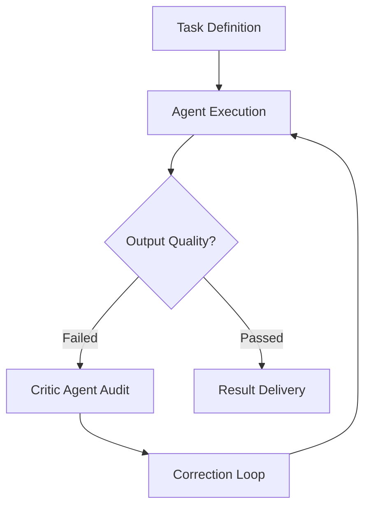
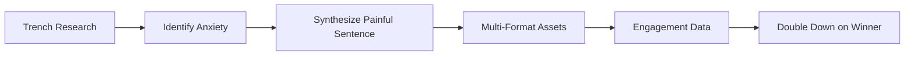
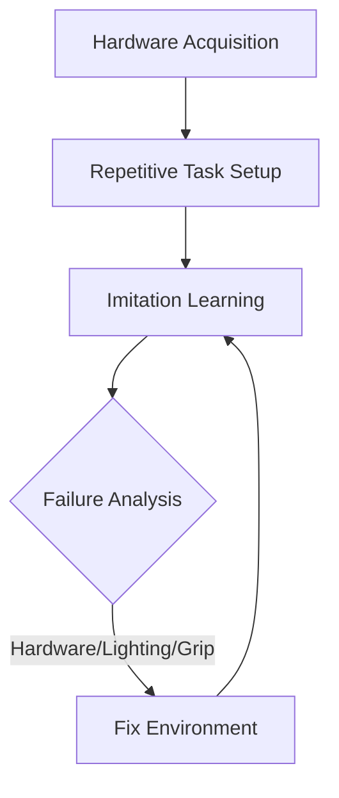
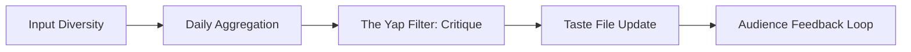
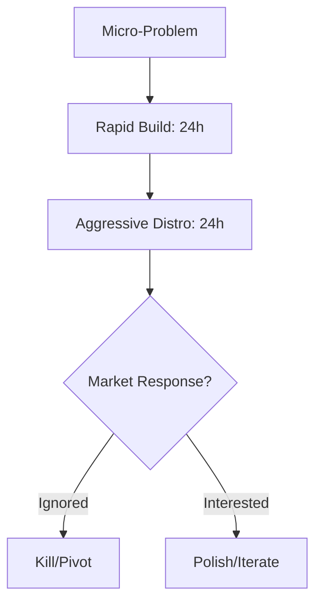
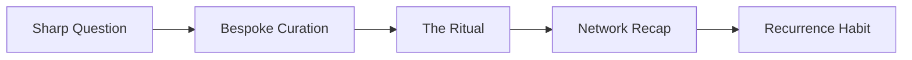

# 6 Skills to Stay Ahead of the Curve for the Agentic Era

The “Learn AI” era is over.

For a short window, curiosity was enough. People experimented with chatbots, generated images, summarized documents, and played with whatever new model happened to dominate the news cycle. That era mattered, but only as a doorway. It gave millions of people a first taste of AI, yet it did not separate the observers from the operators.

As we move into the second half of 2026, the market has shifted from passive exploration to active orchestration.

We have entered the **Agentic Era**.

The question is no longer, “How do I use AI?”

It is, “How do I build systems that use AI for me?”

That shift changes everything. The winners will not be the people who know the most model names, prompt tricks, or demo videos. They will be the people who can turn AI into an operating layer: a system for execution, distribution, judgment, and leverage.

This is your master manual for transitioning from an AI user to an Agentic Operator.

***

## 1. AI Agent Orchestration: The Systems Architect

You are no longer talking to a machine. You are managing a digital department.

That is the first mental shift.

A chatbot is not the right metaphor anymore. A better metaphor is a junior employee: capable, fast, and often useful, but still dependent on direction, boundaries, and review. If you would not ask a human teammate to work without a goal, a process, and a quality bar, you should not ask an agent to do so either.

The real skill is not prompting. It is orchestration.

### The Mental Model: The Manager’s Mindset

A strong operator thinks like a manager, not a user. That means defining scope, assigning tools, setting constraints, and creating review loops. The agent should not be trusted because it sounds confident. It should be trusted because the system around it makes failure visible and recovery automatic.

A useful way to think about this is:

- The human defines intent.
- The agent executes.
- A critic checks quality.
- The system retries if needed.
- The output only ships when it passes.

### Process Flow: The Self-Healing Agent

This is where frameworks like LangGraph become valuable. They let you represent the work as a graph instead of a single prompt. That distinction matters because real work is rarely linear. It has branches, retries, validations, and exceptions.

### Workflow

Define a high-frequency task, architect the pipeline with LangGraph, implement a “Critic” agent for quality control, run locally via Ollama when privacy and latency matter, and refine the system using logs from real failures.

The practical payoff is enormous. You are no longer asking AI for output one request at a time. You are building a system that can produce reliable output repeatedly, with less supervision over time.

Example: a document-processing system that extracts key fields from contracts. The first agent parses the text, the critic checks for missing values or hallucinated entries, and the final result only lands in your workflow if it passes validation.

That is the difference between toy AI and production AI.

***

## 2. Distribution-Focused Marketing: The Demand Engineer

Distribution is not posting on social media.

Distribution is the engineering of demand.

A lot of people still think marketing starts after the product is built. In the Agentic Era, that mindset is a liability. The market does not reward the best hidden product. It rewards the product that is discovered, understood, and felt at the right moment by the right audience.

If your product solves a problem no one feels, it does not matter how elegant the execution is.

### The Mental Model: Pain-Driven Development

Your job is to find the painful sentence.

That is the exact phrase your target audience uses when they are frustrated, blocked, or tired of a recurring problem. It is the sentence they say in a Slack thread at midnight, the line they mutter while debugging, or the complaint they repeat in a forum post because they have not found a good solution yet.

That sentence is the raw material for distribution.

### Process Flow: The Pain-Mapping Cycle

The process is simple, but not easy. You start in the trenches: niche forums, Reddit threads, specialized Slack groups, comment sections, GitHub issues, and industry communities. You collect repeated frustrations and emotional language. Then you compress that into one sentence that feels uncomfortably specific.

After that, you turn one insight into multiple assets:
- A long-form article.
- A 60-second video.
- A thread or post.
- A newsletter segment.
- A cold outreach message.
- A carousel or visual explainer.

### Workflow

Audit niche forums for stress points, identify the painful sentence, deploy five or more assets around that insight, and track engagement to determine what format creates the strongest signal.

The point is not volume. It is resonance.

Example: instead of saying, “I built an AI support tool,” say, “Our support queue is moving fast, but nobody trusts the classifications.”

That line is not just a product description. It is a distribution hook.

The best marketers in the Agentic Era are not attention addicts. They are demand engineers.

***

## 3. Robotics: The Physical Pivot

For two decades, the world rewarded those who moved pixels.

The next two decades will reward those who move atoms.

This does not mean every developer needs to become a robotics researcher. It means the frontier is expanding beyond screens, and the people who understand both software and physical systems will have a new kind of advantage.

Robotics is useful not because it is trendy, but because it forces reality into the loop. In software, failure is often abstract. In robotics, failure is physical, and that makes it brutally honest.

### The Mental Model: Digital Twin Humility

Robotics teaches humility because the physical world refuses to cooperate with your assumptions.

A model may be “correct” in simulation and still fail on a real desk because the lighting changed, the gripper slipped, or the object shifted by three millimeters. Those constraints are not edge cases. They are the actual problem.

That is why robotics is such a good teacher. It reveals the difference between intelligence and control.

### Process Flow: Desktop Automation

A practical entry point is a low-cost robotic arm such as the SO100 ecosystem, paired with a standard USB camera. Start with one boring task: sorting components, moving objects, pressing buttons, or placing items between trays. Use open-source Vision-Language-Action models to train the policy through demonstration. Then document every failure mode carefully.

### Workflow

Buy a low-cost arm, teach one repetitive task, document the physical failure modes, and learn supply-chain logistics by sourcing individual components and replacement parts.

That sourcing step matters more than people think. Robotics is not just about code. It is also about motors, controllers, tolerances, calibration, part availability, and manufacturing constraints. Once you start thinking this way, you stop treating the physical world as a black box and start seeing it as another domain of design.

Example: a simple sorting task can teach you more about reliability, tolerance, and iteration than a dozen software demos ever will.

***

## 4. Curators-in-Chief: The Filter

In an infinite information landscape, the curator becomes the kingmaker.

Information is abundant. Taste is scarce.

That is the core idea.

Anyone can summarize what happened. The valuable person is the one who can tell people what matters, why it matters, and what they should pay attention to next. That is what makes curation such a powerful leverage skill in the Agentic Era.

### The Mental Model: Taste as an Asset

Taste is not a vague aesthetic preference. It is a repeatable ability to detect signal, reject noise, and frame things in a way that creates clarity for others.

The curator is valuable because they help an audience make sense of overwhelming complexity.

### Process Flow: The Value-Add Sprint

Build a small, high-signal input stack: papers, niche blogs, technical repos, industry discussions, and domain-specific newsletters. Spend 30 minutes a day scanning for pattern shifts, not just headlines. Then produce short, opinionated takes that compress the insight into a usable frame.

A strong output format is:

“I saw [Topic]. Most people are treating it like [X], but the hidden implication is actually [Y].”

### Workflow

Scan high-signal sources, record a short “yap” video or post, log the best analogies and hooks into a taste file, and use audience comments as research input for your next piece.

That feedback loop is where curation compounds. The audience is not just consuming your judgment. They are helping you sharpen it.

Example: instead of saying, “This model is faster,” say, “This changes the economics of iteration for small teams.”

That is curation with leverage.

***

## 5. The Builder-Distributor: The Loop Closer

The historical split between the technical builder and the marketer is collapsing.

AI is accelerating both sides of the equation, which means a single person can now build, package, and distribute faster than an entire small team could a few years ago. The person who wins is the one who can close the loop quickly enough to learn from the market before momentum dies.

### The Mental Model: The Velocity Loop

Do not finish the product before showing it.

That instinct is comforting, but it is often expensive. The goal is not perfection. The goal is speed of learning.

A strong operator thinks in terms of:
- Build.
- Distribute.
- Learn.
- Iterate.

### Process Flow: 48-Hour Launch

Choose one minor annoyance in your own life or work. Build the smallest version of a fix in 24 hours. Then spend the next 24 hours putting it in front of people. That means a demo video, a landing page, a post, a thread, or direct outreach.

### Workflow

Solve one small annoyance, build an MVP in 24 hours, launch it in the next 24 hours, and use the real-world friction you encounter to decide whether to kill, pivot, or polish.

This loop is powerful because it replaces speculation with evidence.

Example: a small internal script becomes a public tool, and the confusion people express during the demo tells you exactly what to improve.

The best founders in this era are not the ones who build in secret. They are the ones who can move from idea to feedback with almost no delay.

***

## 6. IRL Community Building: The Trust Architect

Everything digital is becoming commoditized.

That is why everything physical is becoming premium.

As online content, AI outputs, and digital products get easier to generate, trust becomes the scarce asset. And trust is built faster in small, high-context, real-world environments than it is through endless online interaction.

### The Mental Model: High-Friction Belonging

Do not build networks. Build rooms.

A network is broad. A room is specific. A network collects contacts. A room creates repeated trust, shared language, and social memory.

People do not want more shallow connections. They want fewer, better ones.

### Process Flow: The High-Friction Gathering

Start with a difficult, specific question—something real practitioners care about. Then curate only six to eight people who genuinely have something to contribute. Host the gathering as a ritual: dinner, hike, private session, or closed-door roundtable. Remove the performance layer. No slides. No pitching. No agenda theater.

### Workflow

Define one impossible industry question, curate a small group that must answer it, host a high-friction gathering, and send a private recap afterward with useful takeaways and suggested follow-ups.

That recap is important. It turns the event into an asset. It gives the room memory, continuity, and value beyond the evening itself.

Example: a recurring dinner on “agentic drift in production” becomes a trusted forum where people come not to perform, but to think.

That is the kind of network software cannot replace.

***

## Synthesis: How to Stack for Leverage

You do not need to master all six at once.

The real advantage comes from stacking the right two or three skills together so they reinforce each other.

| Stack | Anchor Skills | Objective |
| --- | --- | --- |
| Operator | Agents + Builder-Distributor | Efficiency and output |
| Authority | Curation + IRL Community | Trust and influence |
| Founder | Distribution + Robotics/Agents | Defensible moats |

Think of these as modular leverage stacks:
- If you are a developer, anchor in agent orchestration and the builder-distributor loop.
- If you are a creator, anchor in curation and community.
- If you are a founder, use distribution to discover demand and agents or robotics to build defensibility.

The future does not reward generalists who dabble in everything. It rewards full-stack operators who know how to combine tools, systems, judgment, and distribution into something real.

The future is not AI-first.

It is operator-first—with AI as the ultimate force multiplier.

Which of these workflows will you execute first this weekend?
