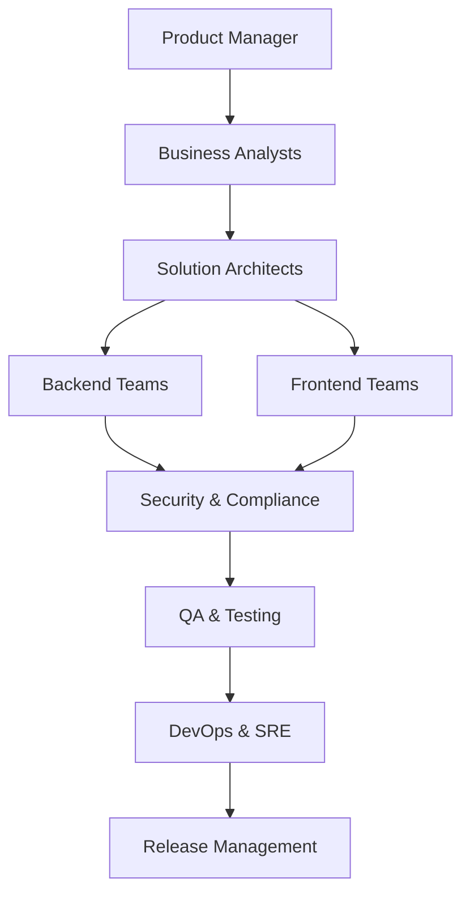
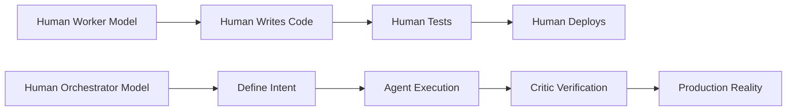
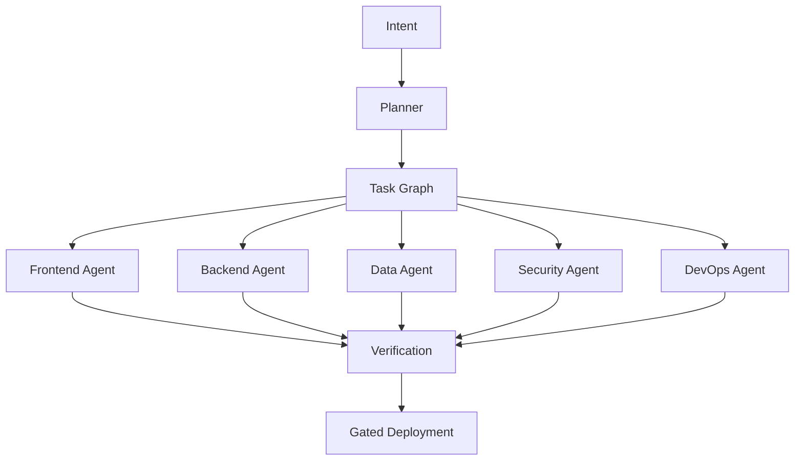
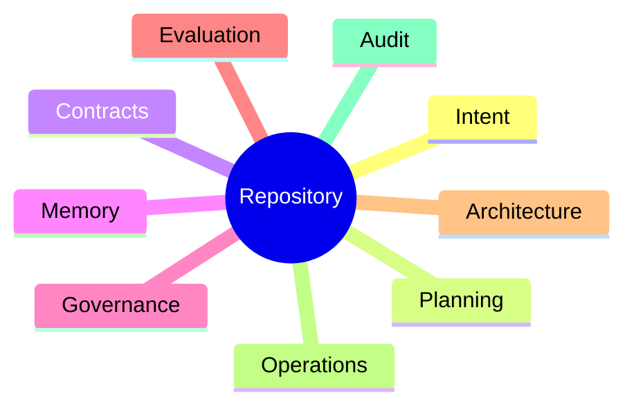
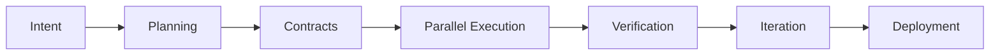
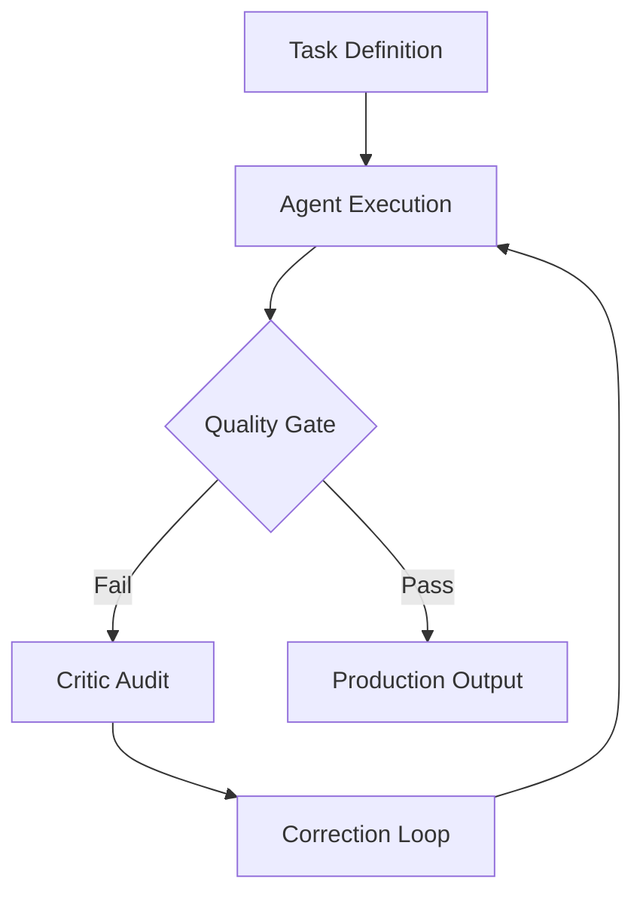
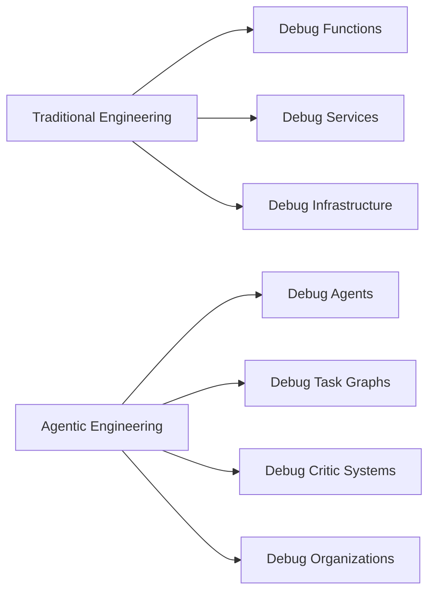
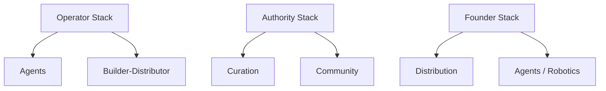

# The Architect's Renaissance: How AI Is Turning Elite Engineers into Architect-Solopreneurs

> *The most important question in software engineering is no longer:*
>
> **"How fast can you write code?"**
>
> *It is now:*
>
> **"How effectively can you design systems that transform intent into verified reality?"**

---

# The End of the Headcount Era

For the past three decades, the software industry operated on a deceptively simple assumption:

> **Complex software requires large teams.**

If a product became more ambitious, companies hired more developers. If delivery slowed, they added managers. If coordination became difficult, they introduced frameworks, ceremonies, and process layers.

This assumption shaped the entire modern technology industry:

* Agile methodologies
* Scrum ceremonies
* Team Topologies
* Program management offices
* Architecture review boards
* Release management processes
* Enterprise governance frameworks

The model worked—until organizations encountered their greatest hidden cost:

> **The synchronization tax.**

The synchronization tax is the enormous overhead created by communication, coordination, handoffs, meetings, context switching, approvals, and organizational alignment.

As organizations grow, this tax frequently compounds faster than productive output.

We are now witnessing the first technological shift capable of attacking this problem at its root.

Not because AI writes code.

But because AI allows one human to orchestrate an entire organization.

This is the beginning of what I call:

# The Architect's Renaissance

---

# The Silent Killer: The Synchronization Tax

Traditional software organizations assumed complexity required scale.

The result looked something like this:

Every arrow introduces hidden costs:

* Context loss
* Misinterpretation
* Waiting
* Political friction
* Documentation drift
* Approval queues
* Knowledge fragmentation
* Organizational latency

Large engineering organizations frequently spend more effort coordinating than building.

Standups become status theater.

Meetings become dependency negotiations.

Documentation becomes historical fiction.

Critical knowledge becomes trapped in Slack threads and individual brains.

The industry spent decades optimizing software production while largely ignoring the cost of synchronizing humans.

AI changes this equation.

---

# The Great Inversion: Human as Orchestrator

The breakthrough of AI is not that machines can write code.

The breakthrough is that:

> **One human can now effectively lead an entire software organization.**

This represents a fundamental inversion.

The human no longer acts primarily as a worker.

The human becomes:

* Vision setter
* Constraint engineer
* System architect
* Organizational designer
* Governance authority
* Quality gatekeeper
* Final decision maker

This is the transition from:

> **Human-as-Worker**

to

> **Human-as-Orchestrator**

---

# The Rise of the Architect-Solopreneur

The most powerful archetype emerging from this transition is the:

# Architect-Solopreneur

An Architect-Solopreneur is not a lone coder.

They are simultaneously:

* Product strategist
* Systems architect
* Organizational designer
* Verification engineer
* Workflow orchestrator
* Governance authority

They do not build every component.

They design the intelligent factory that builds the components.

Implementation becomes abundant.

Judgment becomes scarce.

And scarcity determines value.

---

# The New Software Organization

The traditional organization chart disappears.

Instead of managing people, architects manage specialized agents.

A modern agentic organization might contain:

* Planner Agent
* Frontend Agent
* Backend Agent
* Data Agent
* Security Agent
* DevOps Agent
* Testing Agent
* Evaluation Agent
* Critic Agent

The organization becomes software itself.

Execution becomes:

* Parallel
* Observable
* Deterministic
* Repeatable

The repository is no longer just source code.

It becomes simultaneously:

* Architecture office
* Project management office
* Operations manual
* Governance engine
* Organizational memory
* Audit trail

The repository becomes the organization.

---

# A Canonical Agentic Workflow

The human architect provides strategy and judgment.

Agents perform decomposition, execution, and verification.

Then keep your existing seven phases exactly as written.

---

# The Critic: The Missing Layer of AI Systems

The most important component of an agentic organization is not the generator.

It is the critic.

The critic:

* Challenges assumptions
* Detects drift
* Rejects hallucinations
* Prevents self-certification
* Forces evidence-based reasoning

This is the leap from prompting to orchestration.

---

# The Four Foundational Artifact Classes

Keep this section exactly as written.

---

# The Human Challenge: Debugging Organizations

Agents are not magic.

They hallucinate.

They optimize incorrect objectives.

They reinforce bad assumptions.

They generate dangerous false confidence.

The architect therefore becomes something entirely new:

> An organizational systems engineer.

The architect debugs:

* Task graphs
* Agent interactions
* Reasoning traces
* Evaluation pipelines
* Feedback loops
* Governance systems
* Organizational memory

This is a deeper form of engineering.

---

# The Six Skills of the Agentic Era

Keep all six sections.

Remove the individual diagrams from:

* Robotics
* Curation
* Distribution
* Builder-distributor
* Community

Those diagrams fragment the narrative flow.

---

# Synthesis: Building Leverage Stacks

Replace the table with:

The future does not reward generalists who dabble in everything.

It rewards operators who know how to combine:

* Systems
* Judgment
* Distribution
* Taste
* Leverage

---

# Risk, Responsibility, and Hubris

Keep exactly as written.

---

# The New Competitive Advantage

Keep exactly as written.

---

# The Architect's Renaissance

Keep your existing conclusion.

It is already strong:

> They do not build software.
>
> They build systems that build software.
>
> They do not manage labor.
>
> They orchestrate intelligence.
>
> They do not optimize effort.
>
> They optimize clarity, judgment, and leverage.

The synchronization tax is dying.

And what replaces it will reward those who can architect intent, orchestrate intelligence, and verify reality.

**The age of the Architect-Solopreneur has only just begun.**

