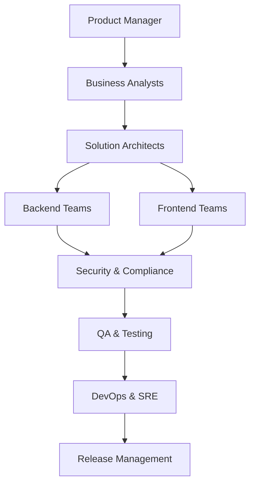
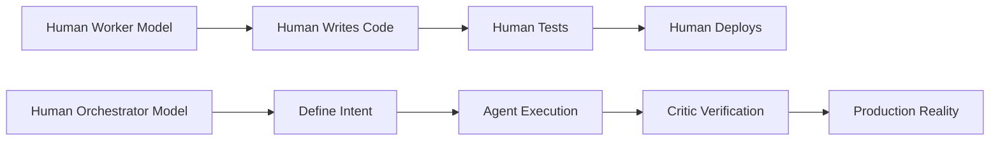
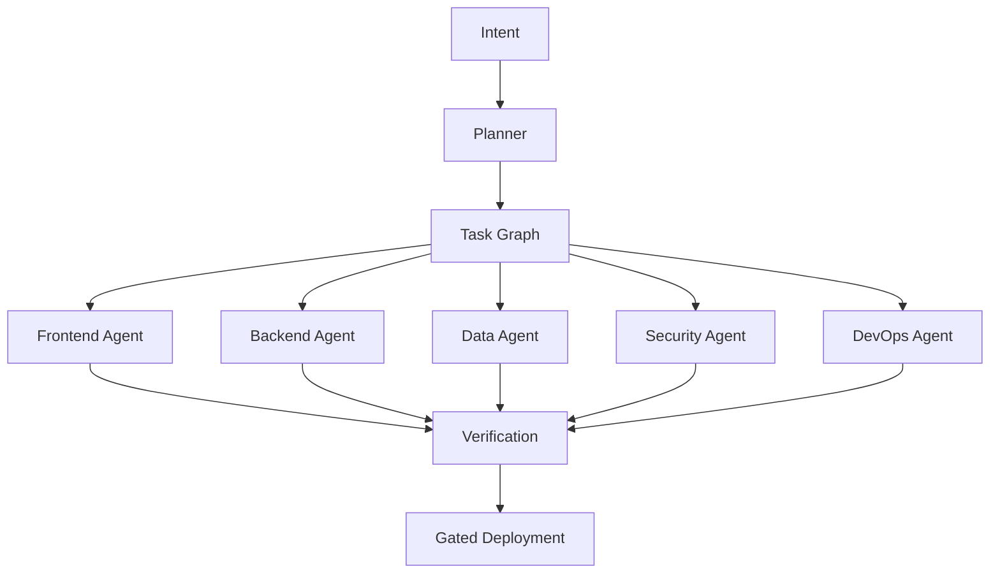
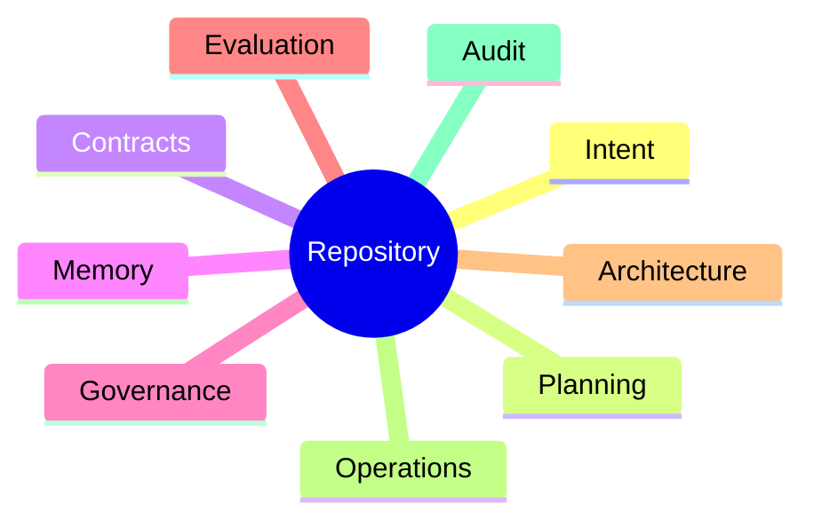
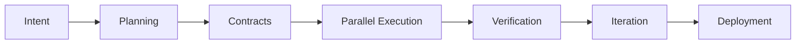
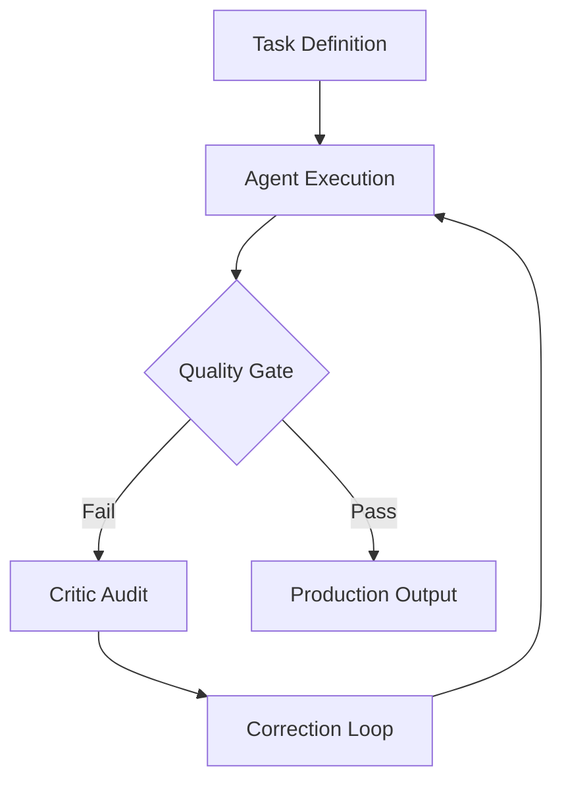
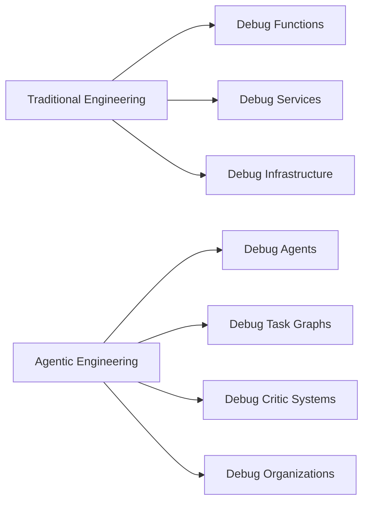
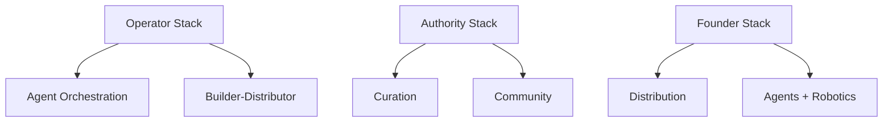

**# The Architect's Renaissance: How AI Is Turning Elite Engineers into Architect-Solopreneurs**

> *The defining question of software engineering is no longer:*  
> **"How quickly can you write code?"**  
>  
> *It is now:*  
> **"How effectively can you transform intent into verified reality?"**

---

## The End of the Headcount Era

For more than three decades, the software industry rested on a foundational, rarely questioned assumption: **complex software requires large teams**. Ambitious products triggered hiring sprees. Coordination challenges spawned layers of managers. Slow delivery invited heavier processes. Communication breakdowns justified new frameworks and rituals.

This mindset sculpted the modern technology landscape, giving rise to:

- Agile methodologies and their endless variants
- Scrum ceremonies and sprint rituals
- Team Topologies and platform engineering
- Program Management Offices (PMOs)
- Enterprise Architecture Boards
- Release Management gates
- Governance frameworks
- Matrix organizations

For years, this model delivered results—enough to mask its deepening inefficiencies. But beneath the surface lurked its greatest hidden cost: **the synchronization tax**.

The synchronization tax encompasses the vast overhead of:

- Endless communication channels
- Coordination rituals
- Meetings that multiply
- Handoffs between specialists
- Context switching
- Approval chains
- Organizational alignment efforts
- Knowledge transfer sessions

Unlike efficient software systems, these costs rarely scale linearly. They compound exponentially. As headcount grows, energy shifts from creation to orchestration. The larger the organization, the more it devotes to managing itself rather than advancing its mission.

We are now witnessing the first technological wave powerful enough to attack this problem at its core—not merely by having AI write code, but by enabling a single skilled human to orchestrate what once demanded entire departments. This marks the dawn of **the Architect's Renaissance**.

---

## The Silent Killer: The Synchronization Tax

Traditional organizations assumed complexity demanded scale. The result was often a sprawling bureaucracy captured in this classic flow:

Every arrow carries friction: context loss, misinterpretation, waiting periods, political maneuvering, approval bottlenecks, documentation drift, knowledge fragmentation, and organizational latency. Large engineering groups frequently expend more effort on coordination theater than on genuine creation. Standups devolve into status updates. Meetings become dependency negotiations. Documentation turns into outdated fiction. Critical knowledge fragments across Slack threads, wikis, and individual brains.

For decades, the industry obsessively optimized code production while treating human synchronization costs as an inevitable fact of life. Artificial intelligence fundamentally rewrites this equation by compressing coordination overhead and enabling fluid, high-bandwidth human-AI collaboration.

---

## The Great Inversion: Human as Orchestrator

The true breakthrough of AI is not that machines can generate code. It is that **one highly capable human can now effectively lead and orchestrate an entire software organization**.

This represents a profound inversion in how software gets built:

The human shifts from primary *worker*—writing lines, running tests, managing deployments—to *orchestrator*: vision setter, constraint engineer, system architect, organizational designer, governance authority, verification gatekeeper, and final decision maker.

This transition from **Human-as-Worker** to **Human-as-Orchestrator** is the real disruption. It is not mere automation; it is radical *organizational compression*.

---

## The Rise of the Architect-Solopreneur

Emerging from this shift is a powerful new archetype: the **Architect-Solopreneur**.

An Architect-Solopreneur is far more than a lone coder. They embody multiple roles simultaneously:

- Product strategist
- Systems architect
- Organizational designer
- Workflow orchestrator
- Verification engineer
- Governance authority
- Long-term steward

They do not hand-craft every component. Instead, they design the *intelligent factory* that assembles components at scale. Implementation becomes abundant and cheap. High-quality judgment, taste, and strategic oversight become the scarce, valuable resources.

Far from diminishing elite engineers, AI dramatically amplifies their impact, allowing one exceptional mind to achieve what previously required dozens or hundreds.

---

## The New Software Organization

Traditional org charts are dissolving. In their place, architects orchestrate networks of specialized agents that function as a living, software-defined organization.

A modern agentic setup might include:

- Planner Agent
- Frontend Agent
- Backend Agent
- Data Agent
- Security Agent
- DevOps Agent
- Testing Agent
- Evaluation Agent
- Critic Agent

The organization itself becomes executable software.

Execution in this model is parallel, observable, deterministic, repeatable, and auditable. The repository evolves from a mere collection of source files into something far richer:

- Architecture office
- Project management office
- Organizational memory
- Governance engine
- Operations manual
- Audit trail
- Verification system

The repository *becomes* the organization.

---

## A Canonical Agentic Workflow

The architect supplies strategic intent and exercises final judgment. Agents handle decomposition, execution, verification, and iteration in a tight, powerful loop.

### Phase 1 — Intent Definition
The architect articulates the system's purpose through high-signal artifacts:

**INTENT.md** — Vision, user stories, desired outcomes, success metrics, and non-negotiables.  
**PROJECT_GOALS.yaml** — Objectives, KPIs, constraints, tech stack, scalability targets, compliance needs.  
**TRADEOFFS.md** — Architectural decisions, explicit compromises, accepted risks.  
**RISK_REGISTER.md** — Technical, business, and market risks.

These artifacts ground everything in "why."

### Phase 2 — Planning and Decomposition
Planning agents generate **PLAN.md**, **TASK_GRAPH.json**, **DEPENDENCY_MAP.json**, **ROADMAP.md**, and Architecture Decision Records (ADRs). The architect reviews, refines, and approves.

### Phase 3 — Contract Definition
Contract agents produce OpenAPI specs, AsyncAPI specs, database schemas, event contracts, frontend contracts, and infrastructure-as-code definitions. Contracts banish ambiguity and enable parallel work.

### Phase 4 — Parallel Execution
Specialized agents work concurrently: frontend interfaces, backend domain logic, data pipelines, security analysis, infrastructure provisioning. Implementation scales massively in parallel.

### Phase 5 — Verification
Independent agents validate functionality, security, performance, accessibility, reliability, and compliance. Central to this is **the Critic Agent**—the organization's most vital safeguard.

The Critic Agent:

- Challenges assumptions
- Detects drift from intent
- Rejects hallucinations
- Prevents self-certification
- Enforces evidence-based reasoning

In the agentic era, competitive advantage shifts from raw generation to rigorous verification.

### Phase 6 — Iteration
Failures are captured as rich feedback. Insights refine intent. The loop repeats with increasing precision.

### Phase 7 — Deployment and Stewardship
The system delivers production infrastructure, monitoring dashboards, alerting rules, runbooks, operational docs, and handover artifacts—often with superior governance and documentation compared to traditional teams. What once took months now unfolds in days or hours.

---

## The Human Challenge: Debugging Organizations

Agents are powerful but imperfect. They hallucinate, pursue misaligned goals, reinforce flawed assumptions, and project false confidence. The architect thus evolves into an **organizational systems engineer**.

The architect now debugs agent interactions, task graphs, evaluation pipelines, reasoning traces, feedback loops, governance mechanisms, and organizational memory. Software engineering matures into a higher-order discipline: organizational systems engineering.

---

## The Six Leverage Systems of the Agentic Era

The "Learn AI" phase is over. Sustainable value now flows from orchestrating intelligence at scale. The next decade's advantage will come from building compounding leverage systems.

### 1. AI Agent Orchestration: The Architect
Mastery of agent teams, critic systems, retry/escalation logic, governance frameworks, and organizational memory. The edge lies not in generating answers but in systematically rejecting flawed ones.

### 2. Distribution Engineering: The Funnel Architect
Software is becoming abundant; attention remains scarce. Winners will discover markets and engineer distribution channels before writing the first line of code.

### 3. Robotics: The Physical Pivot
The next twenty years will reward those who bridge bits to atoms. Physical reality—governed by physics—remains the ultimate verifier and critic.

### 4. Curation: The Taste Layer
In an age of infinite information, sophisticated filtering and judgment become superpower infrastructure. Taste and discernment turn noise into signal.

### 5. Builder-Distributor Loops: The Compression Engine
The line between builder and marketer dissolves. Elite practitioners build, ship, distribute, learn, and iterate in rapid, virtuous cycles.

### 6. IRL Community Design: The Trust Layer
As AI scales, authentic human trust becomes the scarcest resource. Communities, relationships, and real-world networks compound in ways that resist automation.

---

## Building Leverage Stacks

Do not try to master every domain in isolation. Instead, stack complementary leverage systems for exponential returns.

The future belongs to operators who skillfully combine systems thinking, refined judgment, distribution mastery, human trust, and multiplying leverage.

---

## Risk, Responsibility, and Hubris

Agentic systems dramatically amplify human judgment—including flawed judgment. Architects must therefore own governance, safety, auditability, reversibility, escalation paths, and ultimate accountability.

The greatest risk is not AI failure but human overconfidence. Never confuse fluency with correctness. Demand evidence. Insist on verification. Cultivate constructive criticism.

---

## The New Competitive Advantage

The defining question of the coming decade is:

> **"How effectively can you transform intent into verified reality?"**

Mastery now requires excellence in architecture, constraint engineering, artifact design, agent orchestration, verification, observability, governance, and organizational debugging.

The highest-leverage engineer is no longer just a developer. They are the architect of intelligent, autonomous organizations.

---

## The Architect's Renaissance

Artificial intelligence is not ending software engineering—it is elevating and liberating it to new heights. While large enterprises will still need human organizations for complex coordination, for the vast majority of startups, internal tools, products, and business systems, **one skilled Architect-Solopreneur working with intelligent agents will outperform what once required entire departments**.

The solopreneur of today and tomorrow is not a solitary coder hammering away at a keyboard. They are the architect of autonomous organizations. They do not merely build software; they build *systems that build software*. They do not manage labor; they orchestrate intelligence. They do not optimize raw effort; they optimize clarity of intent, quality of judgment, and depth of leverage.

The synchronization tax is finally dying. In its place rises a new era that richly rewards those who can architect clear intent, orchestrate powerful intelligence, and rigorously verify reality.

**The age of the Architect-Solopreneur has only just begun.**
