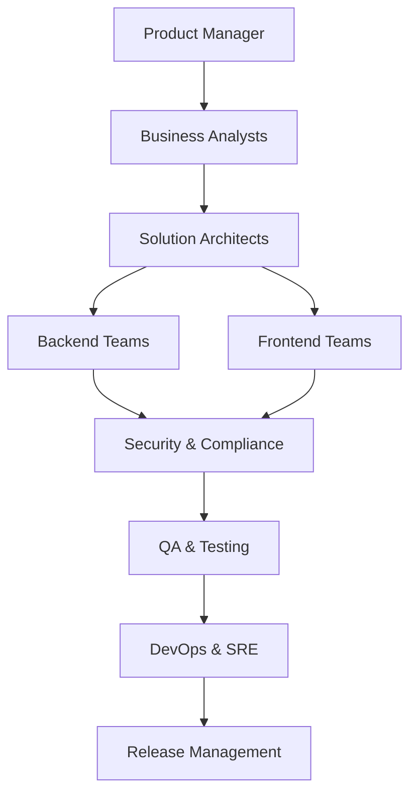
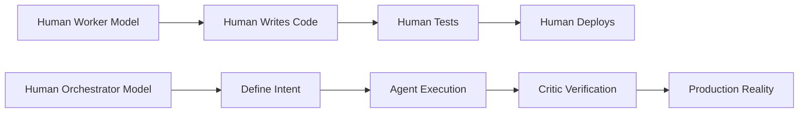
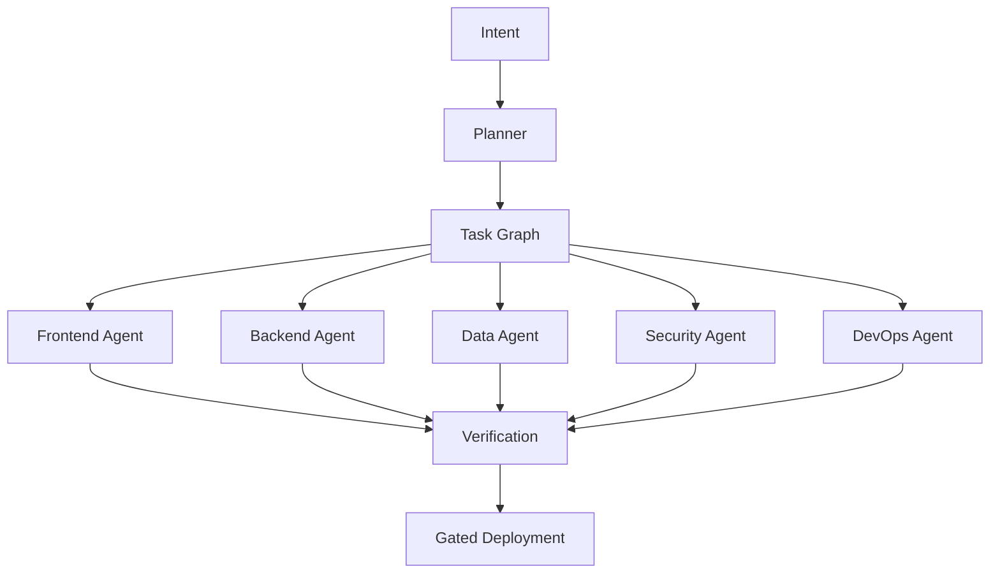
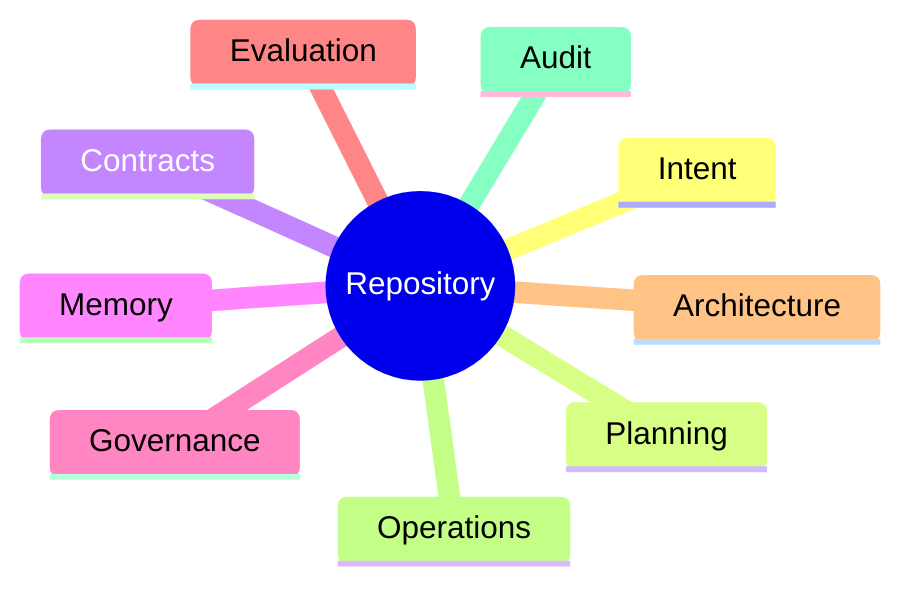
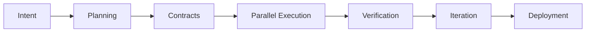
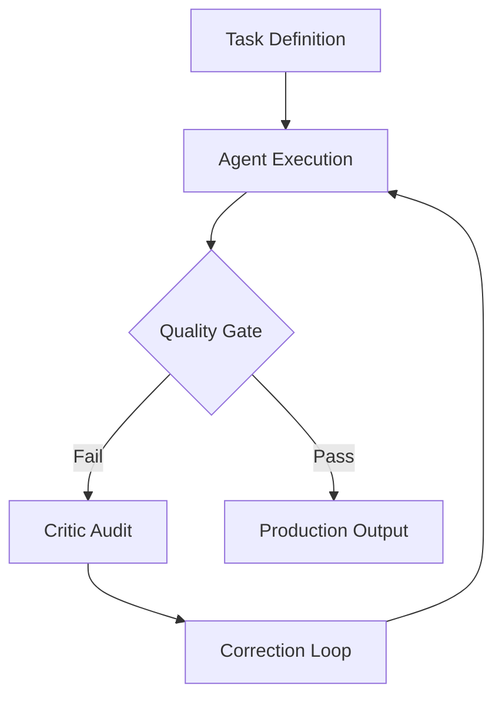
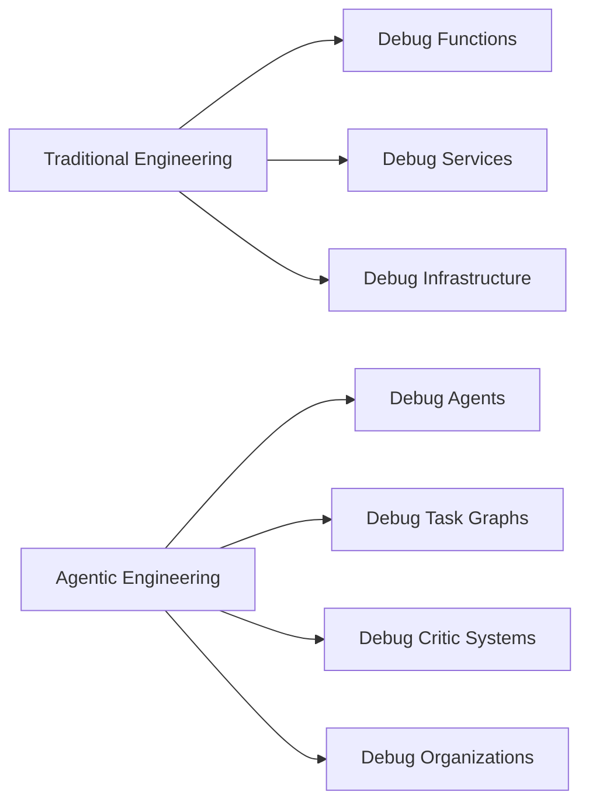
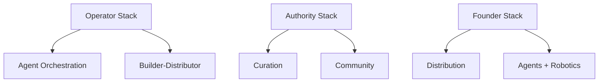

# The Architect's Renaissance: How AI Is Turning Elite Engineers into Architect-Solopreneurs

> *The defining question of software engineering is no longer:*
>
> **"How quickly can you write code?"**
>
> *It is now:*
>
> **"How effectively can you transform intent into verified reality?"**

---

# The End of the Headcount Era

For more than three decades, the software industry operated on a deceptively simple assumption:

> **Complex software requires large teams.**

If products became more ambitious, organizations hired more developers.

If projects became harder to coordinate, organizations hired managers.

If delivery slowed, organizations added processes.

If communication broke down, organizations added frameworks.

This assumption shaped the entire modern technology industry:

* Agile methodologies
* Scrum ceremonies
* Team Topologies
* Program Management Offices
* Enterprise Architecture Boards
* Release Management
* Governance Frameworks
* Matrix Organizations

For many years, this model appeared to work.

Until organizations encountered their greatest hidden cost.

> **The synchronization tax.**

The synchronization tax is the enormous overhead generated by:

* Communication
* Coordination
* Meetings
* Handoffs
* Context switching
* Approvals
* Organizational alignment
* Knowledge transfer

And unlike software systems, this cost rarely scales linearly.

As organizations grow, synchronization costs often compound faster than productive output.

This created a paradox.

The larger organizations became, the more energy they spent coordinating work instead of performing it.

We are now witnessing the first technological shift capable of attacking this problem at its root.

Not because artificial intelligence writes code.

But because artificial intelligence allows a single human to orchestrate what previously required entire organizations.

This is the beginning of what I call:

# The Architect's Renaissance

---

# The Silent Killer: The Synchronization Tax

Traditional software organizations assumed complexity required scale.

The resulting organization often looked like this:

Every arrow introduces hidden costs:

* Context loss
* Misinterpretation
* Waiting
* Political friction
* Approval bottlenecks
* Documentation drift
* Knowledge fragmentation
* Organizational latency

Large engineering organizations frequently spend more effort coordinating than creating.

Standups become status theater.

Meetings become dependency negotiations.

Documentation becomes historical fiction.

Critical organizational knowledge becomes trapped inside Slack threads and individual minds.

For decades, the software industry optimized software production while largely ignoring the cost of synchronizing humans.

Artificial intelligence changes this equation.

---

# The Great Inversion: Human as Orchestrator

The breakthrough of AI is not that machines can write code.

The breakthrough is that:

> **One human can now effectively lead an entire software organization.**

This represents a fundamental inversion of software engineering.

The human no longer acts primarily as a worker.

Instead, the human becomes:

* Vision setter
* Constraint engineer
* System architect
* Organizational designer
* Governance authority
* Verification authority
* Final decision maker

This is the transition from:

> **Human-as-Worker**

to

> **Human-as-Orchestrator**

The true disruption of artificial intelligence is not automation.

It is organizational compression.

---

# The Rise of the Architect-Solopreneur

The most powerful archetype emerging from this transition is the:

# Architect-Solopreneur

An Architect-Solopreneur is not a lone coder.

They are simultaneously:

* Product strategist
* Systems architect
* Organizational designer
* Workflow orchestrator
* Verification engineer
* Governance authority
* Long-term steward

They do not build every component.

They design the intelligent factory that builds the components.

Implementation becomes abundant.

Judgment becomes scarce.

And scarcity determines value.

This is why AI does not diminish elite engineers.

It amplifies them.

---

# The New Software Organization

The traditional organization chart begins to disappear.

Instead of managing people, architects increasingly orchestrate specialized agents.

A modern agentic organization might contain:

* Planner Agent
* Frontend Agent
* Backend Agent
* Data Agent
* Security Agent
* DevOps Agent
* Testing Agent
* Evaluation Agent
* Critic Agent

The organization itself becomes software.

Execution becomes:

* Parallel
* Observable
* Deterministic
* Repeatable
* Auditable

The repository itself transforms.

It is no longer merely source code.

It becomes:

* Architecture office
* Project management office
* Organizational memory
* Governance engine
* Operations manual
* Audit trail
* Verification system

The repository becomes the organization.

---

# A Canonical Agentic Workflow

The architect provides strategic intent and final judgment.

Agents perform decomposition, execution, verification, and iteration.

## Phase 1 — Intent Definition

The architect defines the system's purpose.

Core artifacts include:

### INTENT.md

Defines:

* Vision
* User stories
* Outcomes
* Success metrics
* Non-negotiables

### PROJECT_GOALS.yaml

Defines:

* Objectives
* KPIs
* Constraints
* Technology choices
* Scalability targets
* Compliance requirements

### TRADEOFFS.md

Documents:

* Architectural decisions
* Explicit compromises
* Accepted risks

### RISK_REGISTER.md

Identifies:

* Technical risks
* Business risks
* Market risks

These artifacts define the "why."

---

## Phase 2 — Planning and Decomposition

Planning agents produce:

* PLAN.md
* TASK_GRAPH.json
* DEPENDENCY_MAP.json
* ROADMAP.md
* Architecture Decision Records

The architect reviews and approves the plan.

---

## Phase 3 — Contract Definition

Contract agents generate:

* OpenAPI specifications
* AsyncAPI specifications
* Database schemas
* Event contracts
* Frontend contracts
* Infrastructure contracts

Contracts eliminate ambiguity.

---

## Phase 4 — Parallel Execution

Specialized agents execute simultaneously.

Frontend agents build interfaces.

Backend agents implement domain systems.

Data agents construct pipelines.

Security agents perform analysis.

DevOps agents generate infrastructure.

Implementation becomes massively parallel.

---

## Phase 5 — Verification

Independent agents validate:

* Tests
* Security
* Performance
* Accessibility
* Reliability
* Compliance

Most importantly:

# The Critic Agent

The critic becomes the most important agent in the organization.

The critic:

* Challenges assumptions
* Detects drift
* Rejects hallucinations
* Prevents self-certification
* Forces evidence-based reasoning

The competitive advantage of the future is not generation.

It is verification.

---

## Phase 6 — Iteration

Failures become feedback.

Feedback updates intent.

The organizational loop repeats.

---

## Phase 7 — Deployment and Stewardship

The system produces:

* Production infrastructure
* Dashboards
* Alerts
* Runbooks
* Operational documentation
* Handover artifacts

What once required months now happens in days.

Often with stronger governance and better documentation.

---

# The Human Challenge: Debugging Organizations

Agents are not magic.

They hallucinate.

They optimize incorrect objectives.

They reinforce bad assumptions.

They generate false confidence.

The architect therefore becomes something entirely new:

> An organizational systems engineer.

The architect debugs:

* Agent interactions
* Task graphs
* Evaluation pipelines
* Reasoning traces
* Feedback loops
* Governance systems
* Organizational memory

Software engineering evolves into organizational systems engineering.

---

# The Six Leverage Systems of the Agentic Era

The "Learn AI" era is over.

Value no longer comes from using artificial intelligence.

Value comes from orchestrating intelligence.

The competitive advantage of the next decade will not come from learning more tools.

It will come from building compounding systems of leverage.

## 1. AI Agent Orchestration: The Architect

The highest leverage skill of the next decade is agent management.

The future belongs to people who can design:

* Agent teams
* Critic systems
* Retry loops
* Escalation systems
* Governance frameworks
* Organizational memory

The competitive advantage is not producing answers.

It is rejecting bad ones.

---

## 2. Distribution Engineering: The Funnel Architect

Software becomes abundant.

Attention remains scarce.

The future belongs to those who can discover markets before building products.

Distribution becomes engineering.

---

## 3. Robotics: The Physical Pivot

The previous twenty years rewarded those who moved pixels.

The next twenty years will increasingly reward those who move atoms.

Reality remains the ultimate benchmark.

Physics remains the ultimate critic.

---

## 4. Curation: The Taste Layer

When information becomes infinite:

> Filtering becomes power.

The future belongs to people who can transform information into judgment.

Taste becomes infrastructure.

---

## 5. Builder-Distributor Loops: The Compression Engine

The distinction between builders and marketers collapses.

The future belongs to those who can:

* Build
* Ship
* Distribute
* Learn
* Iterate

Continuously.

---

## 6. IRL Community Design: The Trust Layer

As artificial intelligence scales infinitely:

> Trust becomes the scarcest resource.

Communities compound.

Relationships compound.

Trust compounds.

Human networks become increasingly valuable because they cannot be automated.

---

# Building Leverage Stacks

Do not attempt to master everything.

Stack complementary forms of leverage.

The future rewards operators who combine:

* Systems
* Judgment
* Distribution
* Trust
* Leverage

---

# Risk, Responsibility, and Hubris

Agentic systems amplify human judgment.

Including bad judgment.

Architects therefore own:

* Governance
* Safety
* Auditability
* Reversibility
* Escalation
* Accountability

The greatest danger is not AI failure.

It is human overconfidence.

Never confuse:

> Fluency with correctness.

Demand evidence.

Demand verification.

Demand criticism.

---

# The New Competitive Advantage

The defining question of the next decade is no longer:

> "How quickly can you implement?"

It is:

> "How effectively can you transform intent into verified reality?"

This requires mastery of:

* Architecture
* Constraint engineering
* Artifact design
* Agent orchestration
* Verification
* Observability
* Governance
* Organizational debugging

The highest-leverage engineer is no longer merely a developer.

They become the architect of intelligent organizations.

---

# The Architect's Renaissance

Artificial intelligence is not ending software engineering.

It is elevating it.

Large enterprises will continue to require human organizations.

But for the overwhelming majority of startups, products, internal platforms, and business systems:

> One skilled architect working with intelligent agents will outperform what previously required entire departments.

The solopreneur of 2026 is not a lone coder.

They are the architect of autonomous organizations.

They do not build software.

They build systems that build software.

They do not manage labor.

They orchestrate intelligence.

They do not optimize effort.

They optimize clarity, judgment, and leverage.

The synchronization tax is dying.

And what replaces it will reward those who can architect intent, orchestrate intelligence, and verify reality.

The age of the Architect-Solopreneur has only just begun.
