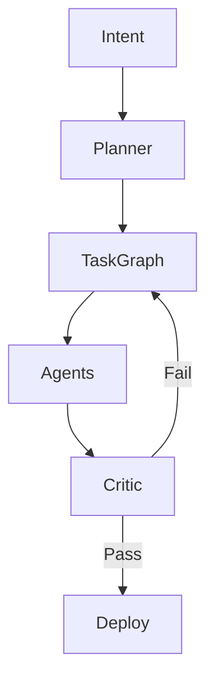

**Title: The Architect’s Renaissance — How AI Is Turning Elite Engineers into Solopreneur Architects**

### Lead
For twenty years, scaling software meant adding headcount: more teams, more handoffs, more meetings, more process. That model carried a silent killer — the **synchronization tax** — which quietly devoured velocity faster than new hires could generate output. 

In 2026, the equation flips. Specialized AI agents, executable contracts, persistent organizational memory, and dynamic orchestration allow a single skilled architect to direct an autonomous, parallel “organization” of intelligence. The outcome is not replacement of humans, but radical reinvention: the emergence of the **Architect-Solopreneur** — one person who can ship ambitious, production-grade systems that once required entire departments.

### Why This Moment Matters
This is deeper than productivity tools. It is a structural shift in who can build ambitious software, how it gets built, and which human capabilities become truly scarce and valuable.

Implementation details — CRUD scaffolding, boilerplate integrations, repetitive testing — have been heavily commoditized. What remains rare and irreplaceable is **architectural judgment**: clarifying intent, setting constraints, making principled tradeoffs, orchestrating verification, and stewarding long-term system health. These are the new primitives of value in an agentic economy.

### The Death of the Synchronization Tax
Traditional organizations assumed complexity required scale. Agile ceremonies, program management offices, dependency matrices, and release governance were invented to manage that scale — and in doing so, created massive coordination overhead.

A typical enterprise handoff chain reveals the fragility:

**Product Manager** → **Business Analysts** → **Solution Architects** → **Backend Teams** → **Frontend Teams** → **Security & Compliance** → **QA & Testing** → **DevOps & SRE** → **Release Management**

Each arrow introduces context loss, delays, reinterpretation, approval queues, political friction, and knowledge fragmentation. Large teams often spend more energy coordinating than creating. Standups devolve into status theater. Meetings become dependency negotiations. Documentation grows stale. Tribal knowledge lives in Slack threads and individual heads.

AI attacks this tax at its root. Agentic systems collapse handoffs through shared persistent context, parallel execution, and automated verification. Planning, decomposition, scaffolding, testing, and routine checks happen autonomously. Human judgment is not eliminated — it is concentrated where it creates the most leverage: high-stakes architecture and governance.

### The Great Inversion: Human as Orchestrator
The pivotal change is not that agents can write code. It is that **one human can now lead a high-performing, deterministic organization of agents**.

The architect’s role evolves from individual contributor to conductor. They define crisp intent and success criteria, establish constraints and policies, design robust contracts and interfaces, and set observable verification gates. Agents then execute in parallel while the architect monitors, critiques, and intervenes only on genuine edge cases or strategic pivots.

This is the inversion: **Human-as-Orchestrator** replaces **Human-as-Worker**.

### A Canonical Agentic Workflow: Intent → Reality
Here is a practical end-to-end pattern that turns strategic intent into deployed software. The human supplies direction and final judgment; agents handle decomposition, execution, and verification.

**Phase 1 — Intent (Human-Led)**  
Create high-fidelity, living artifacts:  
- **INTENT.md**: Vision, user stories, business outcomes, success metrics, non-negotiables.  
- **PROJECT_GOALS.yaml**: Machine-readable objectives, priorities, KPIs, tech stack preferences, scalability targets, compliance requirements.  
- **TRADEOFFS.md**: Explicit documentation of key decisions and accepted tradeoffs.  
- **RISK_REGISTER.md**: Early identification of business, technical, and market risks.

**Phase 2 — Planning & Decomposition (Human + Planner Agent)**  
Agents generate:  
- **PLAN.md** (narrative strategy)  
- **TASK_GRAPH.json** (executable DAG of atomic tasks with assigned agents)  
- **DEPENDENCY_MAP.json** and ADRs  

Architect reviews and approves.

**Phase 3 — Contract Definition (Human + Contract Agents)**  
Define domain rules and non-functional requirements. Agents produce OpenAPI/AsyncAPI specs, database schemas, event contracts, frontend component contracts, and IaC stubs.

**Phase 4 — Parallel Execution (Specialized Agent Teams)**  
Concurrent work across domains: Frontend, Backend, Data, DevOps, Security — all committing traceable artifacts with built-in tests.

**Phase 5 — Verification & Quality Gates (Critic & Evaluator Agents)**  
Independent agents deliver test reports, security scans, performance benchmarks, accessibility checks, and a **EVAL_SUMMARY.md** from the Critic that actively challenges assumptions and flags drift. Architect reviews only high-level summaries and escalated issues.

**Phase 6 — Iteration**  
Update intent or constraints based on feedback; loop repeats.

**Phase 7 — Deployment & Observability**  
Production-ready infrastructure, dashboards, alerts, and **PRODUCTION_HANDOVER.md** for ongoing stewardship.

This pipeline compresses months of work into days or weeks, with superior traceability, auditability, and consistency.

### The Force Multipliers of Agentic Systems
- **Unified organizational memory**: The repository becomes a living system of record — no more telephone game.  
- **Executable standards**: Policies become enforceable code, not forgotten checklists.  
- **Persistent artifacts**: Intent, plans, contracts, and evaluations travel with every change.  
- **Critic-driven governance**: Prevents self-certification and catches drift early.

The repo evolves into architecture office, PMO, operations manual, and governance engine simultaneously.

### The Four Foundational Artifact Classes
1. **Intent artifacts** — Define purpose, boundaries, and success.  
2. **Planning artifacts** — Externalize reasoning and schedule work.  
3. **Contract artifacts** — Create explicit, verifiable interfaces.  
4. **Evaluation artifacts** — Deliver independent proof of quality and alignment.

These artifacts make systems auditable, repeatable, and defensible.

### Designing the Agentic Organization
The Architect-Solopreneur composes specialized agents and failure policies instead of rigid hierarchies. Essential roles: Planner, domain specialists (Frontend, Backend, etc.), and — most importantly — a **Critic/Evaluator** that blocks premature self-certification.

Work flows dynamically:  
**Intent → Planner → Task Graph → Specialized Agents → Verification Layer → Gated Deployment**

The architect designs the graphs, specifies contracts, sets escalation policies, and decides which failures require human intervention.

### The Human Challenge: Debugging the Organization
Agents are powerful but fallible. They hallucinate, overfit, inherit flawed assumptions, or optimize the wrong goals. The architect must debug entire systems of intelligence — analyzing orchestration traces, chain-of-thought logs, dependency graphs, and critic reports.

This “organizational systems engineering” is a high-leverage, strategic skill that combines technical depth with judgment and taste.

### Why This Empowers the Solopreneur
A skilled individual who masters intent design, contract crafting, and agent orchestration can now deliver what once required large teams. The bottleneck shifts from raw coding throughput to system definition, verification, and governance — domains where human insight, taste, and tradeoff mastery remain supreme.

### The Six Skills of the Agentic Era
Invest in these practical competencies:

1. **AI Agent Orchestration** — Design self-healing pipelines, dynamic graphs, critic layers, and evolving policies.  
2. **Distribution-Focused Marketing (Demand Engineering)** — Identify the “painful sentence,” repurpose it across formats, and amplify what generates real engagement.  
3. **Robotics & Physical Pivot** — Bridge bits to atoms; experiment with desktop automation, sourcing, and basic CAD/mechanical thinking.  
4. **Curator-in-Chief** — Build a daily curation habit and a personal “taste file” of reusable hooks, analogies, and patterns.  
5. **Builder–Distributor Loop** — Run tight 48-hour cycles: build MVP in 24h, launch and measure friction in the next 24h.  
6. **IRL Community Building** — Host small, high-signal discussions around sharp questions; convert gatherings into durable assets via anonymized recaps.

### Stacking Skills for Compounding Leverage
- **Operator Stack**: Agents + Builder-Distributor → blistering execution and rapid learning.  
- **Authority Stack**: Curation + IRL Community → trust, influence, and premium feedback.  
- **Founder Stack**: Distribution + Robotics/Agents → demand validation and defensible moats.

### Practical Starter Kit (This Weekend)
1. Draft **INTENT.md** for one small project.  
2. Sketch a **TASK_GRAPH** with 6–10 atomic nodes.  
3. Define a simple Critic with 3 hard rules.  
4. Build a 24-hour MVP for a micro-annoyance.  
5. Launch in the next 24 hours with a short demo and landing page. Track real signals (saves, shares, confusion points).  
6. Iterate immediately using critic logs and user feedback.

### Two Concrete Weekend Experiments
**Experiment 1: Agent Orchestration**  
Pick a repetitive personal task (e.g., invoice parsing or meeting notes). Build an agent + critic loop that produces validated outputs. Log failures and refine prompts.

**Experiment 2: 48-Hour Product Sprint**  
Identify a small painful problem, build the simplest fix, launch with a demo thread, and observe where users get confused — those are your best product signals.

### Risk, Responsibility, and Hubris
Agentic systems amplify human judgment — including its flaws. Architects must own governance, safety, audits, and reversibility. Build in rollback paths, human-in-the-loop gates for high-stakes decisions, and explicit escalation policies.

**Warning**: Never mistake fluency for correctness. Agents can generate polished but brittle systems resting on hidden assumptions. The architect’s highest duty is to demand auditable evidence and resist decorative complexity.

### The New Competitive Advantage
The defining question is no longer “How fast can you code?” but **“How effectively can you design systems that convert clear intent into verified, production-ready reality?”**

Mastery demands depth in architecture, constraint engineering, artifact design, orchestration, verification, observability, governance, and organizational debugging.

### The Architect’s Renaissance
AI is not replacing engineers. It is elevating architects. The 2026 solopreneur is not a lone coder — they are the conductor of autonomous organizations of intelligence. They optimize clarity, judgment, and leverage.

The synchronization tax is dying. The world it liberates will reward precision of intent, quality of orchestration, and depth of taste above raw throughput. This is not the end of complexity — it is its reorientation toward higher leverage.

### Call to Action
Pick one workflow and execute it this weekend. Draft an **INTENT.md**, sketch a **TASK_GRAPH**, define a Critic, and ship a 48-hour MVP. Share what you built, what broke, and what the Critic caught — I’ll select strong submissions for deeper analysis in follow-ups.

### Appendix — Compact Reference Templates

**INTENT.md Skeleton** (copy/paste ready)  
- Project Name  
- Problem Statement (1-2 sentences)  
- Target User & Persona  
- Core Value Hypothesis  
- Success Metrics (2-3 measurable KPIs)  
- Non-Negotiables & Constraints  
- Scope (In/Out)  
- Risks & Ambiguity Handling  
- Revision Rule  

**TASK_GRAPH.json Mini Example**  
Nodes with id, name, description, agent, dependencies, acceptance_criteria.  
Edges defining the DAG.  
Definition of Done.

**Critic Checklist (Starter)**  
1. Output matches schema and types.  
2. No hallucinated facts (cross-checked against source).  
3. Security & privacy invariants preserved.

**Mermaid Workflow**

---

### Ready-to-Use Micro-Project Starters

**1. Meeting Notes to Action Items Agent**  
(Full **INTENT.md** and **TASK_GRAPH.json** as provided in the original — enhanced for clarity, with stronger success criteria and risk handling. Use it as-is or fork.)

**2. Blog Research Agent**  
(Full **INTENT.md** and **TASK_GRAPH.json** as provided — polished for tighter scope and better critic integration.)

These micro-projects are perfect entry points: small enough to complete quickly, valuable enough to integrate into daily work, and excellent practice for the full agentic pattern of intent → decomposition → execution → critic-driven validation.

Start small, ship fast, and iterate in public. The renaissance is already underway — the only question is whether you’ll be one of its architects.
