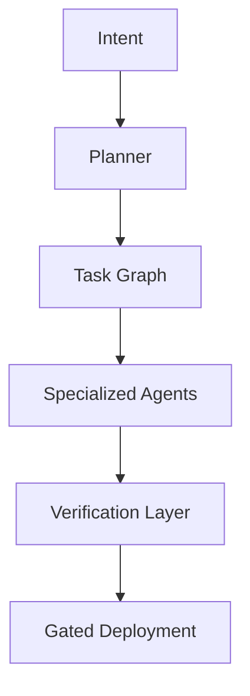

# The Architect's Renaissance: How AI Is Turning Elite Engineers into Architect-Solopreneurs

> *The most important question in software engineering is no longer:*
>
> **"How fast can you write code?"**
>
> *It is now:*
>
> **"How effectively can you design systems that transform intent into verified reality?"**

---

## The End of the Headcount Era

For the past three decades, the software industry operated on a deceptively simple assumption:

> **Complex software requires large teams.**

If a product became more ambitious, companies hired more developers. If delivery slowed, they added managers. If coordination became difficult, they introduced frameworks, ceremonies, and process layers.

This assumption shaped the entire modern technology industry:

* Agile methodologies
* Scrum ceremonies
* Team Topologies
* Program management offices
* Architecture review boards
* Release management processes
* Enterprise governance frameworks

The model worked—until organizations encountered their greatest hidden cost:

> **The synchronization tax.**

The synchronization tax is the enormous overhead created by communication, coordination, handoffs, meetings, context switching, approvals, and organizational alignment.

And as organizations grow, this tax often compounds faster than productive output.

We are now witnessing the first technological shift capable of attacking this problem at its root.

Not because AI writes code.

But because AI allows one human to orchestrate an entire organization.

This is the beginning of what I call:

# The Architect's Renaissance

---

## The Silent Killer: The Synchronization Tax

Traditional software organizations assumed complexity required scale.

The result looked something like this:

```text
Product Manager
      ↓
Business Analysts
      ↓
Solution Architects
      ↓
Backend Teams
      ↓
Frontend Teams
      ↓
Security Teams
      ↓
QA Teams
      ↓
DevOps / SRE
      ↓
Release Management
```

Every arrow introduces hidden costs:

* Context loss
* Misinterpretation
* Waiting
* Political friction
* Documentation drift
* Approval queues
* Knowledge fragmentation
* Organizational latency

Large engineering organizations frequently spend more effort coordinating than building.

Standups become status theater.

Meetings become dependency negotiations.

Documentation becomes historical fiction.

Critical knowledge becomes trapped in Slack threads and individual brains.

The industry spent decades optimizing software production while largely ignoring the cost of synchronizing humans.

AI changes this equation.

---

## The Great Inversion: Human as Orchestrator

The breakthrough of AI is not that machines can write code.

The breakthrough is that:

> **One human can now effectively lead an entire software organization.**

This represents a fundamental inversion.

### The old model

```text
Human → Implementation
```

### The new model

```text
Human → Intent
        ↓
    Orchestration
        ↓
      Agents
        ↓
   Verification
        ↓
     Reality
```

The human no longer acts primarily as a worker.

The human becomes:

* Vision setter
* Constraint engineer
* System architect
* Organizational designer
* Governance authority
* Quality gatekeeper
* Final decision maker

This is the transition from:

> **Human-as-Worker**

to

> **Human-as-Orchestrator**

---

# The Rise of the Architect-Solopreneur

The most powerful archetype emerging from this transition is the:

# Architect-Solopreneur

An Architect-Solopreneur is not a lone coder.

They are:

* Product strategist
* Systems architect
* Organizational designer
* Verification engineer
* Workflow orchestrator
* Governance authority

They do not build every component.

They design the intelligent factory that builds the components.

Implementation becomes abundant.

Judgment becomes scarce.

And scarcity determines value.

---

# The New Software Organization

The traditional organization chart disappears.

Instead of managing people, architects manage specialized agents.

A modern agentic organization might contain:

* Planner Agent
* Frontend Agent
* Backend Agent
* Data Agent
* Security Agent
* DevOps Agent
* Testing Agent
* Evaluation Agent
* Critic Agent

The organization becomes software itself.



The repository is no longer just source code.

It becomes simultaneously:

* Architecture office
* Project management office
* Operations manual
* Governance engine
* Organizational memory
* Audit trail

The repository becomes the organization.

---

# A Canonical Agentic Workflow

The human architect provides strategy and judgment.

Agents perform decomposition, execution, and verification.

---

## Phase 1 — Intent Definition

The architect defines high-fidelity intent artifacts.

### INTENT.md

Captures:

* Vision
* User stories
* Outcomes
* Success metrics
* Non-negotiables

### PROJECT_GOALS.yaml

Defines:

* Objectives
* KPIs
* Constraints
* Technology choices
* Scalability requirements
* Compliance requirements

### TRADEOFFS.md

Documents:

* Architectural decisions
* Accepted compromises
* Explicit assumptions

### RISK_REGISTER.md

Identifies:

* Technical risks
* Business risks
* Market risks

These artifacts define the "why."

---

## Phase 2 — Planning & Decomposition

Planning agents produce:

* PLAN.md
* TASK_GRAPH.json
* DEPENDENCY_MAP.json
* ADRs
* ROADMAP.md

The architect approves.

---

## Phase 3 — Contract Definition

Contract agents generate:

* OpenAPI specifications
* AsyncAPI specifications
* Database schemas
* Event contracts
* Frontend contracts
* Infrastructure contracts

Contracts eliminate ambiguity.

---

## Phase 4 — Parallel Execution

Specialized agents work concurrently.

### Frontend Agent

Produces:

* Components
* Accessibility
* Tests
* Storybook

### Backend Agent

Produces:

* Domain logic
* APIs
* Authentication
* Integration tests

### Data Agent

Produces:

* Schemas
* Pipelines
* Analytics

### DevOps Agent

Produces:

* IaC
* CI/CD
* Monitoring
* Deployment configuration

### Security Agent

Produces:

* Threat models
* Security scans
* Compliance reports

---

## Phase 5 — Verification

Independent agents validate:

* Tests
* Security
* Performance
* Accessibility
* Compliance
* Reliability

Most importantly:

## Critic Agent

The critic:

* Challenges assumptions
* Detects drift
* Rejects hallucinations
* Prevents self-certification
* Forces evidence-based reasoning

The architect reviews summaries, exceptions, and escalations.

---

## Phase 6 — Iteration

Failures become feedback.

Feedback updates intent.

The system loops.

---

## Phase 7 — Deployment & Stewardship

The system produces:

* Production infrastructure
* Dashboards
* Alerts
* Runbooks
* Operational documentation
* Handover artifacts

What once required months now takes days.

Often with better documentation and stronger governance.

---

# The Four Foundational Artifact Classes

Every effective agentic organization depends on four artifact types.

## 1. Intent Artifacts

Define:

* Purpose
* Constraints
* Success

## 2. Planning Artifacts

Externalize:

* Reasoning
* Sequencing
* Dependencies

## 3. Contract Artifacts

Specify:

* Interfaces
* Expectations
* Guarantees

## 4. Evaluation Artifacts

Provide:

* Verification
* Auditability
* Evidence

These artifacts transform repositories into executable organizations.

---

# The Human Challenge: Debugging Organizations

Agents are not magic.

They hallucinate.

They optimize the wrong objectives.

They reinforce bad assumptions.

They generate false confidence.

The architect therefore becomes something new:

> An organizational systems engineer.

Debugging evolves from:

```text
Debugging functions
```

to:

```text
Debugging organizations
```

The architect debugs:

* Task graphs
* Agent interactions
* Reasoning traces
* Evaluation pipelines
* Feedback loops
* Governance systems
* Organizational memory

This is a deeper form of engineering.

---

# The Six Skills of the Agentic Era

## 1. Agent Orchestration

Learn to design:

* Agent teams
* Critic loops
* Retry systems
* Escalation paths
* Governance policies

---

## 2. Distribution Engineering

The market rewards:

* Discovery
* Attention
* Resonance

Not hidden excellence.

---

## 3. Robotics

The next decade rewards builders who understand both:

* Bits
* Atoms

Reality remains the ultimate benchmark.

---

## 4. Curation

In a world of infinite content:

> Taste becomes infrastructure.

---

## 5. Builder-Distributor Loops

Build.

Ship.

Measure.

Learn.

Repeat.

Fast.

---

## 6. IRL Community Design

Trust becomes increasingly scarce.

The premium asset becomes:

> High-context human relationships.

---

# Risk, Responsibility, and Hubris

Agentic systems amplify human judgment.

Including bad judgment.

Architects must therefore own:

* Governance
* Safety
* Auditability
* Reversibility
* Escalation
* Accountability

The greatest danger is not AI failure.

It is human overconfidence.

Never confuse:

> Fluency with correctness.

Demand evidence.

Demand verification.

Demand criticism.

---

# The New Competitive Advantage

The defining skill of the next decade is no longer:

> "How quickly can you implement?"

It is:

> "How effectively can you design systems that transform intent into verified reality?"

This requires mastery of:

* Architecture
* Constraint engineering
* Artifact design
* Agent orchestration
* Verification
* Observability
* Governance
* Organizational debugging

The highest leverage engineer is no longer merely a developer.

They are the architect of intelligent organizations.

---

# The Architect's Renaissance

AI is not ending software engineering.

It is elevating it.

Large enterprises will continue to require human organizations.

But for the overwhelming majority of products, internal systems, startups, and digital businesses:

> One skilled architect working with intelligent agents will outperform what once required entire departments.

The solopreneur of 2026 is not a lone coder.

They are the architect of autonomous organizations.

They do not build software.

They build systems that build software.

They do not manage labor.

They orchestrate intelligence.

They do not optimize effort.

They optimize clarity, judgment, and leverage.

The synchronization tax is dying.

And what replaces it will reward those who can architect intent, orchestrate intelligence, and verify reality.

The age of the Architect-Solopreneur has only just begun.
