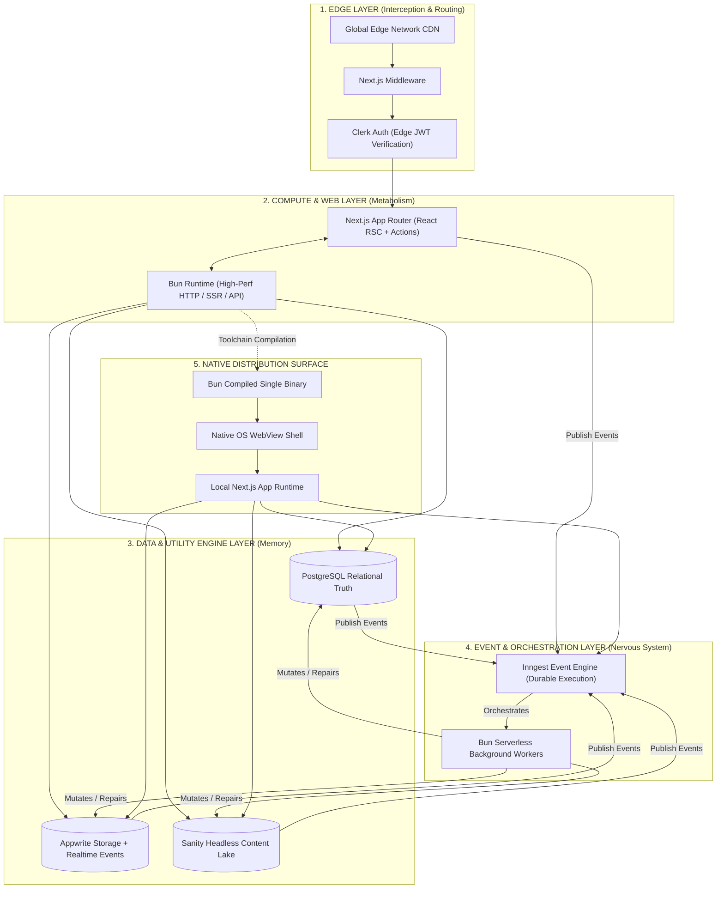
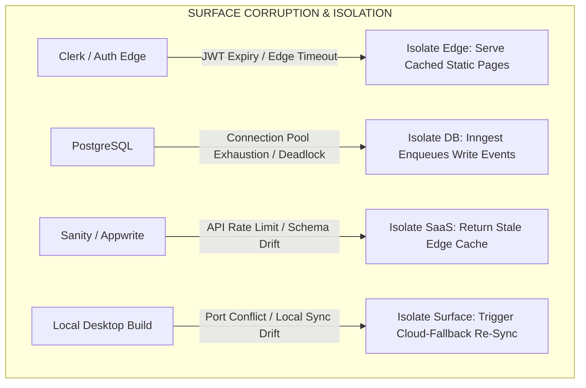
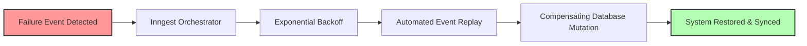

# 🧭 The Multi-Surface Runtime Architecture

## Core Manifesto

Choosing a tech stack is not an exercise in collecting trendy tools; it is an exercise in designing long-term technical identity. Every engineering stack carries an inherent structural gravity. It alters how you approach system boundaries, dictates the operational friction you choose to solve repeatedly, and shapes your evolution as a software architect.

This architecture moves away from fragmented microservices and over-engineered abstractions. Instead, it establishes a unified, type-safe, multi-surface execution system. The same foundational logic runs seamlessly across the browser, edge networks, serverless cloud workers, and native desktop runtimes without requiring code-forking or architectural divergence.

---

## 🌐 System Topology & Operational Layers

The system is organized into five tightly coupled functional zones. Rather than behaving as static layers stacked on top of one another, they form a reactive loop coordinated entirely by asynchronous event pipelines.



### Layer Responsibilities

* **Edge Layer:** Handles lightning-fast routing, geolocated asset optimization, request interception, and cryptographically sound edge-side JSON Web Token (JWT) verification via Clerk.
* **Compute & Web Layer:** Manages user interface composition, React Server Components (RSC) execution, state hydration, and high-throughput server-side rendering (SSR) driven natively by the Bun runtime.
* **Data & Utility Engine Layer:** Acts as the decentralized memory of the system. Relational schemas live within Postgres; blobs, file configurations, and real-time client sync are offloaded to Appwrite; fluid, dynamic market copy and content schemas live within the Sanity Content Lake.
* **Event & Orchestration Layer:** The nervous system. It decouples long-running business logic from request-response cycles. Inngest manages event-driven step functions, ensuring that complex multi-service workflows execute reliably.
* **Native Distribution Surface:** Uses Bun's compilation engine to package the web asset ecosystem directly into a single self-contained, native OS binary executing over local system shells.

---

## 🛠️ Deep Component Breakdown

### 1. Bun Runtime & Desktop Distribution Bridge

Node.js is completely stripped from the pipeline. Bun functions not only as a rapid development runtime and package manager but also as a native distribution build engine.

```
       [Next.js Production App Codebase]
                      │
                      ▼
         ( bun build --compile --outfile )
                      │
                      ▼
        [Self-Contained Executable Binary]
                      │
                      ▼
 ┌────────────────────┴────────────────────┐
 │  • Spawns Local HTTP App Server         │
 │  • Mounts Native OS WebView Shell       │
 │  • Connects to Local/Cloud Data Sync    │
 └─────────────────────────────────────────┘

```

* **Zero-Overhead Desktop Packaging:** Instead of pulling in a heavy Chromium/Electron wrapper or configuring a complex Rust-first Tauri setup, you use Bun to compile your entire TypeScript backend and Next.js static output directly into a single binary.
* **Unified Tooling OS:** A single toolchain manages native execution, zero-config TypeScript compilation, instant bundling, and high-performance server plumbing via `Bun.serve()`.

### 2. Inngest: Asynchronous Coordination & Durable Execution

Traditional message brokers require massive infrastructure overhead and constant maintenance. Inngest flips this by acting as a serverless event engine that invokes background logic via standard HTTP webhooks, introducing bulletproof durability into standard application code.

* **State-Driven Step Functions:** Complex multi-step behaviors—like an onboarding sequence that involves charging a card, provisioning an Appwrite storage bucket, and updating a Postgres record—are handled as single transactional workflows.
* **Eliminating Timers & Cron Frustration:** Long delays, event scheduling, and user-behavior wait cycles are written natively in code using `step.sleep()` or `step.waitForEvent()`, eliminating brittle custom state checking scripts.

---

## 💥 Resiliency Architecture: The Failure & Recovery Blueprint

Most engineering diagrams assume a perfect network environment. This system is architected under the direct assumption that things will crash, third-party APIs will time out, and database connections will face exhaustion.

### Isolated Failure Vectors



### Self-Healing Lifecycle

When a service boundary experiences a failure, the system transitions from a synchronous request-response flow to an automated, event-driven reconciliation pipeline managed by Inngest.



```typescript
// Example of a self-healing, durable transaction workflow
export const orchestrateUserOnboarding = inngest.createFunction(
  { id: "user-onboarding-flow", retries: 5 }, // Automatic exponential backoff
  { event: "app/user.signup" },
  async ({ event, step }) => {
    // Step 1: Write core transactional data to Postgres
    const userId = await step.run("mutate-postgres-records", async () => {
      return await db.users.create({ data: event.data });
    });

    // Step 2: Provision cloud storage structures with failure isolation
    await step.run("provision-appwrite-infrastructure", async () => {
      return await appwrite.storage.createBucket(userId, "user-vault");
    });

    // Step 3: Trigger a dynamic CMS layout instantiation
    await step.run("generate-sanity-editor-profile", async () => {
      return await sanity.client.create({ _type: "author", id: userId });
    });
  }
);

```

---

## 🚀 Commercial Multipliers: Productizing the System

This stack scales effortlessly across two distinct business vectors, giving you clear pathways to turn architectural mastery into profitable, repeatable products.

### Strategic Comparison

| Operational Metric | Path A: The Content & Conversion Architect | Path B: The Systems & Operations Engineer |
| --- | --- | --- |
| **Architectural Gravity** | Focuses on user perception, raw rendering speeds, search engine dominance, and content velocity. | Focuses on transactional integrity, granular authorization, background job durability, and system correctness. |
| **Primary Structural Tech** | `TypeScript` + `React` + `Next.js` + `Sanity` + `Bun` | `TypeScript` + `React` + `Next.js` + `Appwrite` + `Postgres` + `Inngest` + `Bun` |
| **High-Leverage Productization** | **Premium Starter Shells & Programmatic SEO Engines:** Bundling blazing fast Next.js setups with pre-modeled, ultra-intuitive Sanity editorial schemas targeted directly at high-value niches. | **Micro-SaaS Blueprints & Custom "Agency OS" Portals:** Building white-label client platforms, booking infrastructure, and automated workflow dashboards that pull legacy teams out of spreadsheet chaos. |
| **Value Proposition** | Directly acts as a revenue acceleration lever by maximizing conversion rates and page speed performance. | Eliminates human error and lowers business overhead by providing ironclad multi-tenant security and zero-downtime automation. |

---

## 🧭 Final Reflection

Modern software engineering is not about selecting popular tools; it is about writing predictable, resilient execution pathways. By unifying **Next.js** for representation, **Bun** for execution and standalone compilation, **PostgreSQL** for relational structure, **Appwrite** and **Sanity** for utility and content pools, and **Inngest** for background durability, you create an adaptive digital organism.

The system stops feeling like a loose collection of cloud dependencies. It becomes a portable, self-healing runtime that can be deployed across the web, forced down to the edge, or compiled cleanly into an offline-ready desktop binary—scaling endlessly while keeping development overhead practically at zero.
