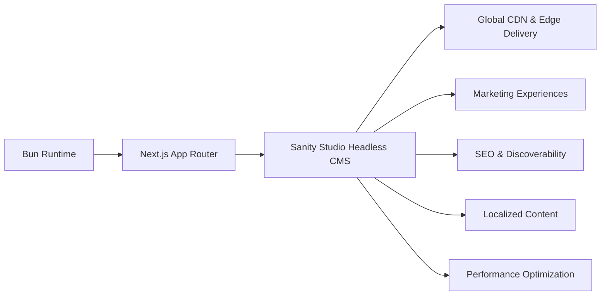
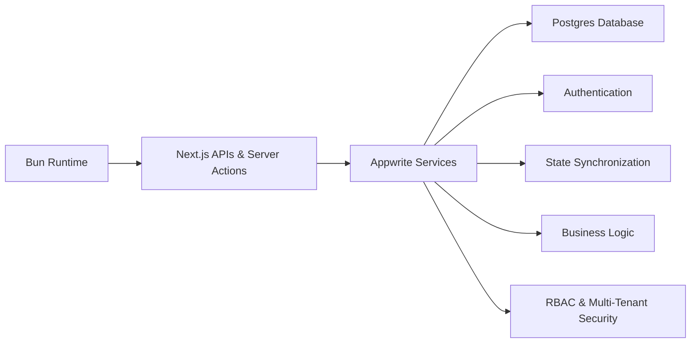
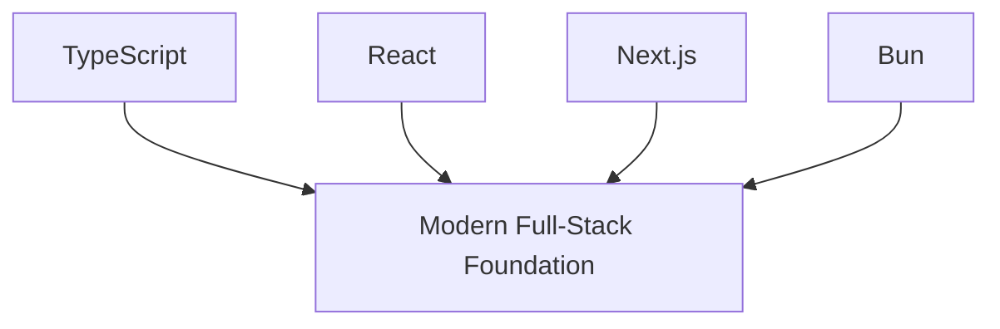
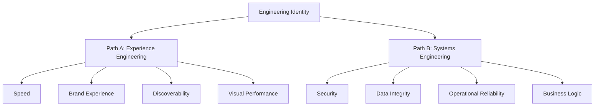

# The Architecture of Choice: Mapping Where My Tech Stack Actually Takes Me

When I committed to a modern engineering stack—**TypeScript, React, Next.js, Appwrite, Postgres, Sanity, and Bun**—I wasn’t just choosing tools. I was choosing a direction.

Every stack carries a bias. It shapes the systems I build, the problems I solve daily, the clients I attract, and eventually the kind of engineer I become. Stacks are not neutral; they quietly pull engineers toward certain industries, workflows, economic models, and technical identities.

When I step back far enough, I can see my stack leading toward two very different trajectories, paired with specific operational blueprints to productize these skills.

---

# Path A: The Content & Conversion Architect

## Marketing Platforms, Media Systems, and Digital Experience Engineering

This path lives at the intersection of engineering, design, and marketing. It is where performance meets storytelling, rendering strategy becomes business strategy, and milliseconds influence conversion rates. Instead of building internal operational systems, the focus is on external-facing digital surfaces.

### Core Stack & System Flow

`TypeScript` + `React` + `Next.js` + `Sanity` + `Bun`

### Daily Engineering Problems

* **Performance Engineering:** Optimizing Core Web Vitals, minimizing hydration cost, reducing rendering overhead, and maintaining near-perfect Lighthouse scores.
* **Content Architecture:** Designing scalable, editor-friendly schemas and reusable content structures that prevent layout breakage from non-technical edits.
* **Rendering Strategy:** Navigating the trade-offs between static generation (SSG), server rendering (SSR), Incremental Static Regeneration (ISR), and edge delivery for speed and caching.
* **Globalization & Scale:** Implementing locale-aware routing, regional content delivery, and multilingual workflows.

### Long-Term Trajectory & Economic Model

* **Target Roles:** Headless CMS Architect, Lead Frontend Engineer, Jamstack Specialist, Digital Experience Engineer.
* **Business Impact:** Engineering becomes a revenue lever. A faster page load improves acquisition; a cleaner content model accelerates marketing execution.
* **Revenue Streams:** High-ticket enterprise rebrands, SEO/performance consulting, boutique frontend agencies, or growth engineering consulting.

---

## Path A Multipliers: Turning Experiences into Products

### Multiplier 1: Productized Starter Sites & Niche Schemas

Stop selling custom hours from scratch. Build 3–4 highly polished, niche-specific landing page and blog templates hooked into a reusable Sanity schema layout.

* **The Play:** Target high-value independent niches (e.g., specialized consultants, boutique agencies, medical clinics). Sell these as premium "Starter Sites" for $800–$2,000.
* **Value Proposition:** The client gets an enterprise-grade, lightning-fast site live within 48 hours; you deploy a pre-built codebase.

### Multiplier 2: SEO & Content Arbitrage Packages

Leverage the extreme speed of Next.js combined with ISR/SSG to outrank slow, legacy WordPress sites.

* **The Play:** Move away from selling "just a website" and sell growth. Package an optimized Next.js frontend with a structured Sanity instance pre-configured for programmatic SEO. Offer an "SEO Site + 30 Blog Posts" bundle.
* **Value Proposition:** Clients pay a premium because they see tangible traffic and lead generation velocity, turning the frontend stack into an infrastructure asset for growth.

---

# Path B: The Systems & Operations Engineer

## SaaS Platforms, Business Systems, and Application Infrastructure

This path shifts the center of gravity away from presentation and toward systems. The question is no longer *“How does this experience feel?”* but *“How does this system behave under pressure?”* The focus becomes workflows, permissions, transactional integrity, operational reliability, and deep business logic.

### Core Stack & System Flow

`TypeScript` + `React` + `Next.js` + `Appwrite` + `Postgres` + `Bun`

### Daily Engineering Problems

* **Database Engineering:** Relational schema modeling, indexing strategy, query optimization, transaction safety, and migration management.
* **Distributed State Complexity:** Synchronizing state boundaries across frontend layers, server components, backend services, and real-time updates.
* **Security Engineering:** Hardening Role-Based Access Control (RBAC), multi-tenant isolation, permission inheritance, and comprehensive audit logging.
* **Reliability Engineering:** Mitigating race conditions, handling database rollbacks, managing concurrency conflicts, and orchestrating background jobs.

### Long-Term Trajectory & Economic Model

* **Target Roles:** Full-Stack Product Engineer, Backend-Oriented Architect, SaaS Systems Engineer.
* **Business Impact:** These systems automate critical operations and reduce overhead. Reliability and data correctness become product features; if they fail, the business stops moving.
* **Revenue Streams:** Internal dashboards, CRM/ERP platforms, B2B SaaS applications, long-term implementation contracts, and high-retainer infrastructure partnerships.

---

## Path B Multipliers: Building High-Leverage Systems

### Multiplier 1: Micro-SaaS Templates & White-Label Dashboards

Use your stack to bypass months of backend configuration and ship software infrastructure quickly.

* **The Play:** Build reusable application foundations—such as a client portal, booking engine, or internal CRM shell. Appwrite handles auth, storage, and webhooks instantly, while Postgres manages complex relational data.
* **Value Proposition:** License these templates to local businesses or white-label them for marketing agencies who need client portals but lack an in-house engineering team. Charge a monthly recurring fee ($49–$199/mo) for maintenance and hosting.

### Multiplier 2: Internal Tools & "Agency OS"

Most operations-heavy businesses run on a fragile mix of Notion, Google Sheets, and operational chaos.

* **The Play:** Use Path B mechanics to build specialized operations dashboards and project-tracking tools in a fraction of the usual development time.
* **Value Proposition:** Sell these solutions to agencies and startups as an "Agency OS." Because the business relies on this system for daily workflows, retaining them on long-term infrastructure and optimization contracts becomes straightforward.

---

# The Shared Foundation

What makes this dual-trajectory powerful is that both paths sit on the exact same foundational baseline.

These technologies form the modern operating system of web engineering. The divergence happens entirely in the surrounding architecture:

* **Sanity** pulls the stack toward publishing, content modeling, and digital experiences.
* **Appwrite + Postgres** pull it toward workflows, state management, and operational systems.

Same foundation. Different gravity.

---

# The Real Difference

This is not a simple frontend-versus-backend division. It is a conscious choice about the category of friction an engineer wants to solve repeatedly for years.

## Strategy Cross-Comparison

| Metric | Path A: Experience Architect | Path B: Systems Engineer |
| --- | --- | --- |
| **Core Optimization** | Perception, speed, discoverability, engagement. | Correctness, uptime, security, stability. |
| **Primary Tooling** | Next.js, Sanity, Global CDNs, Tailwind. | Next.js APIs, Appwrite, Postgres, RBAC. |
| **Value Lever** | Direct revenue growth, conversion, brand scale. | Operational efficiency, risk reduction, stability. |
| **Monetization Mode** | Productized templates, high-ticket rebrands, SEO. | Micro-SaaS, retainers, internal custom tooling. |

Ultimately, architectural choices stop being purely technical decisions. They define workflow, perspective, and engineering identity.

