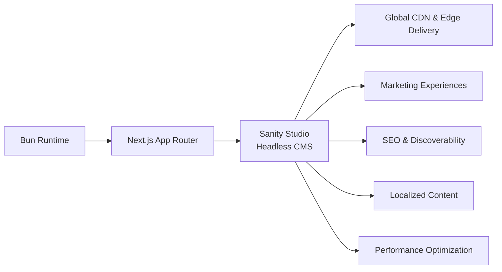
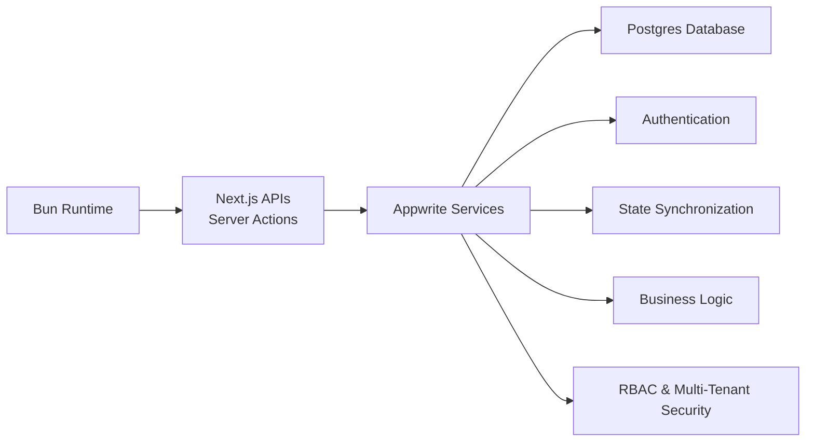
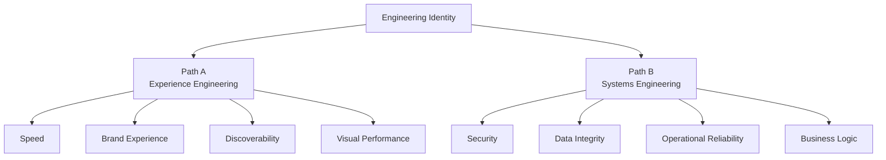
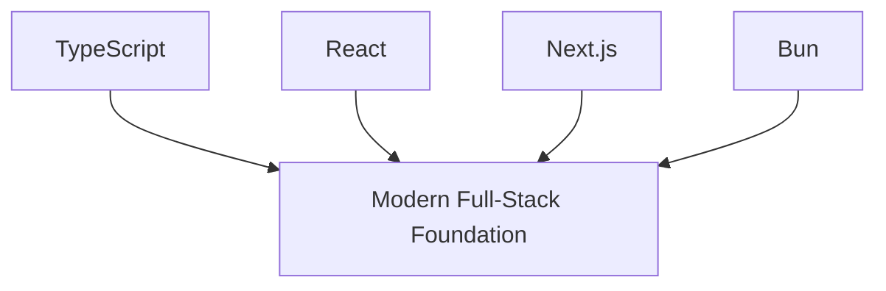

# The Architecture of Choice: Mapping Where My Tech Stack Actually Takes Me

When I committed to a modern engineering stack—**TypeScript, React, Next.js, Appwrite, Postgres, Sanity, and Bun**—I wasn’t just choosing tools.

I was choosing a direction.

Every stack carries a bias.
It shapes the systems I build, the problems I solve daily, the clients I attract, and eventually the kind of engineer I become.

The real question was never:

> “What should I build next?”

It was:

> “What am I training myself to become over time?”

Because stacks are not neutral.
They quietly pull engineers toward certain industries, workflows, economic models, and technical identities.

And when I step back far enough, I can see my stack leading toward two very different trajectories.

---

# Path A: The Content & Conversion Architect

## Marketing Platforms, Media Systems, and Digital Experience Engineering

### Core Stack

`TypeScript` + `React` + `Next.js` + `Sanity` + `Bun`

This path lives at the intersection of engineering, design, and marketing.

It is where performance meets storytelling.
Where rendering strategy becomes business strategy.
Where milliseconds influence conversion rates.

Instead of building internal operational systems, I focus on digital surfaces:

* websites
* landing pages
* publishing platforms
* multi-region content ecosystems

The work is external-facing. Public. Visible.

I’m engineering how a business presents itself to the world.

## Long-Term Direction

Over time, this path naturally evolves toward roles like:

* Headless CMS Architect
* Lead Frontend Engineer
* Jamstack Specialist
* Digital Experience Engineer

The business impact is immediate and measurable.

My work directly affects:

* lead generation
* conversion performance
* SEO visibility
* brand scalability
* content velocity

In this world, engineering becomes a revenue lever.

A faster page load improves acquisition.
A better rendering strategy improves retention.
A cleaner content model accelerates marketing execution.

The frontend stops being “presentation.”
It becomes infrastructure for growth.

---

## Daily Engineering Problems

The challenges here are less about correctness and more about speed, adaptability, and resilience under constant content change.

### Performance Engineering

This becomes a permanent obsession:

* optimizing Core Web Vitals
* minimizing hydration cost
* reducing rendering overhead
* maintaining near-perfect Lighthouse scores

### Content Architecture

Content modeling becomes its own engineering discipline:

* designing scalable editor-friendly schemas
* supporting reusable content structures
* preventing layout breakage from non-technical edits

### Rendering Strategy

Modern rendering is no longer binary.

The constant question becomes:

* static generation?
* server rendering?
* ISR?
* edge delivery?
* hybrid rendering?

Every decision becomes a trade-off between freshness, scalability, caching, and speed.

### Globalization & Scale

At scale, internationalization becomes infrastructure:

* locale-aware routing
* regional content delivery
* multilingual publishing workflows
* edge-distributed performance tuning

---

## Economic Model

The market for this work tends to revolve around:

* enterprise marketing platforms
* publishing systems
* corporate rebrands
* global landing page ecosystems

Revenue usually comes through:

* high-ticket project builds
* SEO optimization retainers
* performance consulting
* ongoing frontend modernization

And over time, this path compounds naturally into:

* boutique frontend agencies
* growth engineering consulting
* senior frontend leadership
* enterprise digital experience architecture

---

# Path B: The Systems & Operations Engineer

## SaaS Platforms, Business Systems, and Application Infrastructure

### Core Stack

`TypeScript` + `React` + `Next.js` + `Appwrite` + `Postgres` + `Bun`

This path shifts the center of gravity away from presentation and toward systems.

The question is no longer:

> “How does this experience feel?”

It becomes:

> “How does this system behave under pressure?”

Now the focus is:

* workflows
* permissions
* transactional integrity
* operational reliability
* business logic

Instead of shaping perception, I build infrastructure businesses depend on to function.

## Long-Term Direction

This trajectory naturally evolves toward:

* Full-Stack Engineer
* Product Engineer
* Backend-Oriented Architect
* SaaS Systems Engineer

The impact here is operational and mission-critical.

These systems:

* automate workflows
* reduce operational overhead
* manage critical business data
* coordinate internal processes

If they fail, the business stops moving.

And that changes the engineering mindset entirely.

Reliability becomes more important than elegance.
Correctness becomes more important than visual polish.
Stability becomes a product feature.

---

## Daily Engineering Problems

The complexity here is structural rather than visual.

### Database Engineering

Data architecture becomes foundational:

* relational schema modeling
* indexing strategy
* query optimization
* transaction safety
* migration management

### Distributed State Complexity

State no longer lives in one place.

Now I’m synchronizing:

* frontend state
* server components
* backend services
* asynchronous workflows
* real-time updates

And every synchronization boundary introduces failure modes.

### Security Engineering

Security becomes a first-class architectural concern:

* RBAC implementation
* tenant isolation
* permission inheritance
* audit logging
* authentication flows

### Reliability Engineering

This path introduces an entirely different category of engineering stress:

* race conditions
* rollback handling
* concurrency conflicts
* background job orchestration
* fault tolerance

The systems are less visible than marketing platforms.

But they carry far greater operational weight.

---

## Economic Model

Typical systems include:

* internal dashboards
* CRM and ERP platforms
* B2B SaaS applications
* operational tooling
* secure client portals

Revenue usually comes through:

* long-term implementation contracts
* infrastructure retainers
* roadmap partnerships
* recurring feature development

And this trajectory often evolves into:

* CTO or technical co-founder roles
* independent SaaS ownership
* enterprise product engineering
* systems architecture leadership

---

# The Real Difference

This is not really a frontend-versus-backend decision.

It is a decision about the type of friction I want to solve repeatedly for years.

Path A optimizes for:

* speed
* discoverability
* rendering performance
* digital experience

Path B optimizes for:

* correctness
* uptime
* security
* operational stability

Each path produces a different engineering instinct.

One trains me to think in terms of perception and engagement.

The other trains me to think in terms of systems behavior and failure tolerance.

---

# The Shared Foundation

What’s interesting is that both trajectories still sit on the same foundational layer.

These technologies form the baseline operating system of modern web engineering.

The divergence happens in the surrounding architecture.

* **Sanity** pulls the stack toward publishing, content modeling, and digital experiences.
* **Appwrite + Postgres** pull it toward workflows, state management, and operational systems.

Same foundation.
Different gravity.

---

# Final Reflection

Path A is the world of:

* branding
* performance
* conversion
* digital experience

Path B is the world of:

* workflows
* security
* data systems
* operational architecture

Both are valuable.
Both are lucrative.
Both demand deep engineering discipline.

But the real decision is not technical.

It is psychological.

Which category of problems do I want to solve—again and again—for the next decade?

Because eventually, architecture choices stop being technical decisions.

They become identity.
