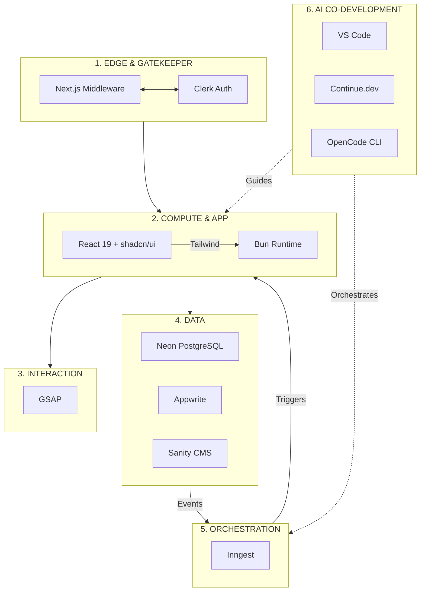
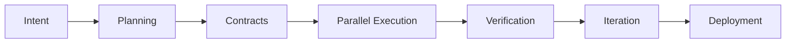

**# Becoming an Architect-Solopreneur: My Plan to Solo-Build EdgeMind — A Web + Local LLM + IoT SaaS**

In 2026, the ultimate advantage belongs to the **Architect-Solopreneur**: a single engineer who orchestrates intelligent agents, enforces architectural integrity, and transforms clear intent into verified, production-grade systems — without the drag of large-team coordination.

Here is my detailed plan for building **EdgeMind**, a privacy-first industrial monitoring SaaS that integrates a modern web application, on-device/on-prem local LLMs, and real-time IoT sensors.

---

### The Architect-Solopreneur Mindset

I am moving beyond traditional coding into true **systems engineering and architectural orchestration**. AI tools like Continue.dev and OpenCode CLI will function as highly capable junior team members — strictly governed by Zod contracts and durable Inngest orchestration. This approach effectively eliminates the synchronization tax that typically slows solo projects.

By maintaining a clean, modular topology, I will be able to pivot or scale by swapping components rather than untangling a monolith.

---

### Target Product: EdgeMind

**EdgeMind** will deliver real-time equipment monitoring for factories and warehouses with:
- Responsive, real-time web dashboards and intelligent alerts
- Local LLM inference for privacy-sensitive anomaly detection and natural language querying
- Secure IoT sensor integration

Core non-negotiable: Strong privacy with minimal or no cloud dependency for critical data paths.

---

### Seven-Layer Architecture Blueprint

I will organize the system using this clear topology:

| Layer | Function | Key Tools |
| --- | --- | --- |
| **1. Edge & Gatekeeper** | Validation & auth | Next.js Middleware, Clerk |
| **2. Compute & Application** | UI & runtime | React 19, Tailwind, shadcn/ui, Bun |
| **3. Interaction** | Motion & UX | GSAP |
| **4. Core Data Engines** | Transactional truth | PostgreSQL (Neon), Appwrite |
| **5. Managed Services** | Content & config | Sanity CMS |
| **6. Orchestration** | Event-driven pipelines | Inngest |
| **7. AI Co-Development** | Intelligence & governance | VS Code + Continue.dev + OpenCode CLI |

---

### My Agentic Workflow Plan

I will execute development through this repeatable, self-improving loop:

**Key Phases:**

- **Intent & Planning**: Start with comprehensive `INTENT.md` and `PROJECT_GOALS.yaml`.
- **Contracts**: Define everything-first with Zod schemas that propagate across web, backend, IoT events, and LLM inputs.
- **Parallel Execution**: Web UI, data layer, Inngest orchestration, local LLM pipelines (Ollama), and IoT integration (with Python + Panel for internal monitoring tools) will advance concurrently under Continue.dev guidance.
- **Verification**: Continue.dev serves as Critic Agent; OpenCode CLI enforces terminal-based gates.
- **Deployment & Iteration**: Durable Inngest jobs, Sanity-driven config, and rapid feedback cycles.

---

### Three Force-Multiplier Mental Models for INTENT.md

To elevate this from a solid plan to a robust, market-ready production system, I will incorporate these principles from day one:

1. **The Observer Effect in Observability**  
   In a system spanning IoT sensors and local LLMs, silent failures are the biggest risk.  
   **Plan**: Implement OpenTelemetry (OTEL) tracing end-to-end — from edge device → Inngest pipeline → local LLM inference → UI alert.  
   **Benefit**: Precise visibility into latency and errors without guesswork.

2. **The Immutable State Rule**  
   Treat the event stream as the ultimate source of truth.  
   **Plan**: Store raw sensor events in an append-only immutable log (e.g., dedicated cold-storage table or S3-compatible bucket).  
   **Benefit**: Future-proof replay capability. If LLM logic improves later, I can re-process historical data easily — a major edge for a monitoring SaaS.

3. **The Self-Healing CI/CD Loop**  
   **Plan**: Integrate OpenCode CLI into git hooks with a Critic Agent that automatically validates before main branch commits:  
   - Zod contract compatibility with DB models  
   - Performance budgets (bundle size, etc.)  
   - Security checks (no hardcoded secrets)  
   **Benefit**: Turns AI from simple assistant into an automated Chief Technology Officer.

---

### Co-Development Discipline

I will reject vibecoding. Every AI contribution will remain governed by contracts, architecture rules (enforced via Continue.dev), and OpenCode CLI automation. This keeps the entire system predictable, maintainable, and aligned with my standards.

---

### The Architect-Solopreneur Advantage

This blueprint demonstrates how one person can deliver ambitious, real-world software combining web, local AI, and physical IoT layers — with enterprise-grade quality and governance.

By nullifying the synchronization tax and building modular, observable, and self-healing systems, the Architect-Solopreneur model becomes a template for the agentic era.

---

**Next Step: The Architect-Solopreneur Framework**

As I build EdgeMind, I am also shaping a repeatable meta-process for managing agents, contracts, and orchestration. I am seriously considering open-sourcing or extensively documenting this “Architect-Solopreneur Framework” alongside the product.

Would you find value in seeing the full framework documented? Let me know in the comments.

---

**What ambitious project are you planning to tackle as an Architect-Solopreneur?** Share your vision below.
