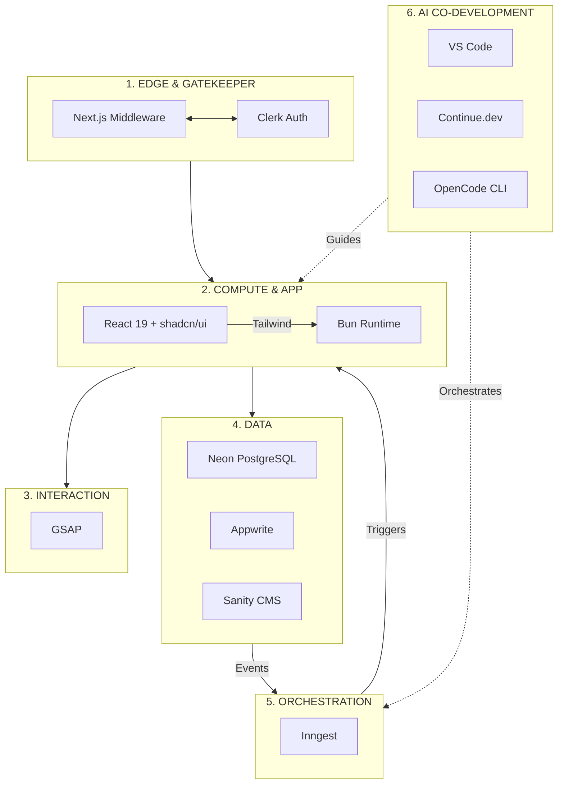
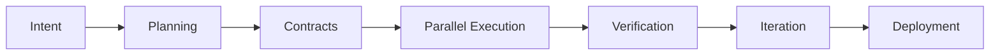

# **Becoming an Architect-Solopreneur: My Plan to Build a Full-Stack SaaS with Web, Local LLMs, and IoT — Solo**

In 2026, the biggest competitive edge isn’t access to capital or large teams. It’s becoming an **Architect-Solopreneur**: one person who can clearly define intent, orchestrate intelligent agents, enforce architectural standards, and ship sophisticated production systems at speed.

Here is my concrete plan for building **EdgeMind** — a privacy-first industrial monitoring SaaS that combines a modern web application, local LLM inference, and real-time IoT sensor integration.

---

### Why the Architect-Solopreneur Model?

Traditional team structures carry a heavy synchronization tax. My approach removes that overhead by acting as the central orchestrator. I will use AI as a governed force multiplier — never as a replacement for judgment — inside a disciplined co-development environment powered by **Continue.dev** and **OpenCode CLI**.

The goal is clear: **Rapid, high-quality delivery without compromising type safety, architectural integrity, or long-term maintainability.**

---

### The Target Product: EdgeMind

**EdgeMind** will be a privacy-centric platform for factories and warehouses featuring:
- Real-time web dashboards and alerting
- On-device / on-prem local LLMs for sensitive data analysis and natural language queries
- Secure IoT sensor integration for equipment monitoring

Critical requirement: No cloud dependency for sensitive inference or data.

---

### My Seven-Layer Architecture Plan

I will structure the entire system using this clean topology for clarity and maintainability:

| Layer | Function | Key Tools |
| --- | --- | --- |
| **1. Edge & Gatekeeper** | Validation & auth | Next.js Middleware, Clerk |
| **2. Compute & Application** | UI & runtime | React 19, Tailwind, shadcn/ui, Bun |
| **3. Interaction** | Motion & UX polish | GSAP |
| **4. Core Data Engines** | Transactional truth | PostgreSQL (Neon), Appwrite |
| **5. Managed Services** | Content & dynamic config | Sanity CMS |
| **6. Orchestration** | Event-driven pipelines | Inngest |
| **7. AI Co-Development** | Intelligence & governance layer | VS Code + Continue.dev + OpenCode CLI |



---

### My Agentic Co-Development Workflow Plan

I will follow this structured loop to transform intent into verified reality:



#### Phase 1: Intent Definition
I will begin with detailed `INTENT.md` and `PROJECT_GOALS.yaml` files that capture vision, non-negotiables (strong privacy, local inference), success metrics, and technical constraints.

#### Phase 2–3: Planning & Contract-First Design
Using Continue.dev with full repository context, I will generate and refine Zod schemas that serve as the single source of truth across all layers.

Example planned contract:

```ts
// src/lib/contracts/sensor.schema.ts
import { z } from 'zod';

export const SensorDataSchema = z.object({
  deviceId: z.string().uuid(),
  temperature: z.number(),
  vibration: z.number(),
  timestamp: z.date(),
  anomalyScore: z.number().optional(),
});

export type SensorData = z.infer<typeof SensorDataSchema>;
```

#### Phase 4: Parallel Execution
- **Web Application**: Next.js 15 + React 19 + Tailwind + shadcn/ui dashboards with GSAP-powered interactions.
- **Data & Backend**: Neon PostgreSQL, Appwrite, and Sanity for content/config.
- **Orchestration**: Inngest for reliable event pipelines (sensor data → local LLM analysis → alerts).
- **Local LLM + IoT**: Ollama-based models running on edge hardware (e.g., Jetson). Python + Panel for internal monitoring dashboards tracking model performance and device health.
- Agents coordinated through Continue.dev for parallel progress.

#### Phase 5: Verification & Criticism
Continue.dev will act as my persistent Critic Agent, enforcing architectural rules. OpenCode CLI will run terminal validation scripts as gatekeepers before commits and deployments.

#### Phase 6–7: Iteration & Deployment
Inngest will handle durable background jobs with retries. The system will support rapid iteration while maintaining strong governance and observability.

---

### Co-Development Principles I Will Follow

- **No vibecoding** — Every AI-assisted output will be reviewed against contracts and architecture rules.
- **Continue.dev** as context-aware policy engine, deeply indexed with my contracts and documentation.
- **OpenCode CLI** for seamless terminal orchestration and self-healing automation.
- Strict complexity budgeting to keep the stack maintainable long-term.

---

### Expected Outcomes

By following this plan, I expect to deliver as a solo Architect-Solopreneur:
- A polished, real-time web SaaS
- Robust local LLM capabilities on edge devices
- Secure, production-ready IoT integration
- Full type safety, auditability, and documentation

All while retaining complete control and minimizing technical debt.

---

### The Architect-Solopreneur Path

You no longer need a large team to build ambitious, real-world systems. You need clear intent, strong contracts, intelligent orchestration, and disciplined execution.

The synchronization tax is now optional.

**Becoming an Architect-Solopreneur** means you define the vision, set the rules, orchestrate the agents, verify the outcomes, and ship confidently.

---

This is my plan for EdgeMind.  

**What project are you planning to build as an Architect-Solopreneur?** Share your vision in the comments.
