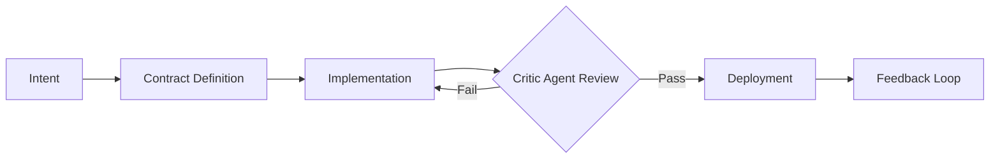

# Appendix A: The Architect Solopreneur Mindset

The Architect Solopreneur mindset represents a radical departure from traditional software engineering. By replacing the high-friction, human-centric coordination of large teams with **disciplined systems engineering, automated governance, and AI-driven orchestration**, the individual builder gains the ability to deliver enterprise-grade systems with unprecedented speed and precision.

The following sections detail the core tenets that enable a single operator to outperform traditional organizational structures.

---

### 1. Abolishing the "Synchronization Tax"

Traditional software projects often suffer from the "synchronization tax"—a cumulative drain on productivity caused by inter-team communication, inconsistent context, and the diluted accountability of large groups.

* **Replacing Meetings with Protocols:** In this model, human-to-human negotiation is minimized. Coordination is instead offloaded to **Code-Defined Interfaces (CDIs)**. When contracts (schemas) define the boundaries between modules, the need for synchronous meetings vanishes.
* **Contextual Integrity:** By utilizing a unified knowledge graph or project documentation, the Architect Solopreneur eliminates the "telephone game" effect, ensuring that the original business intent remains intact from the first line of code to deployment.

### 2. Systems Engineering: From Coding to Orchestration

The shift from "developer" to "architect" changes the fundamental unit of work.

#### The Builder as Conductor

Instead of acting as a manual laborer churning out feature requests, the Solopreneur acts as a conductor. The focus is on designing the flow of data and the interaction of services.

* **Intent-Driven Development:** Every task begins with a formal declaration of intent. If a requirement cannot be mapped to a specific business outcome, it is rejected. This prevents the "feature creep" that often suffocates solo-led initiatives.
* **Atomic Refactoring:** The system is engineered for modularity. By keeping components small, decoupled, and highly observable, the architect ensures that any part of the system—from the database schema to the UI—can be completely rewritten or swapped in a single day.

---

### 3. AI as a Governed Team Member: Beyond "Vibecoding"

Many developers treat AI as a "vibecoding" tool—an unmonitored assistant for generating quick snippets. The Architect Solopreneur treats AI as a **junior team member that requires strict supervision.**

#### The Agentic Governance Loop

Development must follow a rigorous, non-negotiable lifecycle to prevent "agentic drift" (where AI solutions wander away from the architectural blueprint):

1. **Intent Injection:** The architect provides the specific business logic and constraints.
2. **Contractual Framing:** The AI is required to define the interfaces (Zod/TypeScript) before writing functional code.
3. **Execution & Peer Review:** The AI generates the implementation.
4. **Verification (The Critic Agent):** A secondary agent—or a suite of static analysis tools—reviews the output against the original architectural constraints and security policies.

---

### 4. Contract-First Integrity

The "Single Source of Truth" is not just a concept—it is the literal backbone of the project.

* **Zod as Truth:** By utilizing Zod schemas for all data validation, type-related bugs are eliminated at the boundaries. If the contract changes, the entire system knows exactly where it breaks before a single unit of logic is executed.
* **Universal Serialization:** This contract-first approach ensures that the backend, frontend, and IoT layers speak the same language. It prevents the common "API drift" that occurs when teams or agents update services in isolation.

---

### 5. Complexity Budgeting and System Resilience

A solo architect must optimize for maintenance as much as for feature velocity.

* **The Complexity Budget:** You have a finite amount of "cognitive bandwidth." The architect must aggressively tax their own complexity. If a "shiny" library or framework adds more maintenance burden than it provides in utility, it is rejected.
* **Durable Orchestration (Inngest/Temporal):** When building distributed systems (especially IoT), flakiness is a given. Using durable execution engines allows the architect to treat asynchronous, long-running processes as if they were simple, synchronous function calls. This enables automatic retries, state recovery, and granular auditability.
* **Immutable Event Streams:** By logging every state transition as an immutable event, the architect gains the ability to "time travel." If a bug occurs, the architect can replay the event stream to identify the exact point of failure, rather than hunting for state in a black box.

---

### Summary: Mental Model Overview

| Traditional Development | Architect Solopreneur |
| --- | --- |
| **Cohesion** | Human-heavy meetings |
| **AI Role** | Loose assistant |
| **Logic** | Feature-first |
| **Source of Truth** | Documentation |
| **Failure Handling** | Manual debugging |

> **Conclusion:** The Architect Solopreneur mindset prioritizes **clarity of intent, rigorous governance, and high-leverage systems** over the traditional brute-force approach of adding more personnel. It is the art of building systems that are not only high-performing but also inherently sustainable for a single operator to manage at scale.

Would you like me to develop a set of **"Architectural Protocols"** that you can use to enforce these constraints within your own development workflow?
