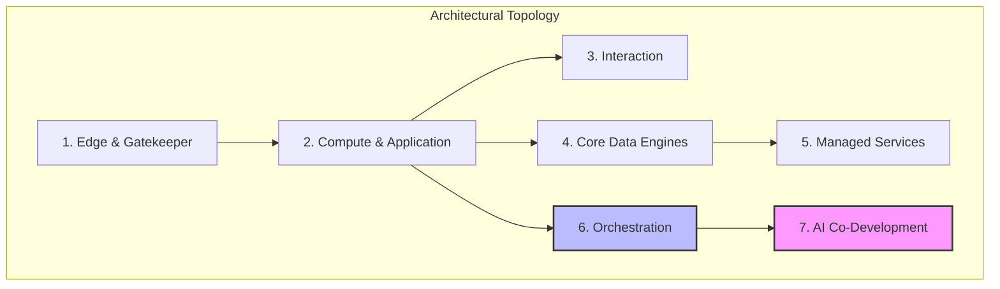

# Appendix B: The Seven-Layer Architecture Blueprint

The Seven-Layer Architecture Blueprint is more than a technology stack; it is a **topology of constraints**. By mapping specific responsibilities to distinct functional layers, the Architect Solopreneur creates a system that is both highly decoupled and profoundly easy to reason about. This blueprint eliminates the "synchronization tax" by ensuring that the builder never has to guess where a logic flow begins, ends, or requires intervention.

---

### The Seven Layers: Strategic Deep Dive

#### 1. Edge & Gatekeeper (The Perimeter)

This layer is the first line of defense and the primary traffic controller. It performs essential pre-processing before a request ever hits the heavy application compute.

* **Responsibility:** Authentication, rate limiting, request validation, and geographic routing.
* **Architectural Role:** By offloading concerns like authentication (Clerk) and request filtering (Next.js Middleware) to the edge, the backend remains "blind" to unauthorized traffic, significantly reducing the surface area for security vulnerabilities.

#### 2. Compute & Application (The Engine)

This is the heart of the system where business logic resides. It is purposefully kept "thin" by pushing state management and complex orchestration to the periphery.

* **Responsibility:** Rendering the user interface, managing local application state, and serving as the primary API interface for the frontend.
* **Architectural Role:** Utilizing modern runtimes (Bun) and modular design patterns (React 19), this layer acts as the "view" of the entire system, strictly adhering to **Locality of Behavior (LoB)** to ensure components are self-contained.

#### 3. Interaction (The Human Layer)

Often ignored, this layer is crucial for the perceived quality of the application.

* **Responsibility:** Providing immediate, fluid visual feedback to user inputs.
* **Architectural Role:** By isolating animations (GSAP) into an "Interaction" layer, the architect prevents UI "jank" from interfering with the application's underlying logic. It ensures the system feels alive and responsive, bridging the gap between raw data and human perception.

#### 4. Core Data Engines (The Truth)

The foundation of system integrity. This layer is treated as immutable and transactional.

* **Responsibility:** Persistence of system state, relational modeling, and long-term storage.
* **Architectural Role:** By using managed relational databases (PostgreSQL/Neon) and backend-as-a-service providers (Appwrite), the architect ensures that "truth" is separated from "presentation." This separation allows the UI to be rewritten completely without needing to migrate the underlying data structures.

#### 5. Managed Services (The Configuration)

This layer offloads non-functional requirements that would otherwise require hard-coding or complex deployment pipelines.

* **Responsibility:** Managing dynamic content, configuration flags, and marketing copy.
* **Architectural Role:** By using a headless CMS (Sanity), the architect can modify the application's look, feel, and business rules without deploying code. This decouples "Content Lifecycle" from "Feature Lifecycle."

#### 6. Orchestration (The Nervous System)

This layer handles the "messiness" of distributed systems—retries, failures, and long-running processes.

* **Responsibility:** Managing asynchronous workflows, IoT device communication, and background jobs.
* **Architectural Role:** Through **Durable Orchestration (Inngest)**, this layer transforms volatile, failure-prone distributed operations into reliable, stateful pipelines. If a device goes offline or a network times out, the orchestration layer handles the state recovery, shielding the rest of the stack from chaos.

#### 7. AI Co-Development (The Governance)

The meta-layer that manages the development lifecycle itself.

* **Responsibility:** Automated code generation, architectural enforcement, and iterative refinement.
* **Architectural Role:** By treating AI as a "junior teammate," the architect uses IDE-integrated tools (Continue.dev) to enforce project-wide standards, ensuring that AI-written code conforms to the established contracts before it enters the main branch.

---

### Architectural Design Constraints

To prevent "Architecture Drift," the following design mandates are strictly enforced:

1. **The 24-Hour Rewrite Rule:** The system must be modular enough that any single layer can be entirely refactored or replaced within one business day. If a component is so tightly coupled that it takes longer, it represents **Structural Debt** and must be refactored immediately.
2. **Interface Integrity (Contract-First):** Layers never communicate through hidden side effects. Every inter-layer connection must be defined by a strictly typed contract (Zod/TypeScript). If it isn't in the schema, it doesn't exist in the system.
3. **Complexity Budgeting:** Every new library or dependency must be "taxed." The Architect Solopreneur asks: *"Does this tool provide enough leverage to offset the cognitive load of maintaining it?"* If the answer is no, it is purged.
4. **Event-Driven Transparency:** All system state changes should be loggable. By treating the system as a collection of events (Event Sourcing), the architect can debug issues by "replaying" events, eliminating the need to guess what happened in a black-box environment.

---

### Visualizing the Hierarchy

> **The Result:** This architecture allows the Architect Solopreneur to scale their operations horizontally—adding features or services—without increasing their own personal cognitive load. By outsourcing complexity to the **Orchestration** layer and governance to the **AI** layer, the individual becomes a master of systems rather than a slave to maintenance.
