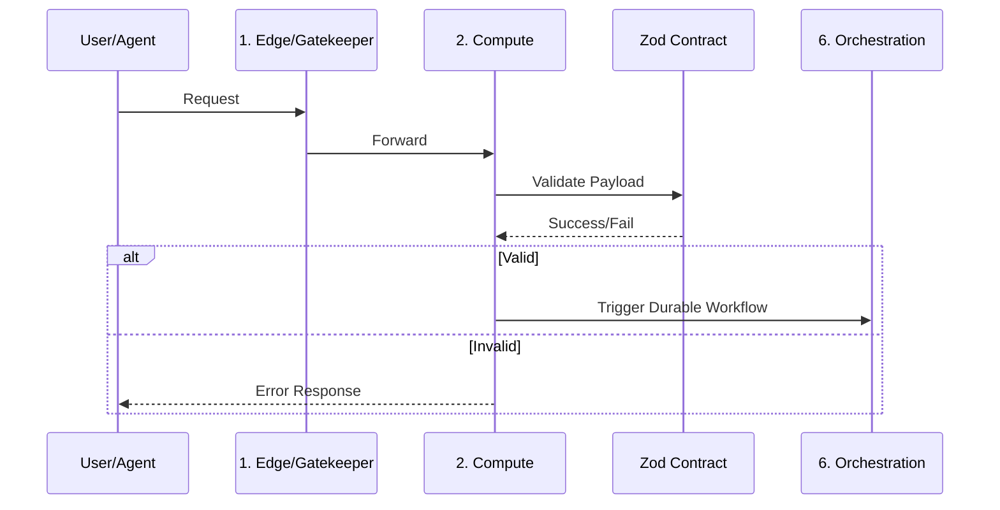

# Appendix C: Layer Contract Template

To maintain the architectural integrity of the **Seven-Layer Blueprint**, communication between layers must be standardized, typed, and verifiable. This contract template uses **Zod** as the universal language, ensuring that the "Compute" layer, "Data" layer, and "Orchestration" layer remain perfectly synchronized.

By defining these contracts *before* logic is written, you eliminate "type-related bugs" and ensure that AI agents have clear guardrails for every interaction.

---

### 1. The Contract Definition Strategy

Each integration point in your stack should be defined as a standalone TypeScript module (`/contracts/*.contract.ts`). This allows both human developers and AI agents to import the exact schema required for a specific cross-layer operation.

#### Example: The Core Integration Contract

This template defines a standard structure for an event or API call, ensuring consistency across your Orchestration and Data layers.

```typescript
import { z } from "zod";

/**
 * Contract: System Event/Action
 * Purpose: Ensures standardized communication between Compute and Orchestration layers.
 */
export const SystemActionSchema = z.object({
  id: z.string().uuid(),
  timestamp: z.date(),
  origin: z.enum(["web-ui", "iot-gateway", "ai-agent"]),
  payload: z.object({
    action: z.string(),
    data: z.record(z.unknown()),
  }),
  metadata: z.object({
    correlationId: z.string().optional(),
    version: z.string().default("1.0.0"),
  }),
});

export type SystemAction = z.infer<typeof SystemActionSchema>;

```

---

### 2. Implementation Template (The "Boundaries")

Use this template to enforce the contract at the point of entry (Gatekeeper) or the point of transition (Orchestration).

```typescript
// /src/lib/contract-handler.ts
import { SystemActionSchema, type SystemAction } from "../contracts/system.contract";

export const validateIncomingAction = (data: unknown): SystemAction => {
  const result = SystemActionSchema.safeParse(data);
  
  if (!result.success) {
    // Log for the Critic Agent/Debugging
    console.error("Contract Violation:", result.error.format());
    throw new Error("Invalid System Contract");
  }
  
  return result.data;
};

```

---

### 3. Integration Checklist for Agents

When tasking an AI agent with building a new feature, provide this checklist to ensure the implementation adheres to the architectural blueprint:

1. **Define the Schema First:** Create the Zod schema in the `/contracts` directory.
2. **Declare the Boundary:** If the code crosses from `Compute` to `Data` or `Orchestration`, it *must* pass through a validator.
3. **Strict Typing:** Never use `any`. Every object must be inferred from the Zod contract.
4. **Error Handling:** The contract must explicitly handle `ZodError` at the boundary.
5. **Logging:** Ensure the operation is wrapped in a log that includes the `correlationId` for traceability across the system.

---

### 4. The "Contractual Flow" Diagram

This flow ensures that no data enters the system without verification.



---

### Why this Template matters for the Solopreneur

* **Agentic Safety:** When your AI agent writes the "Orchestration" logic, it is forced to import the existing Zod schema rather than inventing its own data structure. This is how you prevent "agentic drift."
* **Zero-Maintenance Refactoring:** If you change your database schema, you update the central contract. The TypeScript compiler will immediately highlight every single place in the UI, API, or Orchestration logic that is now broken.
* **Self-Documentation:** The `/contracts` folder serves as the "living API documentation" for your entire system.

> **Pro-Tip:** Include this `ContractTemplate.md` in the root of your project. When you initialize a new coding session with your AI, start by stating: *"Using the Appendix C Contract Template, define the interface for this new feature before writing any logic."*
