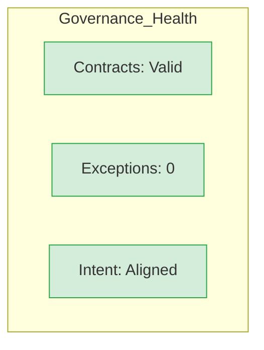

# Appendix H: Architectural Master Dashboard

The Architectural Master Dashboard acts as the "Mission Control" for your Architect Solopreneur practice. It aggregates your governance layers, intent documents, and operational health into a single interface. By centralizing this information, you remove the friction of context-switching, allowing you to move from "Conductor" to "Execution" in seconds.

---

### 1. The Dashboard Topology (`README.md` Hub)

Your project root should contain a `ARCHITECTURAL_DASHBOARD.md` that links all appendices. This serves as the single source of truth for both you and your AI agents.

```markdown
# 🏗 Architectural Master Dashboard

## 1. System Intent & Roadmap
- [ ] [Current Sprint Intent](docs/intent/current.md)
- [ ] [Complexity Budget Audit](docs/budget/current.md)

## 2. The Seven-Layer Stack (Appendix B)
- [ ] Layer 1 (Edge): [Config Status]
- [ ] Layer 6 (Orchestration): [Pipeline Status]
- [ ] Layer 7 (AI Governance): [Critic Agent Status]

## 3. Governance Status (Appendix F)
- [ ] **Contract Health:** [Passing/Failing]
- [ ] **Exception Log:** [Active Items: 0]
- [ ] **Last Pre-Flight Check:** [Timestamp]

## 4. Operational Links
- [Continue.dev Rules](.continue/rules/)
- [Contract Definitions](src/contracts/)
- [Exceptions Log](docs/architectural-exceptions.md)

```

---

### 2. The "Agentic Entry Point"

To ensure your AI agents always know where they stand, add this metadata block to the top of your dashboard. When you open a new session in `Continue.dev`, the agent will read this block and immediately understand the project state.

> **AGENT_CONTEXT_BLOCK**
> * **Role:** Architect Solopreneur
> * **Primary Directive:** Maintain 100% Contractual Integrity.
> * **Current System Health:** [SYSTEM_STATUS_VAR]
> * **Active Architectural Exceptions:** [COUNT_VAR]
> 
> 

---

### 3. The "Conductor's Checklist" (Quick Access)

This is the "cheat sheet" for your daily development cycle.

* **Audit Governance:** `npm run audit:governance`
* **Generate Mocks:** `npm run generate:mocks`
* **Validate Contracts:** `npm run validate:contracts`
* **Log Exception:** Append to `docs/architectural-exceptions.md`
* **Deploy:** Run Pre-Flight (Appendix F) -> `git commit` -> `git push`

---

### 4. Visualizing the System Health

If you prefer a visual, use a simple `mermaid` block in your dashboard to give yourself an instant health check of the Seven-Layer Architecture:



---

### Why the Master Dashboard is the "Moat"

The Architect Solopreneur wins because they manage **information density**.

* **No Hidden Complexity:** If a tool or logic flow is not linked in this dashboard, it is "invisible" and therefore a liability.
* **Instant Onboarding:** If you return to a project after three weeks, or if you delegate a sub-module to an AI agent, they have everything they need to start working *within the parameters of your system* immediately.
* **Emotional Resilience:** When things go wrong (as they do in IoT and distributed systems), you don't panic. You look at the Dashboard, check the **Exceptions Log**, run the **Pre-Flight**, and you know exactly where the integrity of your system has been breached.
