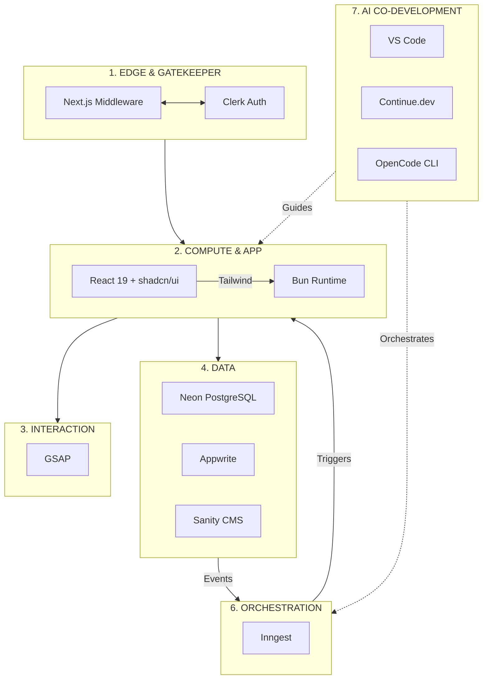
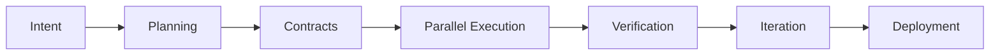

# **Becoming an Architect-Solopreneur Part 1: My Plan to Solo-Build EdgeMind — A Web + Local LLM + IoT SaaS**

In 2026, the ultimate competitive advantage belongs to the **Architect-Solopreneur**: a single engineer who orchestrates intelligent agents, enforces architectural integrity, and transforms clear intent into verified, production-grade systems — without the coordination drag and overhead of large teams.

This is my detailed plan for building **EdgeMind**, a privacy-first industrial monitoring SaaS that seamlessly integrates a modern web application, on-device and on-prem local LLMs, and real-time IoT sensors.

---

### The Architect-Solopreneur Mindset

I am shifting from traditional coding into full **systems engineering and architectural orchestration**. Tools like Continue.dev and OpenCode CLI will act as highly capable junior team members — but only under strict governance via Zod contracts and durable Inngest orchestration.

This approach eliminates the “synchronization tax” that typically cripples solo projects. By maintaining a clean, modular topology, I can pivot or scale by swapping components instead of untangling a brittle monolith.

---

### Target Product: EdgeMind

**EdgeMind** will provide real-time equipment monitoring for factories and warehouses, delivering:

- Responsive, real-time web dashboards with intelligent alerts
- Local LLM inference for privacy-sensitive anomaly detection and natural language querying
- Secure, reliable IoT sensor integration

**Core non-negotiable**: Strong privacy with minimal or zero cloud dependency for critical data paths. Sensitive sensor data and LLM inference remain on-prem or on-device whenever possible.

---

### Seven-Layer Architecture Blueprint

The system is organized around a clear, intentional topology that balances separation of concerns with practical flow:

| Layer                  | Function                  | Key Tools                              |
|------------------------|---------------------------|----------------------------------------|
| **1. Edge & Gatekeeper** | Validation & auth        | Next.js Middleware, Clerk             |
| **2. Compute & Application** | UI & runtime            | React 19, Tailwind, shadcn/ui, Bun   |
| **3. Interaction**     | Motion & UX               | GSAP                                  |
| **4. Core Data Engines** | Transactional truth     | PostgreSQL (Neon), Appwrite           |
| **5. Managed Services** | Content & config         | Sanity CMS                            |
| **6. Orchestration**   | Event-driven pipelines    | Inngest                               |
| **7. AI Co-Development** | Intelligence & governance | VS Code + Continue.dev + OpenCode CLI |

---

### My Agentic Workflow Plan

Development will follow this repeatable, self-improving loop:

**Key Phases:**

- **Intent & Planning**: Begin with comprehensive `INTENT.md` and `PROJECT_GOALS.yaml` to maintain alignment.
- **Contracts**: Define everything-first with Zod schemas that propagate consistently across web, backend, IoT events, and LLM inputs/outputs.
- **Parallel Execution**: Web UI, data layer, Inngest orchestration, local LLM pipelines (Ollama), and IoT integration (supported by Python + Panel for internal tools) will advance concurrently under Continue.dev guidance.
- **Verification**: Continue.dev acts as Critic Agent; OpenCode CLI enforces terminal-based gates.
- **Deployment & Iteration**: Durable Inngest jobs, Sanity-driven configuration, and rapid feedback cycles.

---

### Three Force-Multiplier Mental Models for INTENT.md

To elevate the project from solid to truly robust and market-ready, these principles are embedded from day one:

1. **The Observer Effect in Observability**  
   In distributed systems spanning IoT and local LLMs, silent failures are the greatest risk.  
   **Plan**: Implement OpenTelemetry (OTEL) tracing end-to-end — from edge device through Inngest pipelines, local LLM inference, and into UI alerts.  
   **Benefit**: Precise visibility into latency, errors, and bottlenecks without guesswork.

2. **The Immutable State Rule**  
   Treat the raw event stream as the ultimate source of truth.  
   **Plan**: Store all incoming sensor events in an append-only immutable log (e.g., dedicated table or S3-compatible storage).  
   **Benefit**: Future-proof replay capability. As LLM logic improves, historical data can be reprocessed easily — a powerful advantage for industrial monitoring.

3. **The Self-Healing CI/CD Loop**  
   **Plan**: Integrate OpenCode CLI into git hooks with a Critic Agent that automatically validates before main branch commits: Zod contract compatibility, performance budgets (bundle size, latency), and security checks (no hardcoded secrets).  
   **Benefit**: Transforms AI from a simple assistant into an automated Chief Technology Officer.

---

### Co-Development Discipline

I reject “vibecoding.” Every AI-generated contribution will be governed by contracts, explicit architecture rules (enforced via Continue.dev), and OpenCode CLI automation. This ensures the entire system remains predictable, maintainable, and aligned with high personal standards.

---

### The Architect-Solopreneur Advantage

This blueprint shows how one person can deliver ambitious, real-world software that spans web, local AI, and physical IoT layers — with enterprise-grade quality and governance.

By eliminating the synchronization tax and building modular, observable, and self-healing systems, the Architect-Solopreneur model becomes a powerful template for the agentic era.

---

**Next Step: The Architect-Solopreneur Framework**

As I build EdgeMind, I am simultaneously developing a repeatable meta-process for managing agents, contracts, and orchestration. I am seriously considering open-sourcing or extensively documenting this **Architect-Solopreneur Framework** alongside the product.

Would you find value in seeing the full framework documented early? Let me know in the comments.

---

**What ambitious project are you planning to tackle as an Architect-Solopreneur?** Share your vision below.
