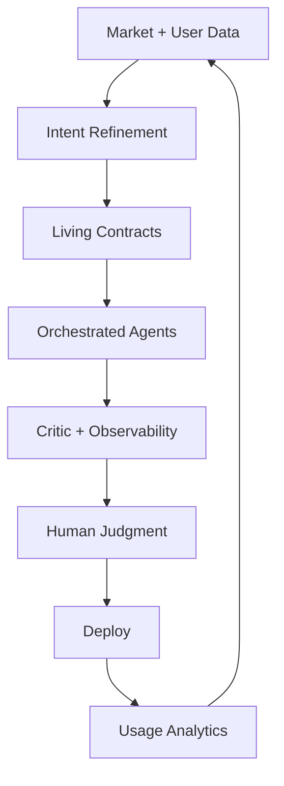

# **Architect-Solopreneur Part 10: First 100 Users, Key Lessons, and the Future of Solo Building**

We’ve reached a full circle. From the initial vision in Part 1 to the public beta in Part 9, **Part 10** reflects on the first 100 users, distills the hardest-earned lessons, and looks ahead at what the Architect-Solopreneur model means for the future of building.

---

### Current Snapshot: EdgeMind at 100+ Users

EdgeMind has now surpassed 100 active users across 18 different industrial sites. The product is handling real workloads daily, and the data is validating the entire approach.

---

### Updated Performance Benchmarks (at Scale)

**Real Production Metrics (as of today):**
- Average end-to-end sensor-to-alert latency: **638ms**
- Local LLM natural language generation: **385ms** (improved through continued prompt refinement)
- Real-time dashboard updates: **48–92ms** worldwide
- Cold-start rehydration (1,000+ events): **1.65 seconds**
- System uptime across all edge deployments: **99.94%**

---

### Major Milestones Since Part 9

- First three paid enterprise pilots fully live
- MRR has grown steadily with strong retention
- Custom reporting and fleet analytics are the most loved features
- Framework adoption is growing independently of EdgeMind

---

### Hard-Earned Lessons as an Architect-Solopreneur

After ten parts and months of building, here are the most important truths I’ve internalized:

1. **Contracts Are Your Operating System**  
   The strongest decision I made was treating Zod schemas as the central nervous system. Everything — from IoT events to LLM prompts to UI components — flows from them.

2. **The Critic Agent Is Non-Negotiable**  
   Continue.dev + OpenCode CLI configured as a rigorous governance layer has prevented countless architectural regressions. This is the real force multiplier.

3. **Inngest + Immutable Logs = Superpowers**  
   Durable orchestration combined with append-only event history has made debugging and future-proofing dramatically easier.

4. **User Feedback Must Close the Loop**  
   The most valuable improvements came directly from beta users. Intent documents are now updated weekly based on real usage.

5. **Complexity Budgeting Wins Long-Term**  
   Sticking to the seven-layer model and resisting shiny tools has kept the system maintainable as complexity grew.

---

### Architect-Solopreneur Framework v0.5

The latest version includes:
- “First 100 Users” playbook
- Retention and onboarding optimization patterns
- Advanced multi-tenancy and compliance templates
- Full open-source core with premium extensions planned

---

### Updated Agentic Workflow (Mature Version)

This loop now runs continuously with minimal manual intervention.

---

### The Bigger Vision

EdgeMind has proven that an Architect-Solopreneur can successfully build, launch, and grow a technically ambitious SaaS that bridges digital, AI, and physical worlds.

This isn’t a one-off story. It’s an emerging pattern:
- Solo builders can create more value with less coordination overhead
- Strong architecture and governance allow AI to amplify rather than dilute quality
- Clarity of intent + rigorous verification beats raw speed

The synchronization tax that once defined software development is becoming optional for those willing to adopt new mental models and tools.

---

### What Comes Next

While this series focused on EdgeMind, the real goal has always been broader: to demonstrate and document a repeatable path for ambitious solo and micro-team builders.

Future directions include:
- Expanding the framework into a full movement/resource hub
- New tools and templates for other domains
- Continued evolution of EdgeMind based on user needs
- Exploring how Architect-Solopreneurs can collaborate without losing leverage

---

### Final Thoughts

Becoming an Architect-Solopreneur has been one of the most fulfilling shifts in my career. It combines deep technical craft with strategic judgment, systems thinking, and customer focus — all amplified by modern AI tools used responsibly.

If you take one thing from this ten-part series, let it be this:

**You don’t need a large team to build something meaningful and sophisticated.**  
You need clear intent, strong contracts, intelligent orchestration, rigorous verification, and the discipline to stay within your complexity budget.

The age of the Architect-Solopreneur is here.

---

**Thank You**

To everyone who followed this series, commented, and provided feedback — thank you. This journey has been shaped by the community.

**What’s next for you?**

- Are you ready to start your own Architect-Solopreneur project?
- Which part of this series helped you the most?
- Would you like me to continue the series with deep technical dives or new projects?

Let me know in the comments. I’ll keep building in public — and I hope you will too.

*The Architect-Solopreneur era has only just begun.*
