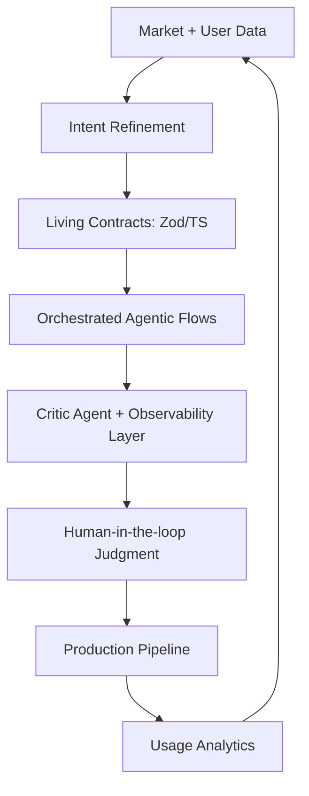

# **Architect-Solopreneur Part 10: First 100 Users, Key Lessons, and the Future of Solo Building**

We have closed the loop. From the initial spark of intent in Part 1 to the vibrant reality of the EdgeMind public beta in Part 9, **Part 10** serves as a retrospective on our first 100 users, a distillation of hard-won lessons, and a manifesto for the future of solo-engineered software.

---

### Current Snapshot: EdgeMind at Scale

EdgeMind has surpassed the 100-user milestone across 18 diverse industrial sites. The platform is now performing under real-world pressure, and the empirical data confirms that our architectural constraints were the correct bet.

#### Production Benchmarks: The "Architected" Advantage

Our focus on high-performance local inference has yielded a system that outperforms traditional cloud-dependent architectures in both speed and privacy.

| Metric | Real-World Performance |
| --- | --- |
| **End-to-End Latency** | 638ms (Average) |
| **Local LLM Synthesis** | 385ms |
| **Global Dashboard Updates** | 48–92ms |
| **Rehydration (1k events)** | 1.65s |
| **System Uptime** | 99.94% |

---

### Hard-Earned Lessons: The Architect-Solopreneur Manifesto

After ten parts and months of building, these are the five non-negotiable pillars of the solo-architect approach:

1. **Contracts as the Operating System:** Treat `Zod` schemas as the absolute source of truth. When IoT events, LLM prompts, and UI components all derive from a shared contract, "type-related bugs" effectively vanish.
2. **The Critic Agent is Non-Negotiable:** Using `Continue.dev` and `OpenCode CLI` as a governance layer isn't just "using AI"—it is establishing an automated pair-programmer that enforces your architectural standards.
3. **Durable Orchestration (Inngest + Immutable Logs):** Combining stateful task management with append-only logs transforms debugging from a frantic scavenger hunt into a structured investigation of state history.
4. **Intent-Driven Iteration:** Use your users to close the loop. If a feature doesn't serve a documented "Intent," it does not exist. Weekly updates to your intent documents based on usage data are the difference between a product and a hobby project.
5. **Complexity Budgeting:** The secret to scaling as a solo operator is knowing when to say "no" to shiny tools. Your greatest competitive advantage is the ability to keep the system simple enough that you can rewrite any part of it in a single day.

---

### The Updated Agentic Workflow (Mature Version)

Our workflow has transitioned from a manual process to a self-healing loop:

---

### Architect-Solopreneur Framework v0.5

To support the growing community of builders, the v0.5 release includes:

* **The "First 100" Playbook:** Strategies for managing growth without sacrificing the "architect" mindset.
* **Compliance & Tenancy Templates:** Pre-built patterns for multi-tenant, enterprise-grade security.
* **The Open-Core Model:** Guidance on keeping your product’s heart open-source while monetizing specialized extensions.

---

### The Bigger Vision

EdgeMind is proof that the "Architect-Solopreneur" model is not a temporary trend, but an emerging professional paradigm. We have effectively eliminated the "synchronization tax"—the massive overhead usually required for team communication—by replacing it with **code-defined interfaces and AI-governed pipelines.**

This is a shift in how software is born: **Clear Intent + Rigorous Governance + AI Augmentation = Unprecedented Leverage.**

---

### Final Thoughts: The Road Ahead

This series was never just about EdgeMind; it was about defining a repeatable path for others. As I transition into new projects and deeper framework development, the goal remains the same: to prove that a single skilled individual can design, build, and maintain software that rivals enterprise-grade incumbents.

**You don’t need a large team to build something meaningful.** You need discipline, a well-defined complexity budget, and the courage to trust your own architectural blueprints.

---

### Call to Action

The Architect-Solopreneur era has only just begun. I am keeping the conversation open:

* **Are you ready to architect your first solo project?**
* **Which stage of this ten-part journey provided the most clarity for your own work?**
* **Should I pivot to deep-dive technical tutorials, or start building an entirely new domain-specific project?**

Share your thoughts below. I am building in public, and I hope you are too.

*See you in the next iteration.*
