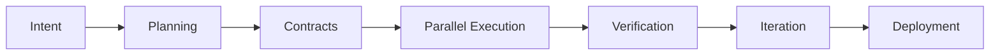

# **Architect-Solopreneur Part 3: Early Implementation — First Contracts, Agentic Loops, and Real Progress on EdgeMind**

In [Part 1](Part-1-My-Plan-to-Solo-Build-EdgeMind.md) I shared the vision for becoming an Architect-Solopreneur. In [Part 2](Part-2-Refining-the-Blueprint-for-EdgeMind.md) I refined the blueprint, introduced the three core pillars of the Architect-Solopreneur Framework, and tackled key production concerns.

Now in **Part 3**, I’m transitioning from planning into active execution. Here’s what I’ve accomplished so far, the early lessons emerging, and how the framework is already proving its value.

---

### Current Status: Implementation Has Begun

I have officially kicked off active development on **EdgeMind**. The repository is properly structured, core architecture layers are initialized, and the first agentic development loops are running smoothly.

Progress already feels dramatically faster than traditional solo development, thanks to governed co-development with AI tools.

---

### First Contract: SensorDataSchema (Live)

As planned, the very first file I created was the foundational contract:

```ts
// src/lib/contracts/sensor.schema.ts
import { z } from 'zod';

export const SensorDataSchema = z.object({
  deviceId: z.string().uuid(),
  temperature: z.number().min(-50).max(150),
  vibration: z.number().min(0),
  humidity: z.number().min(0).max(100).optional(),
  timestamp: z.date(),
  anomalyScore: z.number().min(0).max(1).optional(),
  metadata: z.record(z.string(), z.any()).optional(),
});

export type SensorData = z.infer<typeof SensorDataSchema>;

// Derived contracts
export const IngestionEventSchema = z.object({
  eventId: z.string().uuid(),
  payload: SensorDataSchema,
  source: z.enum(["iot-edge", "manual"]),
});

export type IngestionEvent = z.infer<typeof IngestionEventSchema>;
```

This schema is already being referenced across the stack:
- Inngest event handlers
- Database models (via Drizzle or Prisma)
- Local LLM prompt templates
- Frontend type definitions

---

### Agentic Workflow in Action

I am running the full loop daily:



**Early Wins So Far:**
- Continue.dev (with full context from contracts + `INTENT.md`) successfully generated initial Inngest event handlers and Next.js dashboard components while respecting my rule of “Server Actions only for mutations.”
- OpenCode CLI is already integrated into pre-commit checks.
- Basic IoT simulation (via Python scripts) is successfully feeding mock data through the ingestion pipeline.

---

### Activating the Force-Multipliers

1. **Observability (OTEL)**: Added OpenTelemetry tracing stubs across Inngest functions and web API routes. Early traces already identified unnecessary latency in one planned LLM prompt path.
2. **Immutable State**: Set up an append-only `raw_events` table in Neon PostgreSQL. All incoming sensor data is logged here before any further processing.
3. **Self-Healing CI/CD**: The Critic Agent (via OpenCode CLI git hook) caught and prevented a schema mismatch between a generated component and the database model on day two — exactly the kind of architectural drift I wanted to avoid.

---

### Addressing Production Concerns in Practice

**Cold Start Protocol**  
I implemented a lightweight “event replay buffer” on the edge device side (using local storage + sequence numbers). When a device reconnects, it sends buffered events with their original timestamps. Inngest gracefully handles deduplication and re-processing.

**Model-Governance Layer**  
Created a simple model manifest in Sanity CMS and a Python + Panel dashboard (running locally) for A/B comparisons between Ollama models on historical sensor data. This will form the foundation of the automated regression testing suite.

---

### Early Lessons as an Architect-Solopreneur

- **Contracts are everything.** Investing time in strong Zod schemas upfront has already saved hours of debugging and integration work.
- **The Critic Agent is the real moat.** When Continue.dev suggests code, the governance loop forces it to stay aligned with the overall architecture.
- **Inngest shines for IoT + LLM flows.** Its durable execution and built-in retries make handling flaky edge devices far less stressful.
- **Complexity budgeting works.** Strictly adhering to the seven-layer model keeps cognitive load manageable even as the system grows.

---

### Architect-Solopreneur Framework Progress

I have begun documenting the framework in a dedicated `/framework` folder. Current sections include:
- Contract Management Playbook
- Continue.dev + OpenCode CLI Configuration Templates
- Resilience & Replay Patterns for IoT/LLM systems

I plan to release an initial public version once EdgeMind reaches MVP.

---

### What’s Next (Part 4 Teaser)

- Full web dashboard implementation with real-time GSAP visualizations
- First end-to-end local LLM anomaly detection pipeline
- Initial deployment to a test edge device
- Performance benchmarks and observability dashboard

---

**This journey continues to reinforce my core belief**: A disciplined Architect-Solopreneur, equipped with the right mental models, strong contracts, and intelligent tools, can deliver production-grade industrial software faster and cleaner than many traditional teams.

---

**Questions for you:**
- Would you like early access to the Architect-Solopreneur Framework templates when ready?
- What specific aspect of EdgeMind (web UI, local LLM, IoT resilience, etc.) would you like me to cover in more detail next?

Let me know in the comments — I read every one.

*Onward to Part 4 — where the system starts feeling truly alive.*
