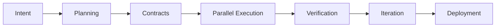

# **Architect-Solopreneur Part 3: Early Implementation — First Contracts, Agentic Loops, and Real Progress on EdgeMind**

In [Part 1](Part-1-My-Plan-to-Solo-Build-EdgeMind.md) I shared the vision of becoming an Architect-Solopreneur. In [Part 2](Part-2-Refining-the-Blueprint-for-EdgeMind.md) I refined the blueprint, introduced the three pillars of the Architect-Solopreneur Framework, and addressed key production concerns.

Now in **Part 3**, I’m moving from planning into early execution. Here’s what I’ve done so far, the lessons emerging, and how the framework is already proving its value.

---

### Current Status: Implementation Has Begun

I have officially kicked off active development on **EdgeMind**. The repository is structured, the core architecture layers are initialized, and the first agentic development loops are running. Progress feels dramatically faster than traditional solo development thanks to governed co-development.

---

### First Contract: SensorDataSchema (Live)

As planned, the very first file I created was the foundational contract:

```ts
// src/lib/contracts/sensor.schema.ts
import { z } from 'zod';

export const SensorDataSchema = z.object({
  deviceId: z.string().uuid(),
  temperature: z.number().min(-50).max(150),
  vibration: z.number().min(0),
  humidity: z.number().min(0).max(100).optional(),
  timestamp: z.date(),
  anomalyScore: z.number().min(0).max(1).optional(),
  metadata: z.record(z.string(), z.any()).optional(),
});

export type SensorData = z.infer<typeof SensorDataSchema>;

// Derived contracts
export const IngestionEventSchema = z.object({
  eventId: z.string().uuid(),
  payload: SensorDataSchema,
  source: z.enum(["iot-edge", "manual"]),
});

export type IngestionEvent = z.infer<typeof IngestionEventSchema>;
```

This schema is already being referenced by:
- Inngest event handlers
- Database models (via Drizzle or Prisma)
- Local LLM prompt templates
- Frontend type definitions

---

### Agentic Workflow in Action

I am running the full loop daily:



**Early Wins So Far:**
- Continue.dev (with full context of contracts + INTENT.md) successfully generated the initial Inngest event handlers and Next.js dashboard components while respecting my “Server Actions only for mutations” rule.
- OpenCode CLI is already hooked into pre-commit checks.
- Basic IoT simulation (using Python scripts) is feeding mock data through the ingestion pipeline.

---

### Activating the Force-Multipliers

1. **Observability (OTEL)**: I have added OpenTelemetry tracing stubs across the Inngest functions and web API routes. Early traces already revealed unnecessary latency in one planned LLM prompt path.

2. **Immutable State**: I set up an append-only `raw_events` table in Neon PostgreSQL. All incoming sensor data is logged here before processing.

3. **Self-Healing CI/CD**: The Critic Agent (via OpenCode CLI git hook) caught and prevented a schema mismatch between a generated component and the database model on day two. Exactly the kind of drift prevention I wanted.

---

### Addressing Production Concerns in Practice

**Cold Start Protocol**  
I implemented a lightweight “event replay buffer” on the edge device side (using local storage + sequence numbers). When a device reconnects, it sends buffered events with their original timestamps. Inngest handles deduplication and re-processing gracefully.

**Model-Governance Layer**  
I created a simple model manifest in Sanity CMS and a Python + Panel dashboard (running locally) that lets me run A/B comparisons between Ollama models on historical sensor data. This will become part of the automated regression suite.

---

### Early Lessons as an Architect-Solopreneur

- **Contracts are everything.** Spending time on strong Zod schemas upfront has already saved hours of debugging.
- **The Critic Agent is the real moat.** When Continue.dev suggests code, the governance loop forces it to stay aligned with my architecture.
- **Inngest shines for IoT + LLM flows.** The durable execution and built-in retries make handling flaky edge devices much less stressful.
- **Complexity budgeting works.** Sticking to the seven-layer model keeps cognitive load manageable even as features grow.

---

### Architect-Solopreneur Framework Progress

I have started documenting the framework in a dedicated `/framework` folder. Current sections include:
- Contract Management Playbook
- Continue.dev + OpenCode CLI Configuration Templates
- Resilience & Replay Patterns for IoT/LLM systems

I plan to release an initial public version once EdgeMind reaches MVP.

---

### What’s Next (Part 4 Teaser)

- Full web dashboard implementation with real-time GSAP visualizations
- First end-to-end local LLM anomaly detection pipeline
- Initial deployment to a test edge device
- Performance benchmarks and observability dashboard

---

**This journey continues to reinforce my belief**: A disciplined Architect-Solopreneur using the right mental models, contracts, and tools can deliver production-grade industrial software faster and cleaner than many traditional teams.

---

**Questions for you:**
- Would you like early access to the Architect-Solopreneur Framework templates when ready?
- What specific aspect of EdgeMind (web UI, local LLM, IoT resilience, etc.) would you like me to cover in more detail next?

Let me know in the comments. I read every one.

*Onward to Part 4 — where the system starts feeling truly alive.*
