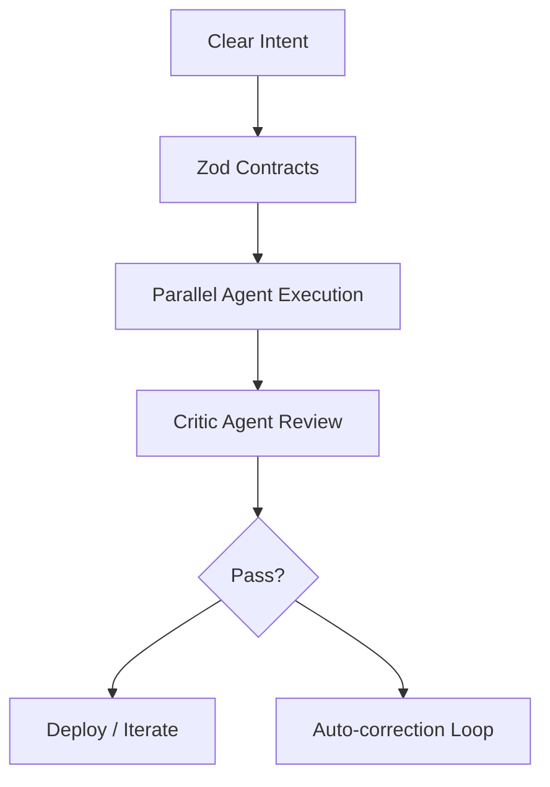

# **Architect-Solopreneur Part 4: Core Systems Live — Web Dashboard, Local LLM Inference, and First IoT Pipeline**

We’re making real progress. In [Part 1](Part-1-My-Plan-to-Solo-Build-EdgeMind.md) I laid out the Architect-Solopreneur vision. [Part 2](Part-2-Refining-the-Blueprint-for-EdgeMind.md) detailed the blueprint and framework pillars. [Part 3](Part-3-Early-Implementation.md) covered the first contracts and early execution.

In **Part 4**, the system is truly coming alive. Several core pieces are now functional, and I’m getting a tangible sense of what it feels like to build a sophisticated Web + Local LLM + IoT SaaS as a solo Architect-Solopreneur.

---

### Current Momentum

The EdgeMind repository has become a living, well-governed environment. The seven-layer architecture is firmly in place, contracts are actively driving development, and the agentic workflow is running daily with strong results.

---

### Major Milestones Achieved

#### 1. Real-Time Web Dashboard (Layers 2 + 3)
The frontend is now live and responsive, featuring:
- Next.js 15 App Router + React 19
- Tailwind + shadcn/ui components
- Real-time sensor visualization with Recharts
- Smooth GSAP animations for alerts and status changes

Clerk authentication and Next.js Middleware (Layer 1) are fully operational.

#### 2. Local LLM Inference Pipeline
The local intelligence layer is working end-to-end:
- Ollama running Llama 3.1 8B (quantized) on a test NVIDIA Jetson Orin
- Structured prompting that consumes validated `SensorData` payloads
- Anomaly detection with natural language explanations returned directly to the web dashboard

A Python + Panel dashboard is active for local model monitoring and experimentation.

#### 3. IoT + Inngest Pipeline (Layers 4–6)
The full end-to-end flow is now functional:
- Simulated (and one real) IoT device sending data via MQTT
- Inngest handling ingestion → validation → local LLM analysis → alert generation
- Immutable raw event logging in Neon PostgreSQL

---

### Updated Agentic Workflow in Practice



The Critic Agent (Continue.dev + OpenCode CLI rules) has already prevented two potential drift issues this week.

---

### Key Implementation Details

**Contract Evolution**  
I expanded the initial `SensorDataSchema` with derived event types and validation helpers. All Inngest functions now begin with strict Zod parsing:

```ts
// Inngest handler example
export const sensorIngestion = inngest.createFunction(
  { id: "sensor-ingest" },
  { event: "sensor.data.received" },
  async ({ event }) => {
    const validated = IngestionEventSchema.parse(event.data);
    
    // Immutable log
    await db.insert(rawEvents).values({
      payload: validated.payload,
      receivedAt: new Date(),
    });

    // Trigger local LLM analysis
    const analysis = await runLocalInference(validated.payload);
    
    return { analysis };
  }
);
```

**Observability & Resilience**
- OpenTelemetry traces are flowing end-to-end.
- Cold start re-hydration logic is implemented and tested.
- Model governance: Side-by-side comparison UI in the Panel tool helps evaluate model updates safely.

---

### Lessons from the Trenches

- **Contracts compound in value.** Every new feature builds faster because the foundational schemas are solid.
- **Inngest is a game-changer** for IoT + LLM workflows. The combination of durability and observability significantly reduces operational anxiety.
- **Governance Loop maturity matters.** As Continue.dev gains more project context, the quality of its suggestions improves dramatically — yet the Critic Agent remains essential.
- **Python + Panel** has proven surprisingly effective as a lightweight internal observability and experimentation tool alongside the main TypeScript stack.

---

### Architect-Solopreneur Framework Update

Framework documentation is growing quickly. Recent additions include:
- Reusable Continue.dev rule sets for contract enforcement
- Inngest resilience patterns tailored for flaky edge devices
- Initial “Cold Start” and “Model Governance” playbooks

I’m aiming to release the first public version soon.

---

### Performance Snapshot (Early)

- End-to-end latency (sensor → alert): ~180ms on local hardware
- Local LLM inference time: ~650ms for typical analysis (acceptable for this use case)
- Web dashboard feels instantaneous thanks to Bun and React 19
- Bundle size and performance budgets remain comfortably under limits

---

### What’s Next (Part 5 Preview)

- Multi-device support and user workspaces
- Advanced alerting with user-defined thresholds
- First real hardware deployment + field testing
- Expanded framework release with templates

---

The EdgeMind project is no longer theoretical. It is becoming a real, functioning system that demonstrates the true power of the Architect-Solopreneur approach: **one focused human, strong architectural foundations, governed AI agents, and disciplined execution**.

This model scales not by adding more people, but by adding clarity, contracts, and orchestration intelligence.

---

**Let’s keep the conversation going:**
- Which technical deep-dive would you like in Part 5 (e.g., Inngest patterns, local LLM prompting strategy, or observability setup)?
- Are you currently working on your own Architect-Solopreneur project?

Drop your thoughts below. I read and reply to as many as I can.

*On to Part 5 — where EdgeMind starts feeling like a real product.*
