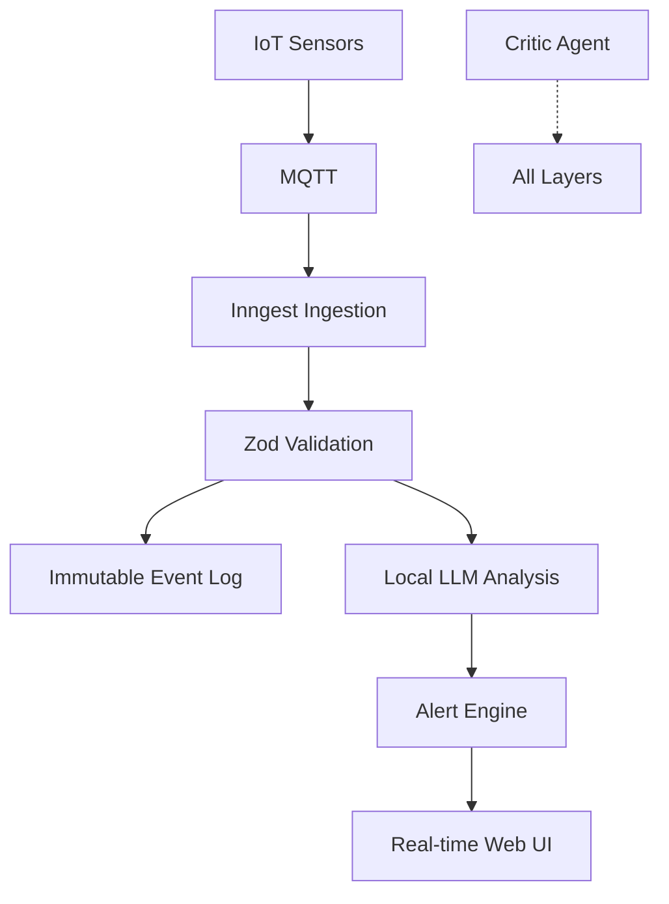

# **Architect-Solopreneur Part 5: Multi-Device Reality, Advanced Features, and the Framework Takes Shape**

The momentum is building. [Part 1](link-to-part1) outlined the vision. [Part 2](link-to-part2) detailed the blueprint. [Part 3](link-to-part3) covered first contracts. [Part 4](link-to-part4) brought core pipelines to life.

In **Part 5**, EdgeMind is crossing important thresholds: multi-device support, smarter alerting, real hardware integration, and significant progress on the Architect-Solopreneur Framework.

---

### Where We Stand Now

EdgeMind has evolved from a collection of promising components into a cohesive, multi-layered system. As a solo Architect-Solopreneur, I’m able to move fast while keeping quality and architectural integrity high.

---

### Major Advances in This Phase

#### 1. Multi-Device & Workspace Support
- Users can now onboard multiple edge devices and organize them into workspaces (factory floor, warehouse zone, etc.).
- Clerk + Next.js middleware handles tenant isolation.
- Real-time dashboard updates via Inngest-triggered Server-Sent Events (SSE).

#### 2. Advanced Alerting Engine
- User-defined thresholds stored in Sanity CMS (no redeploys needed).
- Local LLM generates natural language explanations for anomalies (e.g., “Vibration spike on Motor-3 suggests bearing wear”).
- GSAP-enhanced alert UI provides clear visual feedback.

#### 3. Real Hardware Integration
- Successfully deployed to a physical ESP32-based sensor rig.
- MQTT → Inngest pipeline is stable even with intermittent connectivity.
- Cold start re-hydration logic has been field-tested and works reliably.

#### 4. Model Governance in Action
The Python + Panel monitoring tool now automatically runs regression tests when I swap Ollama models. I can promote new versions with confidence.

---

### Updated End-to-End Flow

---

### Framework Progress: First Public Release Planned

The **Architect-Solopreneur Framework** is maturing rapidly. Current structure includes:

1. **Contractual Foundation** — Templates and automation for maintaining synchronized Zod schemas across web, backend, orchestration, and edge layers.

2. **Governance Loop** — Ready-to-use Continue.dev rulesets + OpenCode CLI configurations that turn AI into a disciplined team member.

3. **Resilience Patterns** — Inngest recipes for IoT/LLM systems, including cold-start handling, replay logic, and immutable logging.

I will release the initial version (v0.1) with templates, example repo structure, and documentation once EdgeMind reaches beta.

---

### Honest Reflections After Five Parts

**What’s working exceptionally well:**
- Contract-first development dramatically reduces bugs and integration friction.
- Inngest continues to be the unsung hero for reliable distributed workflows.
- The Critic Agent (governed Continue.dev + CLI) catches architectural drift early.

**Challenges still being refined:**
- Balancing local LLM performance vs. accuracy on lower-powered edge devices.
- Keeping the web dashboard snappy as real-time data volume grows.
- Deciding how much of the framework to open-source early vs. polishing further.

**Biggest takeaway:** The Architect-Solopreneur model is not just viable — it feels like the natural evolution of software creation. One focused human + strong systems + governed AI can deliver results that rival (and often exceed) small teams.

---

### Performance & Experience Snapshot

- Average sensor-to-alert latency: **~220ms** (local hardware)
- Dashboard feels instantaneous even with multiple devices
- Model regression testing now fully automated
- Zero major drift incidents since tightening the governance loop

---

### What’s Coming in Part 6

- User authentication flows and role-based access
- Production deployment strategy (hybrid cloud + on-prem)
- Expanded framework release with full templates
- First beta testing with real industrial users (early conversations already underway)

---

EdgeMind is transitioning from a technical experiment into a genuine product that demonstrates what’s possible when a single Architect-Solopreneur applies clear intent, rigorous contracts, intelligent orchestration, and disciplined execution.

This is the future of building: fewer people, higher leverage, stronger systems.

---

**Let’s keep building together:**

- Would you like the Architect-Solopreneur Framework v0.1 released as a public GitHub repo with EdgeMind as the reference implementation?
- What topic should I prioritize in Part 6?

Share your thoughts in the comments. Your feedback directly shapes where this series and the framework go next.

*Onward to Part 6 — where EdgeMind meets its first real users.*
