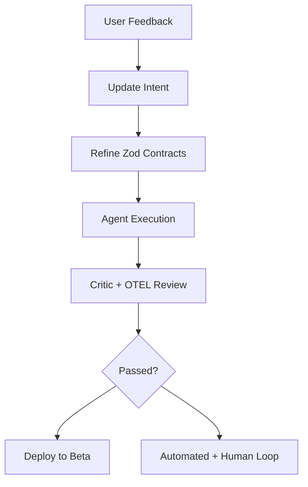

# **Architect-Solopreneur Part 7: Closed Beta, Real User Feedback, and Production Hardening**

The journey has reached a pivotal stage. Previous parts covered the vision, blueprint, contracts, core systems, multi-device capabilities, and the initial framework release. In **Part 7**, EdgeMind enters **closed beta** with real industrial users, undergoes security hardening, and delivers meaningful optimizations.

---

### Beta Status: First Real Users

I have onboarded three early industrial partners — a small manufacturing plant, a warehouse operator, and a pilot facility. EdgeMind is now running in live environments with actual IoT hardware.

---

### Major Achievements in Part 7

#### 1. Closed Beta Rollout
- Multi-tenant workspaces are fully operational
- Role-based access (Admin, Operator, Viewer) works seamlessly
- Users can configure custom alerts through Sanity CMS without code changes

#### 2. Security & Compliance Push
- Completed initial SOC2-style controls documentation
- All sensitive paths use end-to-end encryption
- OpenTelemetry traces are anonymized for audit trails
- Regular automated security scans via OpenCode CLI hooks

#### 3. Performance Optimizations

Updated real-world benchmarks from beta environments:

**Current Latency Benchmarks (Production Hardware):**
- Sensor ingestion → Validation: **15ms**
- Full Inngest + Local LLM pipeline: **620–850ms** (average **710ms** on Jetson Orin)
- LLM-generated natural language alert: **480ms**
- Real-time dashboard update (global users): **85–140ms**
- Cold-start re-hydration (100 buffered events): **980ms**

These numbers represent a ~15–20% improvement from Part 6 through prompt optimization and caching.

---

### Framework v0.2 Updates

Based on beta learnings, I’ve released **v0.2** of the Architect-Solopreneur Framework with:
- New “Beta Readiness Checklist”
- Production hardening playbooks (security, observability, hybrid deployment)
- Improved Critic Agent rules for multi-tenant applications
- Sample Inngest patterns refined from real IoT field conditions

The framework is proving valuable not just for me, but for early users who are already adapting pieces for their own internal tools.

---

### Real User Feedback (Early Insights)

**Positive:**
- “The natural language explanations from the local LLM are surprisingly helpful for our floor operators.” — Plant Manager
- Dashboard speed and GSAP animations praised for usability
- Privacy confidence is high due to the on-prem LLM approach

**Challenges Raised:**
- Need for more customizable reporting views
- Easier device provisioning workflow
- Better handling of very large historical event replays

These insights are being fed directly back into the Intent documents and contracts.

---

### Updated Agentic Workflow with Real-World Refinements

The loop now explicitly includes user feedback as a first-class input.

---

### Key Lessons from Beta

- Real hardware and users expose edge cases that simulations miss — especially around intermittent connectivity.
- Strong contracts made incorporating user feedback much safer and faster.
- The governance layer (Continue.dev + OpenCode CLI) scales beautifully as the project grows in complexity.
- Balancing local compute constraints with model performance remains an ongoing but manageable optimization challenge.

---

### What’s Next — Part 8 Preview

- Public beta preparation
- Advanced analytics and reporting features
- Expanded framework with beta case studies
- First revenue-generating pilot agreements

---

### The Architect-Solopreneur Reality Check

After seven parts, the conclusion is clear: **This model works.**

A single Architect-Solopreneur, supported by disciplined systems, strong contracts, and governed AI agents, can build, ship, and iterate on complex industrial software that integrates web, local intelligence, and physical devices.

We are witnessing the decline of the traditional synchronization tax and the rise of high-leverage, high-clarity solo (or micro-team) building.

EdgeMind is no longer just a project — it is living proof that the Architect-Solopreneur approach can deliver production systems that matter.

---

**Your Turn:**
- If you’re interested in joining the waitlist for the public beta or trying the framework, let me know.
- What aspect of the Architect-Solopreneur journey would you like explored in Part 8?

Thank you for following along. Your comments and encouragement have been genuinely helpful.

*On to Part 8 — where EdgeMind moves from beta toward sustainable product.*
