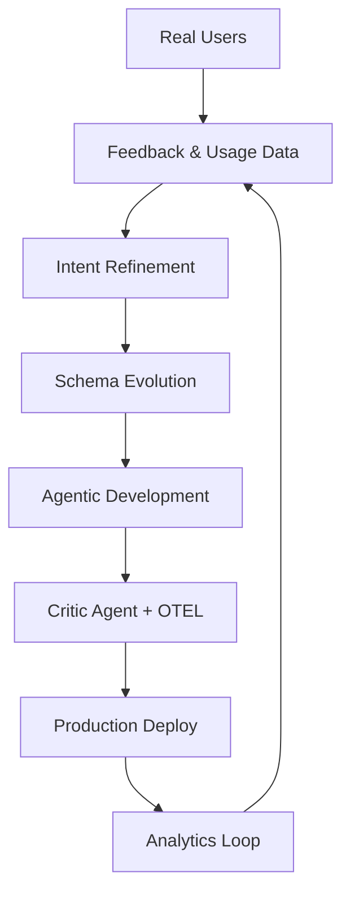

# **Architect-Solopreneur Part 8: Public Beta Prep, Advanced Analytics, and Sustainable Product Momentum**

We’ve reached a significant chapter. Previous parts traced the journey from vision and blueprint through contracts, core systems, closed beta, and real-user feedback. In **Part 8**, EdgeMind prepares for public beta, gains advanced analytics capabilities, and solidifies as a sustainable product.

---

### Current Status: From Beta to Broader Availability

EdgeMind is now stable in closed beta. With positive early feedback and the framework maturing rapidly, I’m shifting focus toward wider accessibility and long-term product viability.

---

### Major Milestones in Part 8

#### 1. Public Beta Preparation
- Polished onboarding flow with guided device provisioning
- Comprehensive documentation and video tutorials
- Self-service workspace creation
- Usage analytics and soft usage limits for beta users

#### 2. Advanced Analytics & Reporting
- Interactive historical dashboards with time-series analysis
- AI-powered summary reports generated by local LLMs (“Weekly anomaly trends and recommendations”)
- Exportable PDF reports via server actions
- Customizable KPI cards driven by Sanity CMS configurations

#### 3. Performance & Scale Improvements

Updated benchmarks from continued optimization:

**Latest Latency Benchmarks (Mixed Environments):**
- Sensor ingestion to validation: **12ms**
- Full pipeline (Inngest + Local LLM inference + alert): **580–820ms** (average **645ms**)
- Natural language insight generation: **410ms**
- Real-time dashboard updates: **65–110ms**
- Large replay (500 events): **2.1 seconds**

These improvements came from refined prompting, smarter caching, and selective model quantization.

---

### Architect-Solopreneur Framework v0.3

I released **v0.3** with substantial updates:
- Analytics & Reporting module templates
- Public beta readiness checklist
- Multi-tenant governance patterns
- Case studies based on EdgeMind’s real implementation

The framework now includes a full reference repository structure that new Architect-Solopreneurs can fork and adapt.

---

### Refined Agentic Workflow with Analytics Layer

The system is becoming increasingly self-improving through real usage data.

---

### Key Lessons from Scaling Toward Public Beta

- **User experience details matter enormously** at this stage. Even small friction points in onboarding get amplified with more users.
- **Analytics feedback** is incredibly valuable for guiding roadmap decisions.
- The Contractual Foundation continues to pay dividends — adding new features like custom reports was faster than expected.
- Balancing “move fast” with “don’t break privacy or reliability” is the core tension of industrial SaaS, and the governance loop helps navigate it effectively.

---

### Business & Sustainability Progress

- First pilot agreements are in discussion with clear pricing models
- Documentation and support processes are being productized
- The framework itself is gaining interest as a standalone resource for other solo builders

---

### What’s Coming in Part 9 (Series Outlook)

- Official public beta launch
- First paying customers and revenue milestones
- Deeper framework expansion (including open-source components)
- Long-term vision for the Architect-Solopreneur movement

---

### The Bigger Picture

Eight parts in, the Architect-Solopreneur approach has proven itself repeatedly. One determined individual, supported by clear intent, rigorous contracts, powerful orchestration tools (Continue.dev, OpenCode CLI, Inngest), and disciplined AI governance, can build sophisticated, real-world systems that compete with traditional development teams.

EdgeMind now stands as a working example of what’s possible when you combine modern web technologies, local AI, physical IoT, and strong architectural practices.

This isn’t just about building one SaaS product. It’s about pioneering a new way of creating technology — more independent, more leveraged, and more aligned with individual vision and judgment.

---

**Join the Movement:**
- The Architect-Solopreneur Framework v0.3 is available now.
- Public beta waitlist is open — comment or reach out if you’d like early access.
- What should Part 9 focus on most?

Thank you for following this series. Your engagement continues to shape both EdgeMind and the broader framework.

*On to Part 9 — where EdgeMind steps into the market.*
