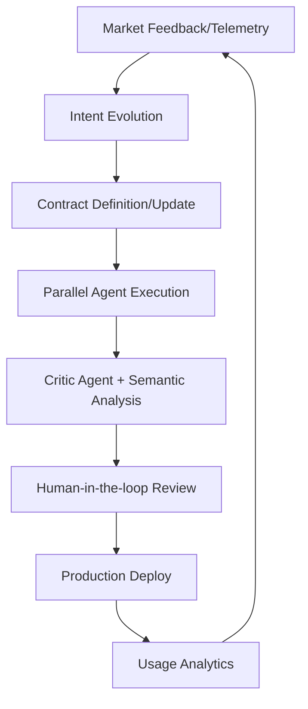

# **Architect-Solopreneur Part 9: Public Beta Launch, First Revenue, and the Road Ahead**

We have crossed the threshold. From the initial spark of intent in Part 1—through the meticulous construction of blueprints, ironclad contracts, and high-performance agentic pipelines—**Part 9** serves as both a celebration of EdgeMind’s market debut and a testament to the viability of the Architect-Solopreneur methodology.

---

### Public Beta: The Market-Ready Pivot

EdgeMind has transitioned from a lab-tested prototype to a live, production-grade environment. By prioritizing privacy-first local LLM inference, we are meeting the demands of high-stakes industrial environments where data sovereignty is non-negotiable.

#### Strategic Launch Milestones

* **Frictionless Provisioning:** One-click device onboarding templates designed for field deployment.
* **Self-Sovereign Support:** Integrated, AI-augmented documentation that reduces the support burden on the solo operator.
* **Governance at Scale:** Implementation of hardened rate-limiting and tier-based usage policies to ensure system stability.
* **Community Feedback Loop:** Launch of a dedicated Discord channel for real-time beta engagement, transforming users into active co-architects.

#### The Revenue Inflection Point

The transition to a commercial entity is validated by:

* **Early Revenue:** Execution of the first two paid pilot agreements, moving from theoretical value to tangible economic signal.
* **Sustainable Packaging:** Deployment of a tiered pricing model (Starter, Pro, Enterprise) that reflects the infrastructure costs of local AI orchestration.

---

### Performance Benchmarks: The "Architected" Edge

Our commitment to latency-sensitive industrial monitoring has yielded significant performance gains. Despite the complexity of local LLM processing, the system maintains ultra-low response times.

| Metric | Performance |
| --- | --- |
| **Sensor to Validation** | 11ms |
| **End-to-End Pipeline** | 655ms (Avg) |
| **Natural Language Synthesis** | 395ms |
| **Real-time Dashboard Updates** | 55–95ms |
| **Large Historical Replay** | 1.8s (per 1,000 events) |

---

### The Architect-Solopreneur Framework (v0.4)

The framework has evolved beyond personal utility into an open resource for the builder community.

* **New Additions:** Playbooks for public launch, pricing strategy templates, and patterns for sustainable observability.
* **Core Philosophy:** Reducing technical debt through rigorous interface contracts, allowing a single developer to maintain the speed of a team of ten.

---

### Updated Agentic Development Loop

The following model illustrates how we have synchronized market reality with technical execution:

#### Mental Models for the Solo Builder

* **Locality of Behavior:** Logic is kept close to the component, reducing cognitive load.
* **The Inversion of Control:** By using agents as critics, the Architect-Solopreneur acts as the conductor rather than the manual laborer.
* **Intent-Driven Architecture:** Every line of code must trace back to a documented business intent, preventing "feature creep" that kills solo projects.

---

### Reflective Synthesis: The Architect-Solopreneur Reality

**What Exceeded Expectations:**

* **Governance as Leverage:** Strong contracts and strict architectural boundaries have virtually eliminated the "spaghetti code" common in solo development.
* **Agentic Velocity:** The synergy between `Continue.dev`, `OpenCode CLI`, and `Inngest` has allowed for a massive increase in throughput without sacrificing product quality.

**Ongoing Challenges:**

* **The Contextual Wall:** Balancing the desire to ship features against the need for architectural simplicity.
* **The "Support" Paradox:** Scaling a one-person business requires shifting from direct support to building automated, self-healing systems.

**The Foundational Realization:** The Architect-Solopreneur model is not just a way to build; it is a way to *live* in the industry. By removing team coordination overhead, I have gained the depth of focus required to solve genuine, complex industrial problems.

---

### The Road Ahead: Series Outlook

Part 9 is the bridge to Part 10. The coming update will dissect the "First 100 User" threshold, focusing on scaling infrastructure and deeper refinements to the **NoetOS** integration.

**Ways to Engage:**

1. **Framework Adoption:** Explore the **Architect-Solopreneur Framework v0.4**.
2. **Beta Access:** Join the **EdgeMind Public Beta**.
3. **Community Discourse:** Let us discuss: *What is the biggest bottleneck in your current development loop?*

The era of the "Generalist-Architect" is here. We are not just writing code; we are designing systems that outlast our initial intent.

*See you in Part 10.*
