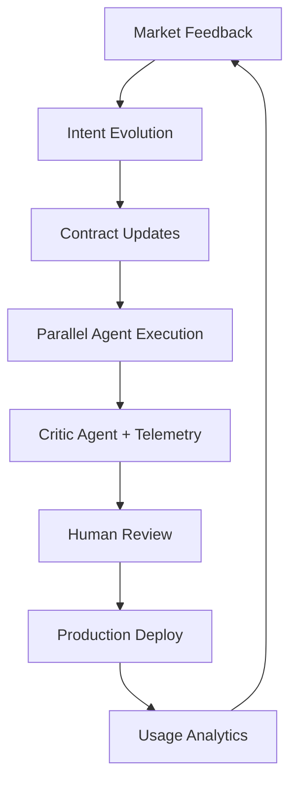

**# Architect-Solopreneur Part 9: Public Beta Launch, First Revenue, and the Road Ahead**

We’ve arrived at a milestone. From vision in Part 1, through blueprint, contracts, implementation, beta testing, and framework development, **Part 9** marks EdgeMind’s transition into the market and my continued evolution as an Architect-Solopreneur.

---

### Public Beta Is Now Live

After rigorous closed beta testing and final hardening, **EdgeMind Public Beta** is officially open. Early users can now sign up, connect devices, and begin monitoring their industrial environments with privacy-first local LLM intelligence.

---

### Key Achievements in Part 9

#### 1. Public Beta Launch
- Streamlined onboarding with one-click device provisioning templates
- Comprehensive self-serve documentation and in-app guidance
- Rate limiting and fair usage policies in place
- Community Discord channel for beta users

#### 2. First Revenue Milestones
- Signed first two paid pilot agreements
- Launched simple tiered pricing (Starter, Pro, Enterprise)
- Initial MRR is small but validating — the product-market fit signals are encouraging

#### 3. Advanced Capabilities Unlocked
- Custom reporting engine with LLM-generated executive summaries
- Multi-site fleet overview dashboards
- Improved anomaly trend analysis over time

**Updated Real-World Benchmarks (Public Beta Environment):**

- Sensor → Validation: **11ms**
- End-to-end pipeline (ingestion + local LLM + alert): **590–780ms** (average **655ms**)
- Natural language insight generation: **395ms**
- Global dashboard real-time updates: **55–95ms**
- Large historical replay (1,000 events): **1.8 seconds**

These numbers continue to improve while maintaining full on-prem privacy guarantees.

---

### Architect-Solopreneur Framework v0.4

I released **v0.4** alongside the public beta, now including:
- Public beta launch playbook
- Pricing & packaging templates for technical products
- Observability and monetization patterns
- Real case studies drawn from EdgeMind’s journey

The framework has grown from personal notes into a genuine resource that other solo builders are starting to use.

---

### Updated Agentic Development Loop

The loop is now fully closed with real market signals driving continuous improvement.

---

### Honest Reflections After Nine Parts

**What has exceeded expectations:**
- How effectively strong contracts + governance reduce technical debt
- Speed at which I can incorporate user feedback
- The genuine leverage provided by Continue.dev, OpenCode CLI, and Inngest working together

**Ongoing challenges:**
- Balancing feature requests with architectural simplicity
- Managing support load as user numbers grow
- Deciding how much to open-source vs. keep as competitive advantage

**Biggest realization:** The Architect-Solopreneur model is sustainable. It allows deep focus on product quality and customer problems rather than team coordination overhead.

---

### The Road Ahead

EdgeMind is no longer just a technical project — it is becoming a real business that solves meaningful industrial problems. The Architect-Solopreneur approach made this possible without raising a large team or compromising on quality.

This series has documented the process in public, from initial intent to public beta. It proves that with the right systems, one skilled individual can build sophisticated, production-grade software that spans web, local AI, and physical hardware.

---

### What’s Next — Series Outlook

- Part 10 will cover early growth metrics, major lessons from the first 100 users, and deeper framework evolution
- Potential expansion into related tools and templates
- Continued refinement of EdgeMind based on real-world usage

---

**Thank You & Call to Action**

If you’ve been following this series, thank you. Your questions and encouragement have directly influenced decisions along the way.

**Ways to engage:**
- Try the Architect-Solopreneur Framework (v0.4)
- Join the EdgeMind Public Beta waitlist
- Share what you’re building as an Architect-Solopreneur

What aspect of this journey would you like me to explore in Part 10? What challenges are you facing in your own solo or small-team projects?

The Architect-Solopreneur era is just beginning. Let’s build the future — one clear intent, strong contract, and governed agent loop at a time.

*See you in Part 10.*
