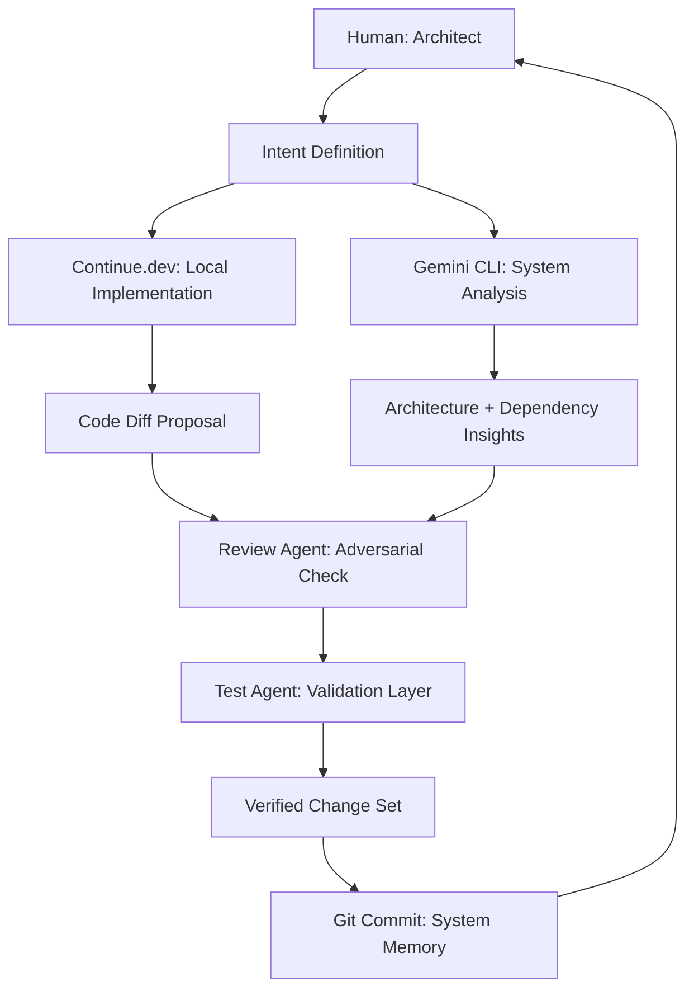
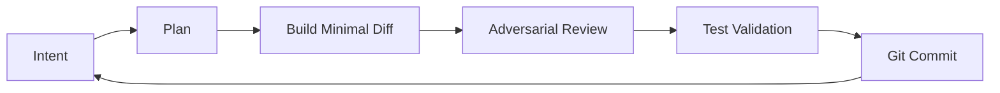
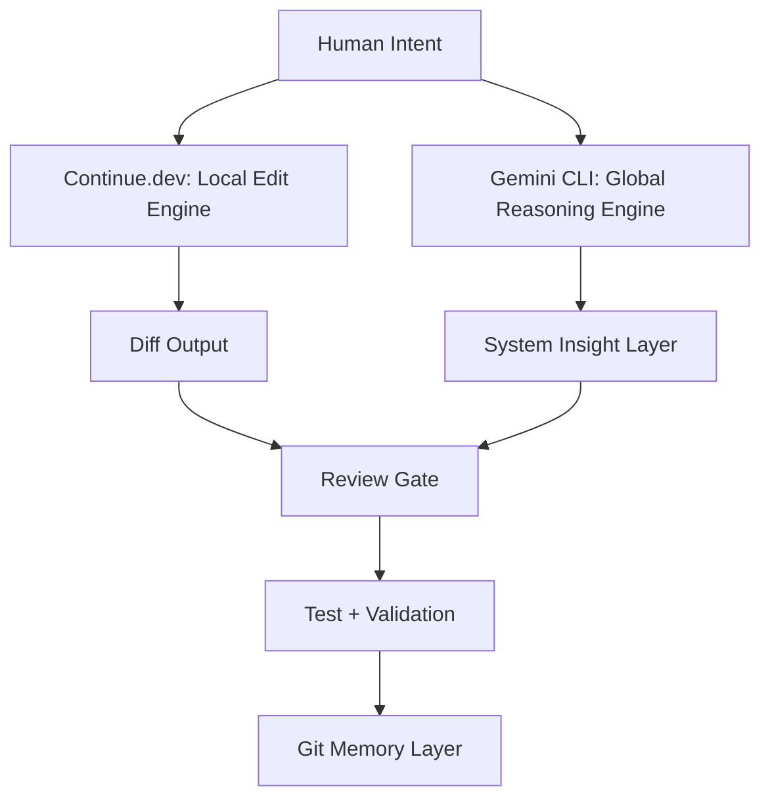
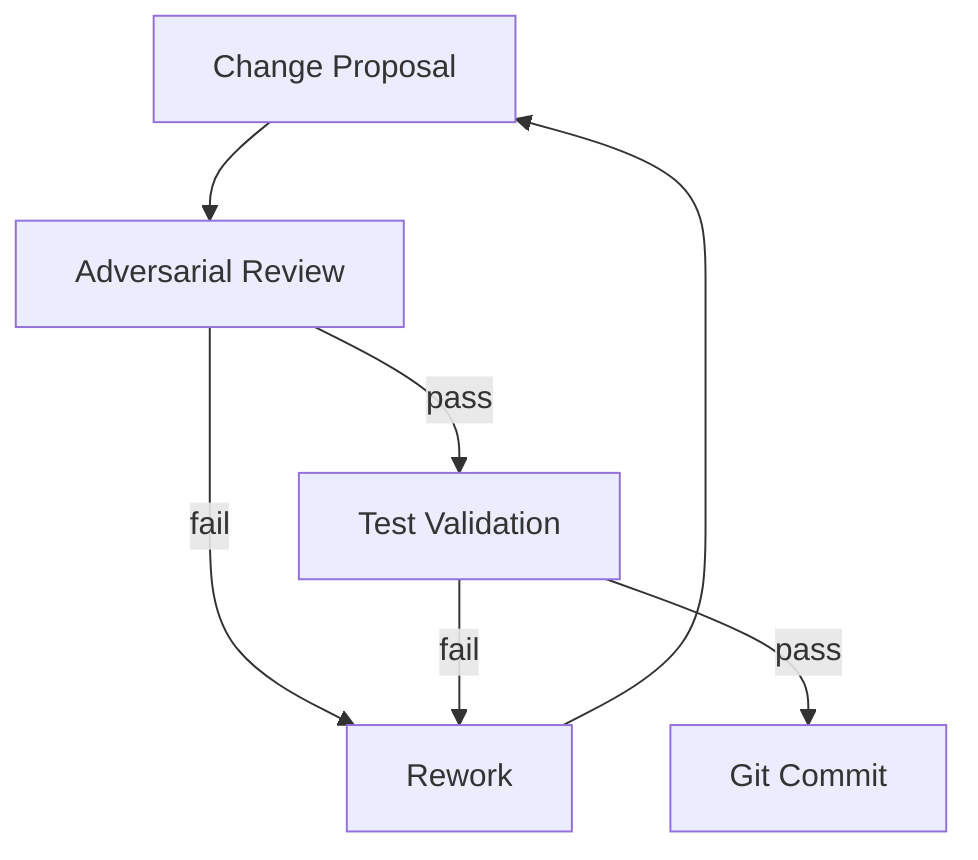
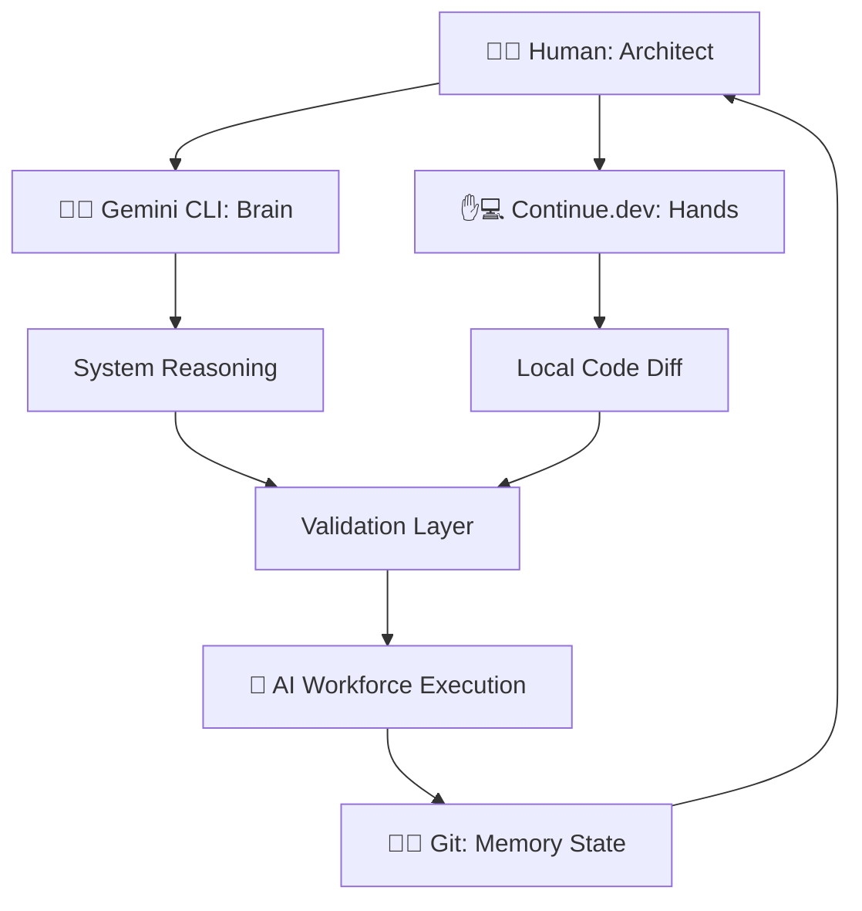

# 🧠 Beyond Vibecoding: Professional AI Co-Development

## A Framework for Discipline, Token Efficiency, and Sovereign Software Engineering

Many developers treat AI as a “vibe machine”—typing vague prompts and hoping for production-ready code. This works for prototypes, but it collapses at scale. Systems become inconsistent, fragile, and filled with hidden assumptions and accumulating technical debt.

The root problem is not the AI.

It is the **mental model of collaboration**.

### The shift is simple but structural:

Stop treating AI as a magical black box.

Treat it as a **constrained engineering participant inside a controlled system**.

This reframes AI from novelty tooling into a **force multiplier for disciplined software engineering**.

---

# 🧩 1. Core Philosophy: Engineering Over “Vibes”

Professional AI co-development is not prompt crafting.

It is **systems engineering with distributed cognitive roles**.

You are not “asking AI to code.”

You are designing a **controlled execution environment for software production**.

---

## ⚠️ The Four Non-Negotiable Engineering Properties

Every AI-assisted change must satisfy all four properties:

* **Explainable** → reasoning is explicit and inspectable
* **Reviewable** → changes are small, diff-based, and inspectable
* **Reversible** → Git guarantees safe rollback
* **Testable** → behavior is validated through tests or observability

If any property is violated, the change is invalid by design.

---

## 🛡️ Role Separation: The Engineering Team Model

Instead of “one AI assistant,” you simulate a **structured engineering organization**:

* **🧠 Code Agent (Builder)**
  Produces minimal diffs, avoids over-engineering, prioritizes clarity and correctness.

* **🧠 Review Agent (Critic)**
  Adversarial thinker. Assumes every change is wrong until proven safe.

* **🧪 Test Agent (Validator)**
  Generates edge-case coverage and enforces behavioral correctness.

* **👤 Human (Architect / Orchestrator)**
  Owns intent, constraints, system design, and final approval authority.

This separation is what converts AI from generator → **controlled engineering system**.

---

## 🧠 Division of Labour: Full System View

### 🧑 Human (System Architect)

* Defines intent and constraints
* Chooses trade-offs (speed vs correctness, simplicity vs extensibility)
* Approves or rejects changes
* Owns architecture and long-term system health

### 🧠 Continue.dev (Local Code Intelligence Layer)

* File-level reasoning
* Diff generation
* Context-aware edits inside editor
* Implements *localized changes only*

### 🌐 Gemini CLI (System Intelligence Layer)

* Cross-repository reasoning
* Dependency analysis
* Architecture validation
* Detects systemic coupling and drift

### 🤖 AI Models (Execution Layer)

* Generate code, tests, and refactors
* Operate strictly under constraints
* Never act as autonomous decision-makers

---

## 🧭 System Architecture of Co-Development



---

# ⚙️ 2. Production-Grade AI Co-Development System

## Tools Stack

* VS Code
* Continue.dev
* Gemini CLI
* Git (non-negotiable backbone)

Together, they form a **closed-loop engineering system**.

---

## 🔁 The Closed-Loop Workflow



Each loop is a **learning and system-hardening cycle**, not just development.

---

## 🧱 Git as System Memory

Git is not version control in this model.

It is the **engineering memory substrate of the system**.

| Type     | Meaning                      |
| -------- | ---------------------------- |
| docs     | intent / reasoning           |
| feat     | new behavior                 |
| fix      | correction                   |
| refactor | structural improvement       |
| test     | behavioral enforcement layer |

Every commit encodes **decision history**, not just code changes.

---

# 🛠️ 3. Tactical Setup: Continue.dev Configuration

```json
{
  "models": [
    {
      "title": "AI Pair Programmer",
      "provider": "openai",
      "model": "gpt-4o"
    }
  ],
  "contextProviders": [
    "codebase",
    "openFiles",
    "diff",
    "terminal",
    "problems"
  ],
  "customCommands": [
    {
      "name": "review",
      "prompt": "Review strictly for correctness, safety, architecture, and edge cases."
    },
    {
      "name": "refactor",
      "prompt": "Refactor with minimal diff and production constraints."
    },
    {
      "name": "test",
      "prompt": "Generate edge-case heavy tests for validation."
    }
  ]
}
```

---

## 🧠 Gemini CLI: System-Level Reasoning Layer

Gemini CLI operates above the editor layer.

It functions as a **global reasoning system across the repository**:

* architecture analysis
* dependency tracing
* coupling detection
* systemic risk identification
* cross-module reasoning

### Key distinction:

* Continue.dev → *local edits*
* Gemini CLI → *system intelligence*

---

## 🧭 System Interaction Model



---

# 🔁 4. The Core Working Loop (Operational Detail)

## Phase 1: Intent → Translation

Human defines:

* goal
* constraints
* risk tolerance
* expected behavior

AI responds with:

* system interpretation
* architecture implications
* failure modes
* execution plan

---

## Phase 2: Build → Critique

AI produces **minimal diffs only**.

Then:

* Review Agent challenges assumptions
* architectural drift is flagged
* unsafe patterns are rejected
* iteration continues until stable

> No change survives without adversarial pressure.

---

## Phase 3: Validate → Commit

Every accepted change must include:

* tests or justification
* behavioral verification
* Git commit as system memory

---

## 🔄 Feedback Loop of Engineering Pressure



---

# ⚙️ 5. Execution Lifecycle (End-to-End)

1. Human defines intent
2. AI translates intent into plan
3. Continue.dev implements minimal diff
4. Gemini CLI evaluates system impact
5. Review Agent enforces correctness
6. Test Agent validates behavior
7. Git commits system state

---

# 🔍 6. Debugging Loop (Failure Recovery System)

When systems break:

1. Reproduce issue
2. Identify root cause boundary violation
3. Trace dependency chain (Gemini CLI)
4. Apply minimal fix (Continue.dev)
5. Validate behavior
6. Add regression test

Failures are not exceptions.

They are **system hardening events**.

---

# ⚡ 7. Feature Development Pipeline

Every feature follows:

1. Intent definition
2. System design reasoning (Gemini CLI)
3. Local implementation (Continue.dev)
4. Adversarial review
5. Test generation
6. Validation
7. Commit

---

# ⚖️ 8. Vibecoding vs Professional Co-Development

| Aspect      | Vibecoding   | Co-Development System |
| ----------- | ------------ | --------------------- |
| Prompts     | Vague        | Structured intent     |
| Ownership   | AI-driven    | Human-architected     |
| Execution   | Uncontrolled | Constrained pipeline  |
| Debugging   | Reactive     | Systematic            |
| Scalability | Breaks early | Production-grade      |

---

# 🧠 9. Mental Model Shift

## AI is NOT:

* autonomous developer
* system architect
* decision authority

## AI IS:

* constrained execution engine
* diff generator under rules
* adversarial reasoning proxy
* structured assistant

---

# 🔒 10. Professional Guardrails

* No change without review
* No commit without validation
* No untested production code
* No silent refactors
* No multi-file changes without intent
* No skipping Git checkpoints

These enforce **discipline over convenience**.

---

# 🚀 11. Final System Outcome

You now operate:

> 🧠 A **disciplined AI co-development system with adversarial validation, layered intelligence (local + global), and Git-backed memory**.

---

# 🧭 Final Identity Shift

You are no longer “using AI tools.”

Here’s a more expressive, systems-oriented version with consistent iconography and clearer cognitive layering:

---

## 🧭 System Roles in AI-Native Co-Development

This is not a toolchain.

It is a **distributed cognitive system** where each component represents a distinct layer of engineering intelligence:

* 🧠👤 **Human = Architect (Authority Layer)**
  Defines intent, constraints, trade-offs, and system boundaries.
  Owns final judgment, direction, and responsibility for outcomes.

* 🧠🌐 **Gemini CLI = Brain (System Reasoning Layer)**
  Performs cross-repository reasoning, dependency analysis, and architectural evaluation.
  Sees the *system as a whole*, not isolated files.

* ✋💻 **Continue.dev = Hands (Local Execution Layer)**
  Operates inside the code editor.
  Implements precise, localized diffs and context-aware modifications.

* 🧾🧠 **Git = Memory (State History Layer)**
  Stores irreversible snapshots of engineering decisions.
  Represents system evolution over time, not just code versions.

* 🤖⚙️ **AI Models = Constrained Workforce (Execution Layer)**
  Generate code, tests, and refactors under strict constraints.
  Do not decide—only execute within defined boundaries.

---

## 🧩 Mental Model Compression

You can think of the system as:

```text
👤 Human → decides what should exist
🧠 Gemini CLI → understands what exists globally
✋ Continue.dev → changes what exists locally
🧾 Git → remembers what existed before
🤖 AI → produces candidate implementations under constraint
```

---

## 🧠 System Topology View



---
