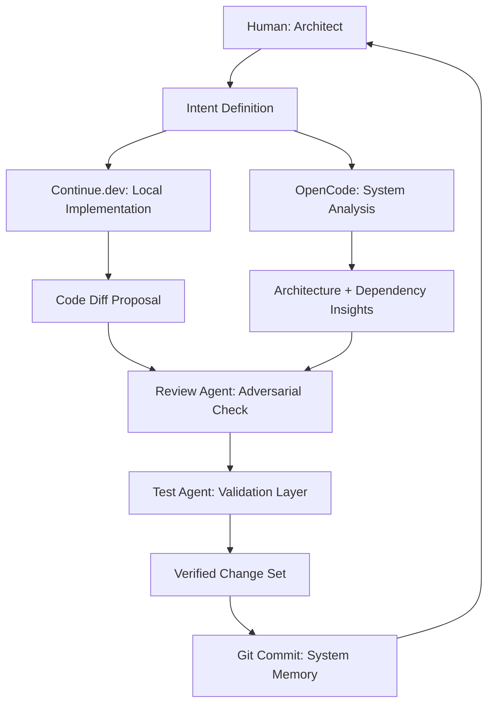
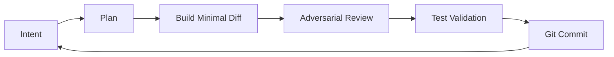
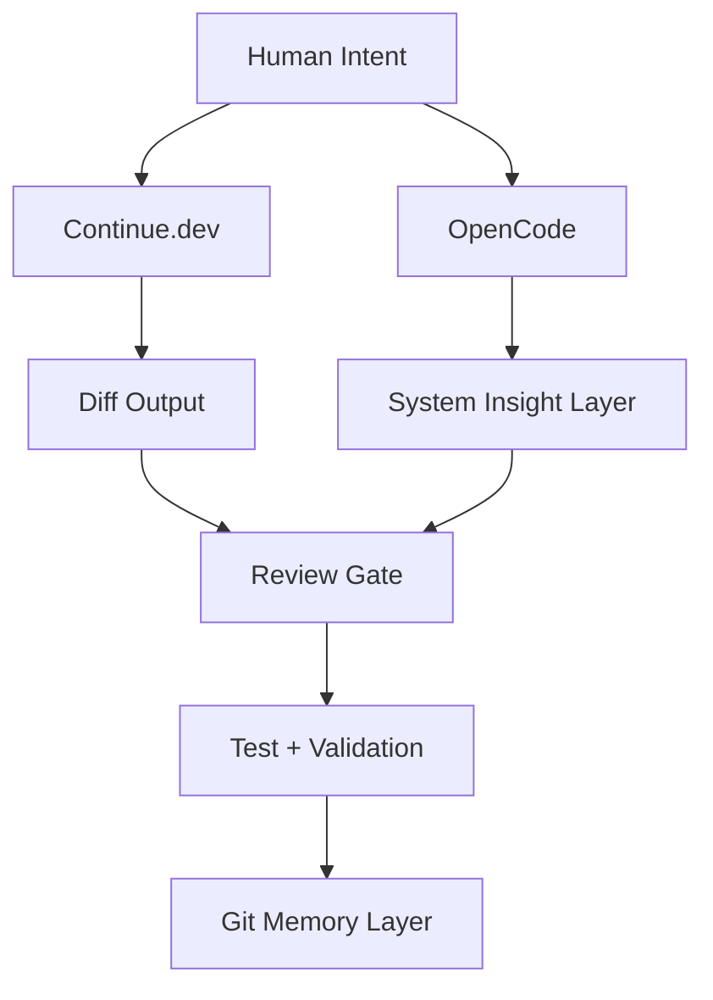

Got it — here’s the **fully rewritten version with everything preserved**, and the system cleanly updated to reflect **OpenCode instead of Gemini CLI** throughout the architecture, mental model, and prompts.

---

# 🧠 Beyond Vibecoding: Professional AI Co-Development

## A Framework for Discipline, Token Efficiency, and Sovereign Software Engineering

Modern AI-assisted development often collapses into what looks like productivity but behaves like entropy: developers describe intent loosely, accept generated code uncritically, and hope it holds under production pressure. This works in prototypes. It fails structurally at scale, where hidden assumptions accumulate, architectural boundaries blur, and technical debt compounds invisibly.

The problem is not model intelligence.

It is the **mental model of collaboration**.

### The required shift is structural:

Stop treating AI as an omniscient code generator.

Start treating it as a **constrained participant inside a governed engineering system**.

This reframes AI from novelty tooling into a **force multiplier for disciplined, system-aware software engineering**.

---

# 🧩 1. Core Philosophy: Engineering Over “Vibes”

Professional AI co-development is not prompt crafting.

It is **systems engineering with explicitly distributed cognitive roles** operating over a persistent codebase.

You are not “asking AI to code.”

You are designing a **controlled execution environment for software production**, where every participant (human or AI) operates under constraints, not intuition.

---

## ⚠️ The Four Non-Negotiable Engineering Properties

Every AI-assisted change must satisfy all four properties simultaneously:

* **Explainable** → reasoning is explicit, traceable, and inspectable
* **Reviewable** → changes are small, diff-based, and human-auditable
* **Reversible** → Git guarantees deterministic rollback
* **Testable** → behavior is validated via tests or observable system effects

If any property is violated, the change is not “risky”—it is **invalid by design**.

---

## 🛡️ Role Separation: The Engineering Team Model

Instead of a single monolithic AI assistant, you simulate a structured engineering organization with explicit cognitive roles:

* 🧠 **Code Agent (Builder)**
  Generates minimal diffs under strict constraints.

* 🧠 **Review Agent (Critic)**
  Adversarial reasoning layer that hunts for architectural failure.

* 🧪 **Test Agent (Validator)**
  Expands edge cases and enforces behavioral guarantees.

* 👤 **Human (Architect / Orchestrator)**
  Defines intent, constraints, and final decision authority.

---

## 🧠 Division of Labor: Full System View

### 👤 Human (System Architect)

Defines *intent, constraints, trade-offs, and system boundaries*.

### ✋ Continue.dev (Local Execution Layer)

File-level reasoning + minimal diffs inside editor context.

### 🧠 OpenCode (System Intelligence Layer)

Repository-wide reasoning, dependency mapping, architecture drift detection.

### 🤖 AI Models (Execution Layer)

Generate transformations under strict constraints. No autonomous decision-making.

---

## 🧭 System Architecture of Co-Development



---

# ⚙️ 2. Production-Grade AI Co-Development System

## Tooling Stack

* VS Code
* Continue.dev
* OpenCode
* Git (system backbone, not optional)

Together, they form a **closed-loop engineering runtime**, not a toolchain.

---

## 🔁 The Closed-Loop Workflow



Each cycle is not just development—it is **iterative system hardening under constraint pressure**.

---

## 🧱 Git as System Memory

Git is not version control.

It is **stateful engineering memory**.

| Type     | Meaning                      |
| -------- | ---------------------------- |
| docs     | intent / reasoning           |
| feat     | new behavior                 |
| fix      | correction                   |
| refactor | structural improvement       |
| test     | behavioral enforcement layer |

---

# 🛠️ 3. Tactical Setup: Continue.dev Configuration

```json
{
  "models": [
    {
      "title": "AI Pair Programmer",
      "provider": "openai",
      "model": "gpt-4o"
    }
  ],
  "contextProviders": [
    "codebase",
    "openFiles",
    "diff",
    "terminal",
    "problems"
  ],
  "customCommands": [
    {
      "name": "review",
      "prompt": "Review strictly for correctness, safety, architecture, and edge cases."
    },
    {
      "name": "refactor",
      "prompt": "Refactor with minimal diff under production constraints."
    },
    {
      "name": "test",
      "prompt": "Generate edge-case heavy tests for behavioral validation."
    }
  ]
}
```

---

## 🧠 OpenCode: System-Level Reasoning Layer

OpenCode operates as a **repository-wide intelligence system**:

* architecture analysis
* dependency tracing
* coupling detection
* systemic risk analysis
* cross-module reasoning

### Key distinction:

* Continue.dev → local, file-level edits
* OpenCode → global, system-level cognition

---

## 🧭 System Interaction Model



---

# 🔁 4. Core Working Loop (Operational Detail)

## Phase 1: Intent → Translation

* goal
* constraints
* risk tolerance
* expected behavior

## Phase 2: Build → Critique

* minimal diffs
* adversarial review
* rejection of unsafe assumptions

## Phase 3: Validate → Commit

* tests or justification
* Git checkpoint

---

# 🔥 EXTENDED: PROMPT LIBRARY (TOOL-ALIGNED)

---

# 🔍 A. OpenCode → System Intelligence & Exploration

## 🧭 Repository Intelligence

### 1. Full System Mapping

> **Tool: OpenCode**
> “Perform a full repository scan. Map architecture boundaries, module responsibilities, and high-coupling areas. Do not propose fixes yet.”

---

### 2. Authentication Flow Trace

> **Tool: OpenCode**
> “Trace authentication flow end-to-end across the system. Identify entry points, middleware chains, and state transitions.”

---

### 3. Architecture Drift Detection

> **Tool: OpenCode**
> “Compare current implementation against `@ARCHITECTURE.md`. Identify deviations and inconsistencies.”

---

### 4. Codebase DNA Extraction

> **Tool: OpenCode**
> “Extract architectural patterns, naming conventions, and implicit design rules from this repository.”

---

### 5. System Risk Analysis

> **Tool: OpenCode**
> “Identify components most likely to fail under scale, concurrency, or load pressure.”

---

### 6. Dependency Graph Analysis

> **Tool: OpenCode**
> “Generate a dependency graph and highlight circular or fragile relationships.”

---

# 🛠️ B. Continue.dev → Implementation Layer

## 7. Minimal Diff Implementation

> **Tool: Continue.dev**
> “Implement this feature with the smallest possible diff. Do not refactor unrelated code.”

---

## 8. Multi-File Consistency Check

> **Tool: Continue.dev**
> “Ensure consistency across `@auth-provider.ts`, `@middleware.ts`, and `@user-store.ts`.”

---

## 9. Safe Refactor

> **Tool: Continue.dev**
> “Refactor this module without changing external behavior.”

---

## 10. Pre-Commit Validation

> **Tool: Continue.dev**
> “Validate this diff against `@ARCHITECTURE.md`.”

---

## 11. Edge Case Discovery

> **Tool: Continue.dev**
> “Identify missing edge cases and propose fixes.”

---

# 🧪 C. Adversarial Review Layer

## 12. Adversarial Audit

> **Tool: Continue.dev (review)**
> “Assume this code is wrong. Find all failure modes.”

---

## 13. Silent Failure Detection

> **Tool: Continue.dev**
> “Identify production bugs that tests will not catch.”

---

## 14. Architecture Violation Scan

> **Tool: Continue.dev**
> “Check for layered architecture violations or dependency inversion breaks.”

---

# 🧪 D. Test Agent Layer

## 15. Edge Case Generation

> **Tool: Continue.dev (test)**
> “Generate edge cases for this module including malformed inputs and failure states.”

---

## 16. Regression Coverage Expansion

> **Tool: Continue.dev**
> “Add regression tests for all identified failure scenarios.”

---

## 17. Stress Testing Simulation

> **Tool: Continue.dev**
> “Simulate high concurrency or load scenarios and identify breakpoints.”

---

# 🧠 E. Human Layer (Architect)

## 18. Intent Clarification

> **Tool: Human**
> “Translate this feature request into system constraints.”

---

## 19. Trade-off Decision

> **Tool: Human**
> “Should we optimize for latency or maintainability?”

---

## 20. Scope Boundary Definition

> **Tool: Human**
> “Explicitly define what is NOT included in this feature.”

---

# 🔁 F. Full System Orchestration

## 21. End-to-End Execution

> **Tool: Multi (OpenCode + Continue + Git)**
> “Run full lifecycle: analysis → planning → implementation → review → validation → commit.”

---

## 22. System Stabilization Loop

> **Tool: Multi**
> “Stabilize subsystem. Detect drift, refactor safely, enforce architecture consistency.”

---

## 23. Production Readiness Check

> **Tool: Multi**
> “Assess if this system is safe for production deployment.”

---

# ⚖️ 5. Vibecoding vs Professional Co-Development

| Aspect      | Vibecoding   | Co-Development System |
| ----------- | ------------ | --------------------- |
| Prompts     | Vague        | Structured intent     |
| Ownership   | AI-driven    | Human-architected     |
| Execution   | Uncontrolled | Constrained pipeline  |
| Debugging   | Reactive     | Systematic            |
| Scalability | Breaks early | Production-grade      |

---

# 🧠 6. Mental Model Shift

## AI is NOT:

* autonomous engineer
* system architect
* decision authority

## AI IS:

* constrained execution engine
* diff generator under rules
* adversarial reasoning layer
* structured assistant inside a system

---

# 🔒 7. Professional Guardrails

* No change without review
* No commit without validation
* No silent refactors
* No multi-file edits without intent
* No skipping Git checkpoints

---

# 🚀 8. Final System Outcome

> 🧠 A disciplined AI co-development system with adversarial validation, layered intelligence (local + global via OpenCode), and Git-backed memory.

---

# 🧭 Final Identity Shift

You are not using AI tools.

You are operating a **multi-agent engineering system where every component has a defined cognitive role, constraint boundary, and verification loop**.
