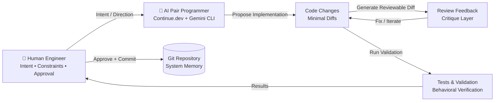

# **🧠 Beyond Vibecoding: Build a Professional Co-Developer Relationship with AI (for Free)**

**A Complete, Step-by-Step Guide to Discipline, Token Efficiency, Sovereign Control, and Shipping Better Software with AI**

## 🧠 Production-Grade AI Pair Programming System  
**(Continue.dev + Gemini CLI + VS Code + Git-Gated Engineering Workflow)**

**⚠️ Core Principle**  
This system is **not** autonomous coding. It is a deterministic, human-governed engineering system where the AI acts as a constrained, role-separated pair programming partner under explicit human control, rigorous review, and Git-enforced safety boundaries.

The AI never owns execution. It operates strictly as a bounded collaborator inside a well-engineered workflow — behaving like a senior engineering pair, not an agentic developer.

## 🧩 Non-Negotiable Engineering Properties  
Every change must satisfy **all four** properties simultaneously:

- **Explainable** — Reasoning is transparent and fully inspectable  
- **Reviewable** — Changes are delivered as minimal, diff-based proposals  
- **Reversible** — Git history guarantees safe rollback  
- **Testable** — Behavior is always verifiable  

If any property is violated, the change is rejected by design.

### 🧠 1. System Overview  
This framework treats software development as a continuous closed-loop collaboration between human intent and AI-assisted execution.



### 🧠 2. The Core Working Loop

**🔁 Phase 1: Intent → Translation**  
Human provides: intent, constraints, expected outcomes, and risk tolerance.  
AI responds with: architecture interpretation, system impact analysis, risks/edge cases, and an incremental plan.

**🔁 Phase 2: Build → Critique**  
AI generates small, minimal diffs.  
A Review Agent then critiques aggressively for structure, safety, and quality. Iteration continues until the change passes critique.

**🔁 Phase 3: Validate → Commit**  
Every change must include tests (or explicit justification), behavioral validation, and a Git commit that serves as durable system memory.

### 🧠 3. Role Model (Separation of Concerns)

- **Code Agent (Builder)**: Produces minimal diffs, preserves existing behavior, prioritizes clarity over elegance.  
- **Review Agent (Critic)**: Hunts for edge cases, architectural drift, security/performance risks. Assumes every change is guilty until proven safe.  
- **Test Agent (Validator)**: Generates strong tests and ensures regression coverage.  
- **Human (Orchestrator)**: Sets direction, approves/rejects changes, and holds final authority.

### ⚙️ 4. Execution Loop
1. Human defines intent  
2. AI translates intent into plan  
3. Code Agent implements minimal change  
4. Review Agent critiques aggressively  
5. Human decides (approve / reject / iterate)  
6. Test Agent validates behavior  
7. Git commit stores system state

### 🔁 5. VS Code + Continue.dev Workflow
- **Context** → Understand the module  
- **Intent** → Define the goal clearly  
- **Implement** → Minimal diff only  
- **Review** → Strict critique  
- **Fix** → Iterate quickly  
- **Validate** → Run tests  
- **Commit** → Lock in knowledge with Git

### 🧱 6. Git as System Memory  
Git is not just version control — it is the **durable memory of engineering decisions**.

Commit types:
- `docs` — intent/design  
- `feat` — new behavior  
- `fix` — bug correction  
- `refactor` — structural change  
- `test` — validation layer

### 🧠 7. Recommended Continue.dev Configuration

```json
{
  "models": [
    {
      "title": "AI Pair Programmer",
      "provider": "openai",
      "model": "gpt-4o"
    }
  ],
  "contextProviders": ["codebase", "openFiles", "diff", "terminal", "problems"],
  "customCommands": [
    {
      "name": "review",
      "prompt": "Review strictly for correctness, safety, architecture, and edge cases."
    },
    {
      "name": "refactor",
      "prompt": "Refactor with minimal diff and production constraints."
    },
    {
      "name": "test",
      "prompt": "Generate edge-case heavy tests for validation."
    }
  ]
}
```

### 🧠 8. Gemini CLI (System-Level Reasoning Layer)  
Use for repo-wide architecture analysis, dependency tracing, systemic debugging, and coupling detection.

### 🔍 9. Debugging Loop
1. Reproduce the issue  
2. Identify root cause  
3. Locate boundary violation  
4. Design minimal fix  
5. Validate fix  
6. Add regression test

### ⚡ 10. Feature Development Pipeline
1. Define intent  
2. Design approach  
3. Incremental implementation  
4. Adversarial review  
5. Test generation  
6. Behavioral validation  
7. Commit

### 🧠 11. Mental Model Shift

**AI is NOT**:  
- An autonomous developer  
- A decision-maker  
- An architecture authority  

**AI IS**:  
- A constrained engineering partner  
- A diff generator under strict rules  
- An adversarial reviewer simulation  
- A structured reasoning assistant

### 🔒 12. Guardrails
- No change without review  
- No commit without approval  
- No silent refactors  
- No untested production code  
- No multi-file rewrites without explicit intent  
- No skipping Git checkpoints

### 🚀 13. Final System Outcome  
You now operate a **disciplined AI pair programming system** backed by enforced engineering rigor and Git-backed memory.

---

### 📘 Integrated Foundation: Why Vibecoding Fails at Scale

Many developers treat AI tools as “vibe machines” — throwing vague prompts like “make a login form” and hoping for production-grade results. It feels fast, but collapses under scale, producing fragile, inconsistent systems full of hidden debt.

**Constraints are not limitations — they are a forcing function for better engineering.**

Instead of treating AI as a code generator, treat it as a capable junior-to-mid-level co-developer.

#### What You’ll Learn
- Rules files for consistent AI behavior  
- PR-style review mindset  
- Context-efficient prompting  
- Smart resource allocation  
- Plan → Critique → Execute → Review loop  
- Sovereign, production-grade AI development habits

#### Prerequisites
- AI coding tool (Cursor, Continue.dev, or Cline)  
- Real project (Next.js recommended)  
- Basic TypeScript knowledge  
- Initialized Git repository  
- Terminal access

#### Original Core Practices (Now Embedded)
- **Rules File** (`.cursorrules` / `.clinerules`) — Define stack, standards, architecture, and validation rules upfront.  
- **PR Mindset** — Treat every AI output as a pull request to review.  
- **Context Efficiency** — Use precise references, raw logs, and reset context when needed.  
- **Resource Allocation** — Match tools to task (autocomplete for small, chat for architecture, review mode for quality).  
- **Architect’s Loop** — Plan → Critique → Execute → Review.

**Vibecoding vs Co-Development**

| Aspect              | Vibecoding              | Co-Development                  |
|---------------------|-------------------------|---------------------------------|
| Prompts             | Vague                   | Structured intent               |
| Ownership           | AI owns code            | Human owns architecture         |
| System Quality      | Fragile                 | Maintainable                    |
| Debugging           | Endless                 | Targeted & systematic           |

### 🧭 Final Identity Shift  
You are no longer “using AI tools.”  

**You are operating a controlled engineering system where AI functions as a highly capable, constrained senior pair programmer under strict software engineering discipline.**
