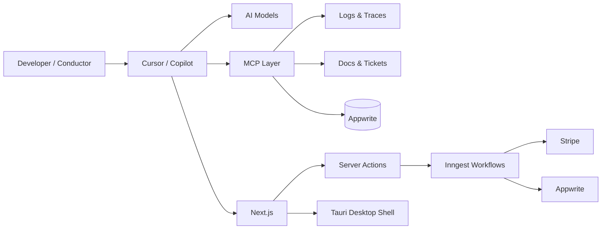
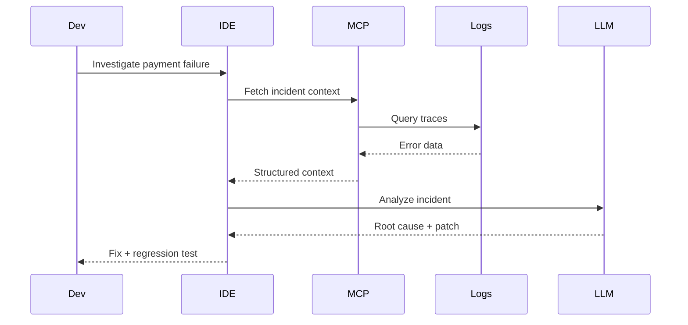

# From Coding to Conducting: Architecting My AI-Native Engineering System in 2026

## Why I No Longer Measure Productivity by Lines of Code

The era of treating AI as glorified autocomplete is over.

For years, tools such as GitHub Copilot and later Cursor acted primarily as accelerators. They generated boilerplate, completed familiar patterns, and reduced repetitive work. Useful, certainly—but fundamentally limited.

That model of software development now feels increasingly outdated.

The most important shift of 2026 is not that AI writes code faster. It is that developers can now operate at an entirely different level of abstraction.

I no longer *code with* AI.

I *conduct through* it.

My role has evolved from implementer to architect, reviewer, and orchestrator. The leverage no longer comes from typing code. It comes from defining systems, enforcing standards, establishing constraints, and directing intelligence toward meaningful outcomes.

The keyboard still matters.

Judgment matters more.

---

## The Developer as Conductor

Traditional software development treated implementation as the primary activity.

Modern AI-native development shifts the center of gravity upward.

The developer becomes responsible for alignment across three dimensions:

* Business intent
* System behavior
* Operational reality

AI handles increasing portions of implementation, but humans remain accountable for ensuring those three dimensions stay synchronized.

This is why architecture has become more valuable than syntax.

A poorly designed system now fails faster.

A well-designed system scales faster.

AI amplifies both.

---

## The AI-Native IDE Is No Longer a Tool

One of the biggest breakthroughs in my workflow occurred when I stopped thinking of AI features individually and started treating the IDE as a coordinated intelligence system.

Each interaction mode serves a different engineering purpose.

### Inline Chat: Precision Engineering

Inline chat is my scalpel.

I use it for focused transformations:

* Refactoring imperative code into functional patterns
* Extracting services from controllers
* Improving type safety
* Simplifying complex logic

The scope is intentionally narrow.

The goal is precision.

### Sidebar Chat: Architectural Reasoning

The sidebar acts as a persistent architectural partner.

This is where I discuss:

* Domain models
* Event flows
* API contracts
* System boundaries
* Trade-off analysis

Rather than thinking about a single function, I am reasoning about entire systems.

### Edits and Workspace Operations: System-Level Manipulation

The most transformative capability is scoped editing.

Instead of modifying files individually, I operate across architectural boundaries:

```text
src/features/**
packages/backend/**
apps/web/**
```

Large-scale refactors become orchestrated operations rather than manual exercises.

Naming conventions, architectural patterns, validation strategies, and cross-cutting concerns can be enforced across entire systems.

This is no longer coding assistance.

It is system manipulation.

---

## Context Is the New Programming Language

The quality of AI output is determined less by prompting tricks and more by contextual precision.

I rely heavily on:

```text
@workspace
#file
#folder
```

These references ground the model inside the realities of the codebase.

Without context, AI behaves like a knowledgeable stranger.

With context, it behaves like an engineer embedded within the team.

The difference is dramatic:

* Fewer hallucinations
* Better architectural consistency
* Stronger adherence to existing patterns
* More relevant recommendations

Context is no longer optional.

Context is infrastructure.

---

## The Architecture Behind My Workflow

The most common misconception about AI-native development is that the model itself is the system.

It is not.

The model is only one component.

The actual system looks more like this:



Notice what changed.

The laptop is no longer where systems run.

The laptop is where systems are orchestrated.

---

## Guardrails Before Velocity

One lesson became clear very quickly:

AI can generate working code.

That does not mean it generates correct code.

Or secure code.

Or maintainable code.

Every output must pass deterministic validation.

My minimum pipeline includes:

```json
{
  "scripts": {
    "lint": "eslint .",
    "typecheck": "tsc --noEmit",
    "test": "vitest run",
    "security": "npm audit --audit-level=high"
  }
}
```

The model proposes.

The toolchain decides.

If linting fails, the work is incomplete.

If tests fail, the work is incomplete.

If security checks fail, the work is incomplete.

Velocity without guardrails simply creates technical debt faster.

---

## From Prompts to Contracts

The largest behavioral shift in my workflow is moving away from conversational prompting and toward specification-driven engineering.

Old approach:

```text
Fix this bug.
```

Current approach:

```text
@workspace

Analyze PaymentController.ts.

Use recent staging logs and the original ticket.

Generate a failing regression test.

Implement the smallest possible fix.

Constraints:
- Preserve API contract
- Ensure idempotency
- Prevent duplicate charges
- Pass ESLint
- Pass TypeScript
- Pass security checks

Output:
1. Root cause
2. Test
3. Patch
4. Trade-offs
```

This is no longer prompting.

It is contract definition.

The model succeeds because the expectations are explicit.

---

## MCP: The Missing Layer

The most important development of the past year has been the rise of Model Context Protocol (MCP).

MCP transforms AI from a passive assistant into an active participant in the engineering environment.

Instead of relying solely on source code, the model gains access to:

* Logs
* Traces
* Monitoring systems
* Documentation
* Tickets
* Internal knowledge bases

This fundamentally changes how debugging occurs.



The AI is no longer guessing.

It is reasoning against operational reality.

---

## Workflow Orchestration Over Request-Response Programming

Another major shift has been embracing durable workflows.

For years, developers packed business logic into controllers and API routes.

Modern systems require something more resilient.

Using Inngest, workflows become explicit, observable, replayable, and recoverable.

```ts
export const processPayment = inngest.createFunction(
  { id: "process-payment" },
  { event: "payment/requested" },
  async ({ event, step }) => {
    const payment = await step.run(
      "create-payment",
      async () => createPaymentRecord(event.data)
    );

    const charge = await step.run(
      "charge-customer",
      async () => chargeCustomer(payment)
    );

    await step.run(
      "sync-status",
      async () => syncPaymentStatus(payment.id, charge.status)
    );

    return { ok: true };
  }
);
```

This architecture aligns naturally with AI because the workflow itself becomes visible, traceable, and explainable.

---

## Operating as a Solo Architect

I work largely alone.

There is no dedicated architecture team.

No QA department.

No platform engineering group.

The stack itself fills those roles:

* Next.js for application delivery
* Appwrite for backend services
* Inngest for orchestration
* Tauri for native interfaces
* MCP for operational context
* AI models for implementation and reasoning

What once required multiple specialized teams can increasingly be coordinated by a single engineer operating at a higher level of abstraction.

The challenge is no longer manpower.

The challenge is maintaining clarity.

---

## The Skills That Matter Now

Ironically, AI has made foundational engineering skills more important rather than less.

The most valuable capabilities today are:

### Domain Modeling

Defining boundaries, ownership, and business language.

### Intent Engineering

Expressing requirements as contracts instead of requests.

### Observability

Making systems visible through logs, metrics, and traces.

### Workflow Design

Building resilient processes that survive retries, failures, and partial execution.

### Security Discipline

Applying deterministic standards regardless of what the model generates.

AI can accelerate implementation.

It cannot replace engineering judgment.

---

## A 30-Day Transition Framework

The transition to AI-native development happened in stages.

### Days 1–10

Define architectural principles.

Document conventions, constraints, and standards.

Create persistent context.

### Days 11–20

Adopt contract-first development.

Design APIs, workflows, and state models before implementation.

### Days 21–30

Integrate MCP.

Connect AI to logs, tickets, telemetry, and operational systems.

Build feedback loops.

The outcome is not merely faster delivery.

It is tighter alignment between intent, implementation, and reality.

---

## The Real Transformation

Many people describe AI as a coding assistant.

That description is already becoming insufficient.

The deeper transformation is organizational.

AI changes where value is created.

The developer's job is increasingly less about producing code and increasingly about designing systems that produce correct outcomes.

The highest leverage activity is no longer implementation.

It is orchestration.

In 2026, I do not think of AI as a tool sitting beside me.

I think of it as an engineering workforce operating inside architectural constraints.

My responsibility is not to write every line.

My responsibility is to ensure that business intent, system behavior, and operational reality remain aligned.

When that alignment exists, systems become more predictable, more observable, and increasingly capable of improving themselves.

That is the true shift.

Not from coding to AI.

But from implementation to orchestration.

From builder to conductor.
