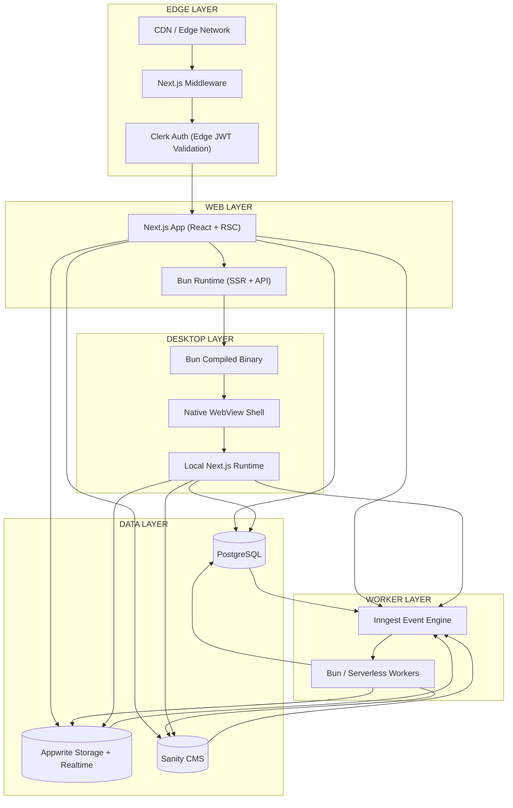
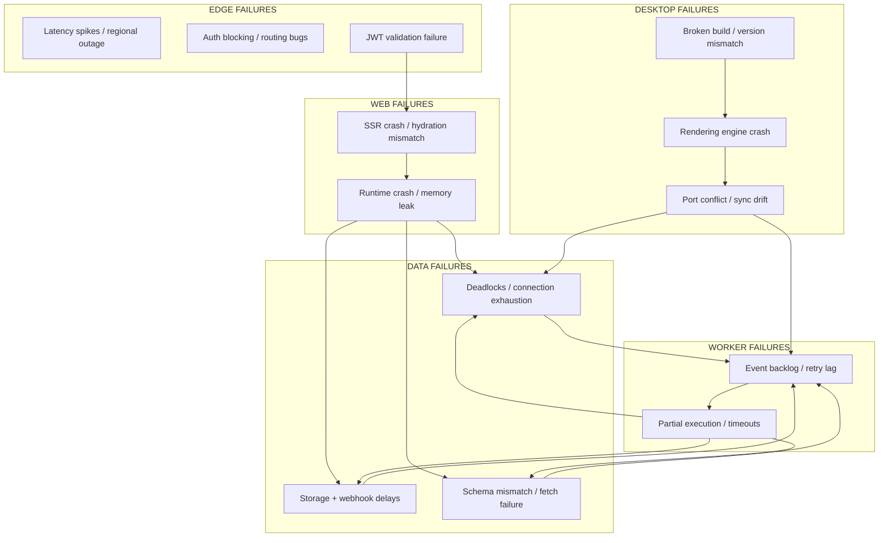
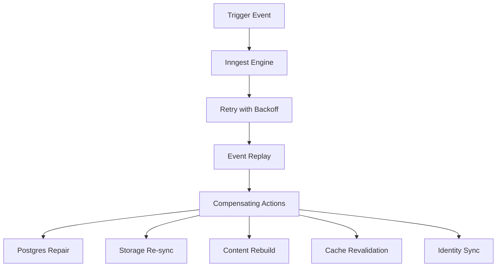

# From Web Stack to Living System: My Multi-Surface Architecture with Next.js, Bun, and Inngest

Choosing a tech stack today often feels like assembling a temporary compromise rather than designing a system. The tools change faster than the problems they solve, and most architectures end up as loosely connected services held together by convention and hope.

Over time, I’ve moved away from that mindset entirely.

What I’ve converged on is not just a “web stack,” but a **multi-surface execution system**—one that spans web, edge, desktop, and background workers, all coordinated through a single event-driven backbone.

My core stack centers around **Next.js, Bun, PostgreSQL, Appwrite, Clerk, Sanity, and Inngest**. But the more interesting part isn’t the tools—it’s how they fail, recover, and distribute execution across environments.

This is the system as I actually think about it.

---

# 🧭 The Shape of the System

I mentally divide the architecture into five layers:

1. **Edge Layer** – authentication, routing, request interception
2. **Web Layer** – primary application runtime (Next.js + Bun)
3. **Data Layer** – PostgreSQL, Appwrite, Sanity
4. **Worker Layer** – Inngest + background execution
5. **Distribution Layer** – web + desktop (via Bun compilation)

But unlike traditional architectures, these layers are not just “stacked.” They are **interconnected through failure, recovery, and event flow.**

---

# 🌐 The Full Topology (Web, Edge, Workers, Desktop)

At the center of my system is a simple idea:

> The same application should run everywhere—but behave differently depending on where it executes.

Here’s how that actually looks.

---

# ⚙️ The Key Shift: Execution Is No Longer Single-Surface

The important realization for me was this:

> A modern application is not deployed once—it is executed in multiple contexts.

* Browser (web)
* Edge (middleware + auth)
* Worker runtime (background logic)
* Desktop (local-first binary via Bun)

Each of these is just a different **execution surface over the same system.**

---

# ⚠️ Thinking in Failures, Not Features

Most architecture diagrams stop at “happy path flows.”

I found that misleading.

Instead, I now design around a more honest question:

> What breaks, where does it break, and how does the system recover?

So I map the entire system as a failure model first.

---

# 💥 Failure Model: Where Things Actually Break

---

# 🧠 The Real Insight: Failure Is Not an Exception, It’s a Path

Once I started modeling failure explicitly, the system changed in three important ways:

### 1. Failures became local

A broken service doesn’t collapse the system—it isolates impact.

---

### 2. Everything became replayable

Because Inngest sits at the center, most workflows are event-driven:

* onboarding
* billing sync
* content updates
* asset provisioning

If something breaks, it can be replayed.

---

### 3. Recovery became automatic

Instead of debugging live systems, I rely on:

* retries
* backoff strategies
* event replay
* compensating actions

---

# 🔁 Recovery Model: How the System Heals Itself

---

# 🖥️ The Desktop Layer: Bun as a Distribution Engine

One of the most interesting extensions of this system is using **Bun as a compiler for desktop applications**.

Instead of introducing a separate stack like Electron or a full Rust-based Tauri pipeline, I treat Bun as the **distribution bridge**.

The flow looks like this:

1. Bun compiles the full Next.js + server runtime into a binary
2. The binary boots a local HTTP server
3. A native WebView shell renders the UI
4. The app behaves like a desktop-native product

This creates something powerful:

> The same application runs in the browser, in the cloud, and as a local executable—without architectural divergence.

---

# 🧩 What This Architecture Actually Becomes

Once everything is connected, the system stops feeling like a “stack.”

It starts behaving like a **distributed runtime organism**:

* **Next.js** → perception layer (UI + rendering)
* **Bun** → execution + packaging layer (metabolism)
* **PostgreSQL** → memory (truth)
* **Inngest** → nervous system (time + coordination)
* **Appwrite** → utility organs (storage + realtime)
* **Clerk** → identity layer (who is acting)
* **Sanity** → content cognition (what is shown)

And across all of it:

> Events are the only thing that truly move the system.

---

# 🧭 Final Thought

Most architectures try to minimize failure.

I’ve started designing systems that **expect failure, model it explicitly, and route around it automatically**.

The result is not just a stack that is fast to build with.

It’s a stack that behaves more like a **living system**—one that can run across environments, recover from partial collapse, and continue operating without human intervention in the critical path.

That shift—from tools to systems, from services to execution surfaces—is the real architecture.

Everything else is just implementation detail.
