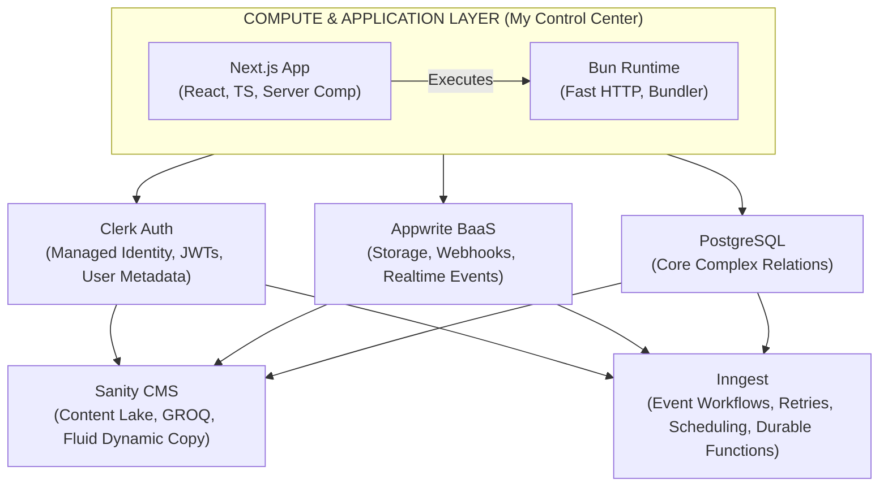
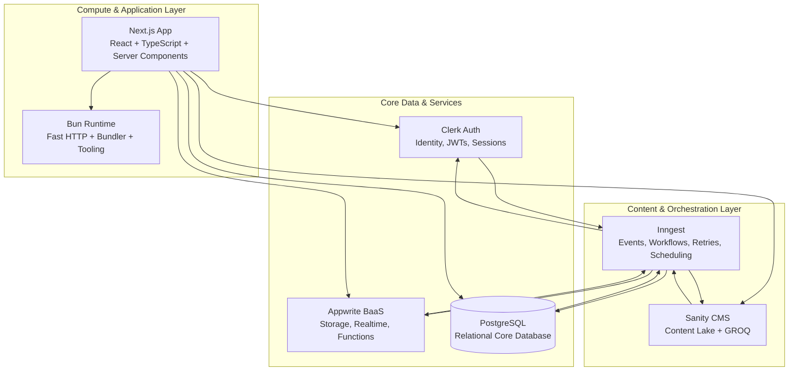
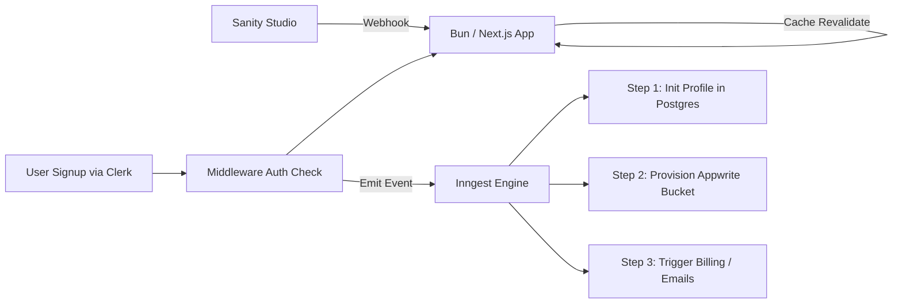

# Building My Ideal Web Stack: Next.js, Bun, PostgreSQL, Appwrite, Clerk, Sanity, and Inngest

Choosing a tech stack in today’s ecosystem can feel like trying to hit a moving target. The hype cycle moves fast, but my engineering objective has always remained sharp and consistent: **achieve rapid product delivery without sacrificing type safety, deep architectural control, or raw performance.**

Over years of building, refactoring, and maintaining production systems, I’ve moved away from bloated, fragmented setups and overly complex microservices. Instead, I’ve converged on a highly cohesive architecture that balances engineering velocity with structural rigidity: **Next.js**, **Bun**, **PostgreSQL**, **Appwrite**, **Clerk**, **Sanity**, and **Inngest**.

Modern applications don't just need storage and rendering anymore; they require reliable orchestration. They need event-driven workflows, bulletproof retries, durable background execution, and clean asynchronous boundaries between services. That's exactly where Inngest enters the picture, acting as the connective tissue that transforms a collection of isolated tools into a unified distributed application platform.

---

## My Architectural Topology

When designing systems, I rely on a strict mental model of where compute happens, where state lives, and how data flows across operational boundaries. I segment this stack into four distinct layers:

1. **Compute & Application Layer:** Managing UI composition and runtime execution.
2. **Core Data Engines:** Hosting transactional truth and relational structure.
3. **Managed Utility Services:** Offloading identity, content pools, and object storage.
4. **Event & Workflow Orchestration:** Executing durable background pipelines.

---

## 🧱 Architecture




---

## 🧠 Architecture: Another Representation



---

## Component-by-Component Blueprint

### 1. Frontend & Compute: Next.js, React, & TypeScript

For the user-facing side of my applications, Next.js acts as the unified application layer. Moving to the App Router fundamentally changed how I structure code, primarily because it embraces **Locality of Behavior (LoB)**.

* **Locality of Behavior:** I strongly believe that code is far easier to reason about when its behavior is visible right where it’s defined. With React Server Components (RSC), I can colocate my data-fetching queries directly inside the UI components that consume them.
* **End-to-End Type Safety:** By writing everything in TypeScript, I create an unbroken chain of type safety. I pair Next.js with modern ORMs like Drizzle or Prisma to map database schemas directly to application types. If I alter a column in PostgreSQL, the compiler immediately flags exactly which React components will break.
* **Hybrid Rendering Control:** Between static generation, streaming SSR, partial prerendering, and edge rendering, Next.js gives me surgical control over performance characteristics on a route-by-route basis.

### 2. The Engine: Bun Runtime

I swapped out Node.js for Bun in my development environments and server runtimes, and the impact on developer velocity has been staggering.

* **Zero-Config TypeScript:** Bun natively executes `.ts` and `.tsx` files without requiring a messy compilation layer like `tsc` or `ts-node`. Things just work out of the box.
* **Unified Tooling:** Bun replaces my package manager, bundler, and test runner. Dependencies install in fractions of a second rather than minutes, keeping me locked in a continuous flow state.
* **High-Throughput Networking:** Bun’s native HTTP stack (`Bun.serve()`) is absurdly fast, making it an incredibly robust foundation for self-hosted Next.js deployments and containerized infrastructure.

> Removing tooling friction frees up immediate cognitive bandwidth for actual engineering.

### 3. Core Data: PostgreSQL

While Backend-as-a-Service (BaaS) platforms offer excellent out-of-the-box utility, complex applications eventually outgrow naive data stores. PostgreSQL remains the absolute backbone of my operational data layer.

* **Relational Integrity:** Complex business logic, robust permission models, billing engines, and multi-tenant structures belong in Postgres.
* **ACID Guarantees:** Multi-step workflows—such as payments, onboarding, and inventory adjustments—require absolute transactional consistency.
* **JSONB Flexibility:** When I need to model semi-structured payloads, `jsonb` allows me to do so cleanly without abandoning relational constraints.
* **Advanced Query Power:** Recursive Common Table Expressions (CTEs), materialized views, complex indexing strategies, and analytical queries give the application plenty of room to scale without architectural redesigns.

### 4. Content & Presentation State: Sanity

Hardcoding UI copy is a maintenance nightmare, but shoving marketing copy and editorial blocks into relational tables creates massive schema chaos. Sanity cleanly separates content management from operational data.

* **Content Lake Architecture:** Sanity stores data as structured, queryable JSON rather than rigid, monolithic page documents.
* **GROQ Querying:** Using GROQ allows me to shape API responses precisely to match my frontend component props, eliminating over-fetching.
* **Live Preview Pipelines:** Editors can modify copy visually while Next.js instantly revalidates cached layouts on-demand via webhooks.
* **Type Generation:** Sanity’s schema-driven TypeScript generation fits perfectly into my end-to-end type-safe pipeline.

### 5. Identity & Security: Clerk

Authentication is one of those domains where “building it yourself” sounds like a fun weekend project until you realize you’ve accidentally volunteered to be an enterprise identity provider. I outsource that liability entirely to Clerk.

* **Edge-Aware Authentication:** Clerk’s JWT verification runs beautifully inside Next.js Middleware, allowing authorization checks to occur at the edge before requests ever hit expensive compute paths.
* **Production-Ready Security:** Multi-factor authentication (MFA), social OAuth, session management, organization routing, and account recovery are handled securely out of the box.
* **Webhook Synchronization:** Clerk asynchronously synchronizes user metadata into PostgreSQL via webhooks, ensuring authentication state is decoupled from core application logic.

### 6. Backend Utility & Storage: Appwrite

Instead of manually stitching together AWS S3 buckets, custom WebSocket brokers, and isolated image processors, I use Appwrite to fill infrastructural gaps.

* **Object Storage:** File uploads, image transformations, access control lists (ACLs), and signed storage URLs become easy to implement.
* **Realtime Events:** Appwrite’s built-in realtime subscriptions eliminate the need to spin up and maintain custom socket infrastructure.
* **Serverless Functions:** Lightweight utility execution and isolated, resource-heavy workloads fit naturally into Appwrite Functions.

I treat Appwrite less like a "backend replacement" and more like a highly reliable, centralized utility layer.

### 7. Workflow Orchestration & Background Execution: Inngest

This is the critical asynchronous layer that most modern web stacks eventually realize they are missing.

As applications mature, synchronous request-response cycles break down. Systems start needing retries, event queues, delayed execution, fan-out execution patterns, cron scheduling, event replays, and end-to-end workflow observability. Most teams respond by manually duct-taping together Redis queues, BullMQ, cron servers, and background workers.

I’d rather avoid that operational overhead. That’s why I integrate Inngest.

---

## Why Inngest Fits My Architecture Perfectly

Inngest introduces a clean, event-driven execution layer directly into my TypeScript ecosystem. Instead of scattering background logic across random cron scripts and brittle worker processes, I model my backend as durable event flows.

Firing an event is a single, non-blocking call:

```typescript
await inngest.send({
  name: "user/signed.up",
  data: {
    userId,
    email,
  },
});

```

That single event can seamlessly coordinate an array of decoupled tasks:

* Triggering onboarding email sequences
* Provisioning rows in PostgreSQL
* Firing analytics tracking payloads
* Dispatching Slack notifications
* Initializing Appwrite storage buckets
* Personalizing Sanity content delivery
* Synchronizing billing states with Stripe

### Durable Execution Without Infrastructure Pain

What makes Inngest a standout choice is that it delivers true workflow durability without forcing me to manage heavyweight distributed systems infrastructure. It handles step-level recovery, exponential backoff retries, rate limiting, concurrency control, and long-running schedules entirely on its own. Because everything is written in TypeScript, the developer experience remains tightly integrated with the rest of my codebase.

### The Asynchronous Nervous System

| Layer | Responsibility |
| --- | --- |
| **Next.js** | User interaction & UI rendering |
| **Bun** | High-performance runtime execution |
| **PostgreSQL** | Durable relational state & transactional truth |
| **Sanity** | Dynamic, structured content state |
| **Clerk** | Edge identity & session authentication |
| **Appwrite** | Utility infrastructure & secure object storage |
| **Inngest** | Workflow orchestration & async execution boundaries |

Instead of tightly coupling services together via synchronous API calls, I let events coordinate behavior. This drastically reduces system complexity and increases resilience.

---

## The Lifecycle of a Request: Data Flow in Action

To demonstrate how these moving parts cooperate, let’s trace a real-world scenario: **An editor updates a landing page, a new user signs up, onboarding workflows execute asynchronously, and the user downloads a protected asset.**



### 1. Content Modification (Sanity Pipeline)

1. An editor updates a landing page inside Sanity Studio.
2. Sanity fires a webhook to a Next.js API route.
3. Next.js triggers `revalidateTag()` to purge the edge cache and instantly regenerate the fresh route.
4. Concurrently, a webhook event is fed to Inngest to log editorial audits and trigger downstream cache-warming routines.

### 2. Edge Authentication (Clerk Gateway)

1. A new user registers via a Clerk Auth component.
2. Next.js Middleware validates the session JWT at the edge, protecting compute resources from unauthenticated traffic.
3. Clerk simultaneously emits a secure webhook event directly into Inngest.

### 3. Asynchronous User Provisioning (Inngest Workflow)

Instead of blocking the initial signup request with a massive, fragile database transaction, Inngest orchestrates onboarding asynchronously. The `user/signed.up` event kicks off a durable workflow:

* **Step 1:** Initialize the user profile in PostgreSQL.
* **Step 2:** Provision an isolated Appwrite storage bucket.
* **Step 3:** Fire off a welcome email sequence and initialize a Stripe customer ID.

If any single step fails (e.g., a third-party email API goes down), Inngest pauses, retries that specific step with exponential backoff, and resumes without failing the entire user onboarding sequence.

### 4. Application Rendering (Next.js + Bun Compute)

1. The authenticated user hits the dashboard.
2. Inside the Bun runtime, React Server Components concurrently fetch transactional user data from PostgreSQL, structured layout copy from Sanity, and session details from Clerk.
3. The generated UI streams progressively back to the client browser for an instant perceived load time.

### 5. Secure Asset Delivery (Appwrite Storage)

1. The user clicks a link to download a protected asset.
2. The client requests the file directly from Appwrite Storage.
3. Appwrite checks the file's custom access control list (ACL), validates permissions, and securely streams the asset.
4. A real-time download event is piped back to Inngest for audit logging and usage analytics.

---

## Architectural Philosophy

The core principle behind this stack is simple:

> **Systems should communicate through events, not fragile synchronous coupling.**

By sticking to rigid execution boundaries, this setup scales both technically and cognitively. I can move incredibly fast without losing structural clarity, introduce complexity incrementally without creating distributed chaos, and keep my engineering focused purely on shipping product rather than firefighting infrastructure.

---

## Final Thoughts

Modern architecture is no longer about trying to force a single framework to handle every operational requirement. It’s about composing specialized, high-performance systems with clear boundaries, and letting an event-driven layer coordinate the communication between them.

The end result is lower coupling between systems, clearer operational boundaries, higher resilience through async workflows, and a codebase that remains fast to build on and predictable under load.
