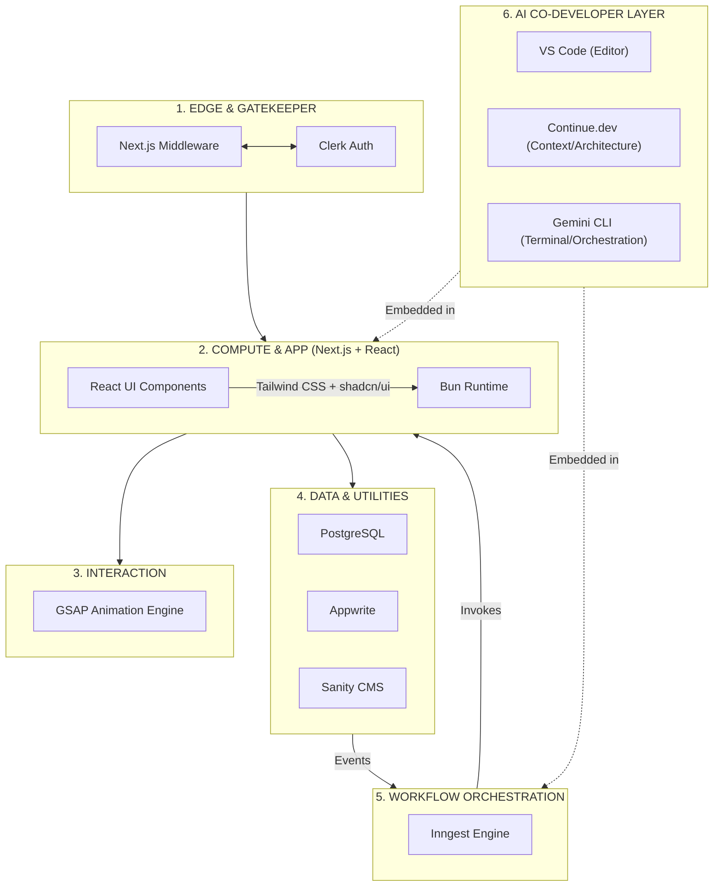

# Building My Ideal Web Stack in 2026:  
**Next.js + React + Tailwind + Bun + PostgreSQL + Appwrite + Clerk + Sanity + Inngest + GSAP + Free Cloud-AI Co-Developer Layer**

Choosing a tech stack today can feel like hitting a moving target. The hype cycle races forward, but my engineering objective has stayed sharp and consistent:  
**achieve rapid product delivery without sacrificing type safety, deep architectural control, or raw performance.**

After years of building, I've moved away from bloated, fragmented setups. Instead, I've converged on a **highly cohesive architecture** that balances engineering velocity with structural rigidity—anchored by:

- The reliability of **React**
- The styling precision of **Tailwind CSS + shadcn/ui**
- The full-stack orchestration of **Next.js**

To maximize efficiency, I streamlined my development environment to rely **exclusively** on:

- **VS Code** as my editor
- The **Continue.dev** extension for architectural context
- The **Gemini CLI** for terminal orchestration

This is a **cloud-native, free-tier AI strategy** that keeps my local machine lightweight, responsive, and focused on what matters: shipping software.

***

## 🧠 My Architectural Topology

When designing systems, I rely on a strict mental model of:

- **Where compute happens**
- **Where state lives**
- **How data flows**

I segment my stack into **seven distinct layers**:

| Layer | Function | Key Tools |
|-------|----------|-----------|
| **1. Edge & Gatekeeper** | Intercept requests, validate tokens at the edge | Next.js Middleware, Clerk Auth |
| **2. Compute & Application** | UI composition + styling | React, Tailwind + shadcn/ui, Next.js, Bun |
| **3. Interaction Layer** | High-performance UI motion | GSAP Animation Engine |
| **4. Core Data Engines** | Transactional truth | PostgreSQL |
| **5. Managed Utility Services** | Identity, content, storage | Clerk, Sanity CMS, Appwrite |
| **6. Event & Workflow Orchestration** | Durable background pipelines | Inngest Engine |
| **7. AI Co-Developer Layer** | Embedded intelligence | VS Code + Continue.dev + Gemini CLI |

***

## 🧱 Integrated Architecture Model



***

## 🚀 The Foundation: Performance & Orchestration

| Tool | Role | Why It Matters |
|------|------|----------------|
| **Next.js** | Architecture hub | Server Actions eliminate REST/GraphQL boilerplate |
| **React Server Components (RSC)** | Server-side data logic | Heavy fetching stays on the server |
| **Tailwind CSS + shadcn/ui** | Styling system | Utility-first + production-grade accessible components |
| **GSAP** | Animation engine | Decoupled from React's reconciliation cycle |
| **Bun** | Unified runtime | Package manager + bundler + test runner + runtime in one binary |

### Multi-Surface Strategy with Bun

Bun lets you compile your app into a **standalone native binary** that boots a local HTTP server and drives a **platform-native WebView**.

| Target Surface | Execution Environment | Styling/UI |
|----------------|------------------------|------------|
| **Web & Edge** | Vercel / Edge Network | Tailwind + shadcn/ui |
| **Local/Desktop** | Bun Native Runtime | Tailwind + shadcn/ui + Native WebView |
| **Hybrid** | Offline-First | React-based Local State + GSAP |

***

## 🤖 The AI Co-Developer Layer: Free, Fast, & Cloud-First (2026)

In 2026, production-grade AI means **avoiding hardware-intensive local models** in favor of **free-tier cloud reasoning** managed through lightweight VS Code interfaces. My setup is **entirely free**, leveraging:

- **Google's Gemini ecosystem**
- **Open-standard integrations** (Continue.dev, Gemini CLI)
- **Free tiers from Google AI Studio + Groq**

### 1. Continue.dev — Architectural Integrity

Continue is my **primary interface for architectural enforcement**:

- **Standards**: Enforces App Router patterns, Server Actions, strict TypeScript
- **Context**: Uses codebase embeddings to match my shadcn/ui + GSAP conventions
- **Rules**: Keeps `PROMPTS.md` and `.continue/rules` synced

### 2. Gemini CLI — Orchestration & Command

As I move away from GUI-heavy "vibecoding" tools, **Gemini CLI** is my terminal assistant:

- **Speed**: Instant reasoning without leaving terminal context
- **Agentic Tasks**: Script generation, CI/CD setup, querying Inngest events
- **Automation**: Pipes terminal errors into a reasoning loop for fixes before staging

### 3. Example `~/.continue/config.yaml`

```yaml
models:
  - name: Gemini 1.5 Flash (Context)
    provider: gemini
    model: gemini-1.5-flash
    apiKey: ${GEMINI_API_KEY}
    roles: [autocomplete, chat, edit]

  - name: Llama 3.3 (Reasoning)
    provider: groq
    model: llama-3.3-70b-versatile
    apiKey: ${GROQ_API_KEY}
    roles: [chat]
```

***

## 🔄 A Realistic Hybrid Workflow

| Task Category | Primary Tool | Strategy |
|---------------|--------------|----------|
| **Architecture** | Continue.dev | Keep `PROMPTS.md` + `.continue/rules` synced |
| **UI/Components** | VS Code / Continue | Rapid generation of shadcn primitives |
| **Workflows/CLI** | Gemini CLI | Direct orchestration of Inngest + terminal tasks |
| **Reasoning** | Cloud APIs | Flash/Pro models for high-velocity logic |

***

## 📦 Production-Ready Code Snippets & Deployment Configs

### 1. Next.js + Bun Setup

**`package.json`**
```json
{
  "name": "my-ideal-stack",
  "scripts": {
    "dev": "bun run next dev",
    "build": "bun run next build",
    "start": "bun run next start",
    "test": "bun test"
  },
  "dependencies": {
    "next": "15.3.0",
    "react": "19.0.0",
    "react-dom": "19.0.0",
    "tailwindcss": "4.0.0",
    "gsap": "3.12.5"
  },
  "devDependencies": {
    "@types/react": "19.0.0",
    "typescript": "5.8.0"
  }
}
```

**`bunfig.toml`**
```toml
[install]
strict = true

[run]
silent = false
```

***

### 2. Tailwind + shadcn/ui Configuration

**`tailwind.config.ts`**
```ts
import type { Config } from 'tailwindcss';
import { shadcn } from 'shadcn/ui';

export default {
  content: ['./app/**/*.{ts,tsx}', './components/**/*.{ts,tsx}'],
  plugins: [shadcn()],
  theme: {
    extend: {
      colors: {
        border: 'hsl(var(--border))',
        background: 'hsl(var(--background))',
        primary: 'hsl(var(--primary))',
      },
    },
  },
} as Config;
```

**`app/globals.css`**
```css
@tailwind base;
@tailwind components;
@tailwind utilities;

@layer base {
  :root {
    --background: 0 0% 100%;
    --foreground: 0 0% 3.9%;
    --border: 0 0% 89.8%;
    --primary: 0 0% 9%;
  }
}
```

***

### 3. React Server Component with Server Action

**`app/actions.ts`**
```ts
'use server';

import { db } from '@/lib/db';

export async function createPost(title: string, content: string) {
  const post = await db.post.create({ data: { title, content } });
  return post;
}
```

**`app/posts/new.tsx`**
```tsx
import { createPost } from '@/app/actions';

export default function NewPostForm() {
  return (
    <form action={async (e) => {
      const title = e.target.title.value;
      const content = e.target.content.value;
      await createPost(title, content);
    }}>
      <input name="title" placeholder="Title" required />
      <textarea name="content" placeholder="Content" required />
      <button type="submit">Create</button>
    </form>
  );
}
```

***

### 4. GSAP Animation Decoupled from React

**`components/AnimatedHero.tsx`**
```tsx
'use client';

import { useEffect, useRef } from 'react';
import gsap from 'gsap';

export default function AnimatedHero() {
  const ref = useRef<HTMLDivElement>(null);

  useEffect(() => {
    if (!ref.current) return;
    gsap.fromTo(ref.current, { opacity: 0, y: 50 }, { opacity: 1, y: 0, duration: 1, ease: 'power3.out' });
  }, []);

  return <div ref={ref} className="text-4xl font-bold">Hero Animation</div>;
}
```

***

### 5. Clerk Authentication + Next.js Middleware

**`middleware.ts`**
```ts
import { clerkMiddleware, createRouteMatcher } from '@clerk/nextjs/server';

const isProtectedRoute = createRouteMatcher(['/dashboard(.*)', '/forum(.*)']);

export default clerkMiddleware((auth, req) => {
  if (isProtectedRoute(req)) auth.protect();
});

export const config = {
  matcher: ['/((?!.*\\..*|_next).*)', '/', '/(api|trpc)(.*)'],
};
```

**`.env.local`**
```env
CLERK_SECRET_KEY=sk_test_xxxx
NEXT_PUBLIC_CLERK_PUBLISHABLE_KEY=pk_test_xxxx
NEXT_PUBLIC_CLERK_SIGN_IN_URL=/sign-in
NEXT_PUBLIC_CLERK_SIGN_UP_URL=/sign-up
```

***

### 6. Appwrite Integration

**`lib/appwrite.ts`**
```ts
import { Client, Storage, Account } from 'appwrite';

const client = new Client();
client.setEndpoint('https://cloud.appwrite.io/v1').setProject('your-project-id');

export const account = new Account(client);
export const storage = new Storage(client);
```

**Upload file**
```ts
export async function uploadFile(file: File) {
  const result = await storage.createFile('your-bucket-id', uniqueId(), file);
  return result;
}
```

***

### 7. Sanity CMS Integration

**`lib/sanity.ts`**
```ts
import { createClient } from '@sanity/client';

export const sanityClient = createClient({
  projectId: 'your-project-id',
  dataset: 'production',
  useCdn: true,
  token: process.env.SANITY_TOKEN,
});
```

**Fetch post**
```ts
export async function getPost(slug: string) {
  const query = `*[_type == "post" && slug.current == "${slug}"]{title,content}`;
  return sanityClient.fetch(query);
}
```

***

### 8. Inngest Event Orchestration

**`inngest.ts`**
```ts
import { Inngest } from 'inngest';

export const inngest = new Inngest({ id: 'my-app' });
```

**Event handler**
```ts
export const createPostHandler = inngest.createFunction(
  { id: 'create-post' },
  { event: 'post.created' },
  async ({ event }) => {
    const { title, content } = event.data;
    console.log(`Creating post: ${title}`);
  }
);
```

**`.env.local`**
```env
INNGEST_DEV_KEY=dev_xxxx
NEXT_PUBLIC_INNGEST_EVENT_KEY=event_xxxx
```

***

### 9. PostgreSQL with Drizzle ORM

**`lib/db.ts`**
```ts
import { drizzle } from 'drizzle-orm/postgres-js';
import postgres from 'postgres';

const client = postgres(process.env.DATABASE_URL!);
export const db = drizzle(client);
```

**Schema**
```ts
import { pgTable, text, uuid } from 'drizzle-orm/pg-core';

export const posts = pgTable('posts', {
  id: uuid('id').primaryKey(),
  title: text('title').notNull(),
  content: text('content').notNull(),
});
```

**Create post**
```ts
export async function createPost(title: string, content: string) {
  const post = await db.insert(posts).values({ title, content }).returning();
  return post[0];
}
```

***

### 10. Continue.dev Config

**`~/.continue/config.yaml`**
```yaml
models:
  - name: Gemini 1.5 Flash (Context)
    provider: gemini
    model: gemini-1.5-flash
    apiKey: ${GEMINI_API_KEY}
    roles: [autocomplete, chat, edit]

  - name: Llama 3.3 (Reasoning)
    provider: groq
    model: llama-3.3-70b-versatile
    apiKey: ${GROQ_API_KEY}
    roles: [chat]

rules:
  - "Use App Router patterns"
  - "Use Server Actions for data mutations"
  - "Enforce strict TypeScript"
  - "Match shadcn/ui conventions"
  - "Decouple animations with GSAP"
```

***

### 11. Vercel Deployment Config

**`vercel.json`**
```json
{
  "buildCommand": "bun run build",
  "devCommand": "bun run dev",
  "installCommand": "bun install",
  "framework": "nextjs",
  "env": {
    "CLERK_SECRET_KEY": "@clerk-secret-key",
    "DATABASE_URL": "@database-url",
    "SANITY_TOKEN": "@sanity-token",
    "INNGEST_DEV_KEY": "@inngest-dev-key",
    "GEMINI_API_KEY": "@gemini-api-key",
    "GROQ_API_KEY": "@groq-api-key"
  }
}
```

**`.vercelignore`**
```
node_modules
.git
.env.local
*.md
```

***

### 12. Bun Native Desktop Build (Tauri-like)

**`build.desktop.ts`**
```ts
import { build } from 'bun';

const result = await build({
  entrypoints: ['./app/index.tsx'],
  output: './dist/desktop.bundle',
  target: 'bun',
  minify: true,
});

console.log('Desktop binary built:', result);
```

***

### 13. Gemini CLI Orchestration Script

**`ci-orchestrate.sh`**
```bash
#!/bin/bash
echo "Running tests..."
bun test

echo "Building app..."
bun run build

echo "Deploying to Vercel..."
vercel deploy --prebuilt

echo "Triggering Inngest event..."
gemini-cli --prompt "Trigger post.created event for latest build"
```

***

## 📁 Deployment Summary

| Platform | Config File | Key env vars |
|----------|-------------|--------------|
| **Vercel (Web)** | `vercel.json` | CLERK, DATABASE_URL, SANITY, INNGEST, GEMINI, GROQ |
| **Local Desktop** | `build.desktop.ts` | Bun runtime, native WebView |
| **Appwrite** | Cloud endpoint | Project ID, Bucket ID |
| **Clerk** | Middleware | Secret key, Publishable key |
| **PostgreSQL** | Drizzle ORM | DATABASE_URL |
| **Inngest** | Event handler | DEV_KEY, EVENT_KEY |

***

## 🏁 Final Thoughts

Modern software architecture is about designing **portability**, **resilience**, and **intelligence** into the runtime. By combining:

- **Next.js + React + Tailwind + GSAP + Bun + PostgreSQL**
- **AI layer powered by VS Code + Continue.dev + Gemini CLI**

I build a **self-healing, self-improving system** that is:

- **Free to operate**
- **Powerful enough to scale**
- **Focused on velocity without sacrificing control**

By **decoupling animation design from component state with GSAP** and **embedding AI as a governed co-developer** in the terminal and editor, I maintain **maximum focus and engineering velocity**.

**This is the stack I ship with in 2026.**
