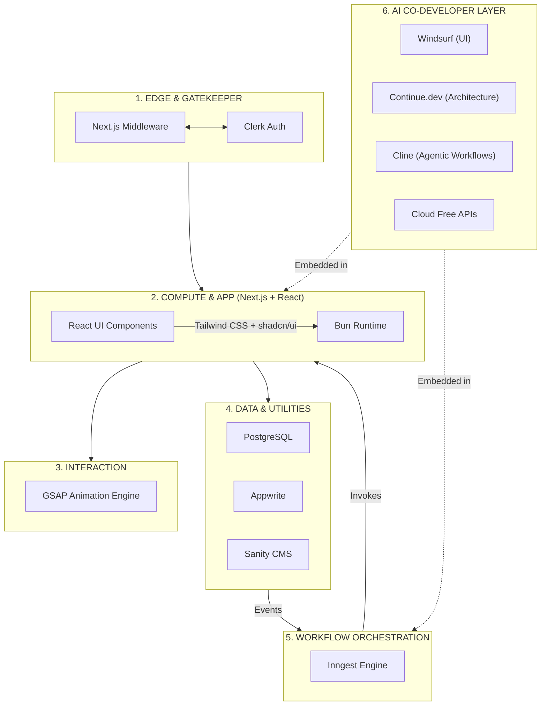

# Building My Ideal Web Stack: Next.js, React, Tailwind, Bun, PostgreSQL, Appwrite, Clerk, Sanity, Inngest, GSAP + AI Co-Developer Layer

Choosing a tech stack in today’s ecosystem can feel like trying to hit a moving target. The hype cycle moves fast, but my engineering objective has always remained sharp and consistent: **achieve rapid product delivery without sacrificing type safety, deep architectural control, or raw performance.**

Over years of building, I’ve moved away from bloated, fragmented setups. Instead, I’ve converged on a highly cohesive architecture that balances engineering velocity with structural rigidity, anchored by the reliability of **React**, the styling precision of **Tailwind CSS + shadcn/ui**, and the full-stack orchestration of **Next.js**.

Modern applications don't just need storage and rendering; they require reliable orchestration, polished interaction with **GSAP**, **and structured collaboration with AI**. This stack transforms a collection of isolated tools into a unified, distributed application platform—with AI embedded as a true co-developer.

---
## My Architectural Topology

When designing systems, I rely on a strict mental model of where compute happens, where state lives, and how data flows. I segment this stack into seven distinct layers:

1. **Edge & Gatekeeper:** Intercepting requests and validating tokens at the network edge.
2. **Compute & Application:** Managing UI composition (React) and styling (Tailwind + shadcn/ui) via Next.js.
3. **Interaction Layer:** Orchestrating fluid, high-performance UI motion (**GSAP**).
4. **Core Data Engines:** Hosting transactional truth (PostgreSQL).
5. **Managed Utility Services:** Offloading identity (Clerk), content (Sanity), and storage (Appwrite).
6. **Event & Workflow Orchestration:** Executing durable background pipelines (Inngest).
7. **AI Co-Developer Layer:** Embedded intelligence across all layers (Windsurf, Continue.dev, Cline + Cloud APIs).

---
## 🧱 Integrated Architecture Model



---
## 🚀 The Foundation: Performance & Orchestration

* **Next.js:** The hub of the architecture. It bridges the gap between your frontend and backend. By utilizing **Server Actions**, we eliminate the need for traditional REST/GraphQL API boilerplates.
* **React Server Components (RSC):** Heavy data-fetching logic remains on the server.
* **Tailwind CSS + shadcn/ui:** Utility-first styling with production-grade, accessible, and beautifully designed components. shadcn/ui provides copy-pasteable, fully customizable primitives that integrate seamlessly with Tailwind.
* **GSAP:** Professional-grade animation engine for buttery-smooth, high-performance interactions decoupled from React's reconciliation cycle.
* **Bun:** Unifies the development environment—package manager, bundler, test runner, and runtime—into a single high-speed binary.

### The Multi-Surface Strategy

Bun allows you to compile your application into a standalone native binary that boots a local HTTP server and drives a platform-native WebView.

| Target Surface | Execution Environment | Styling/UI |
| --- | --- | --- |
| **Web & Edge** | Vercel / Edge Network | Tailwind + shadcn/ui |
| **Local/Desktop** | Bun Native Runtime | Tailwind + shadcn/ui + Native WebView |
| **Hybrid** | Offline-First | React-based Local State + GSAP |

---
## 🛠️ The Strategic Tool Breakdown

### 1. Interaction & Styling
* **GSAP:** Industry-standard animation library for complex timelines, scroll-triggered effects, and frame-accurate motion that feels native.
* **Tailwind CSS + shadcn/ui:** Utility-first styling combined with high-quality, accessible component primitives. shadcn/ui gives you full ownership of the code while maintaining design consistency.

### 2. Orchestration & Resilience
* **Inngest:** Durable step functions with intelligent retries for async workflows.

### 3. Data & Utilities
* **PostgreSQL:** ACID-compliant relational core.
* **Appwrite:** Object storage and real-time.
* **Clerk:** Edge-side auth.
* **Sanity:** Decoupled content management.

---
## 🤖 Beyond Vibecoding: The AI Co-Developer Layer

In 2026, AI is no longer experimental — it is operational. The difference between prototypes and production systems is how well you **structure collaboration with AI inside a real-world stack**.

Your stack (TypeScript, React, Next.js App Router, **Tailwind + shadcn/ui**, Clerk, Inngest, PostgreSQL, Sanity, **GSAP**, Bun) is component-driven, event-oriented, and API-light. AI must respect these conventions.

### Mapping AI Roles to Your Stack

#### 1. Windsurf → Frontend Velocity Layer
- Excels at React components, **Tailwind + shadcn/ui** composition, and **GSAP** animations.
- Ideal for generating dashboard cards, refactoring JSX/TSX, converting designs into shadcn patterns, and iterating complex animation timelines.
- Prompt example: *"Create a dashboard card component using shadcn with loading skeleton, Clerk user data, and subtle GSAP entrance animation."*

#### 2. Continue.dev → Architecture and Standards Layer
- Enforces rules across server actions, Inngest events, Clerk boundaries, PostgreSQL patterns, **shadcn/ui** standards, and **GSAP** integration.
- Define checks in `.continue/checks/` for consistent, reviewable output.
- Perfect for maintaining architectural guardrails.

#### 3. Cline → Event and Workflow Automation Layer
**What it does best:**  
Cline is an open-source autonomous AI coding agent that brings powerful agentic capabilities to your workflow layer. It works exceptionally well with **Inngest** for:
- Background jobs and durable execution.
- Event-driven flows with retry logic.
- Async orchestration across services.

Cline can:
- Read a feature spec.
- Create Inngest functions and event definitions.
- Wire Clerk webhooks to database updates.
- Run terminal commands, tests, and validation loops.
- Iterate in Plan → Act mode until the workflow is production-ready.

**Example use case:**  
You prompt:
> "Build a complete user onboarding flow."

Cline can:
- Create Clerk webhook handler.
- Emit and handle Inngest events.
- Process onboarding steps asynchronously.
- Update PostgreSQL and sync with Sanity.
- Run tests and fix issues autonomously (with your approvals).

**Key strength:** Cline shines on multi-step, cross-layer, stateful tasks while keeping you in control via human-in-the-loop approvals.

### Cloud-Only Free Models: Your Efficiency Multiplier

Since your laptop hardware is limited, this setup uses **cloud-only free tier models** for all AI tasks. Your machine stays cool and responsive while leveraging powerful remote reasoning.

**Recommended Free Cloud Setup:**

| Purpose | Model | Provider | Why |
|---------|-------|----------|-----|
| **Autocomplete** | Gemini 1.5 Flash / Flash-Lite | Google AI Studio | Ultra-fast, generous free tier, low latency |
| **Chat / Refactor** | Gemini 1.5 Flash / Pro | Google AI Studio | Strong context + complex logic (great for shadcn/GSAP) |
| **High-End Reasoning** | Llama 3.3 70B | Groq | Extremely fast inference |
| **Model Variety** | Free tier models | OpenRouter | Access to multiple providers |

**Continue.dev config example** (`~/.continue/config.yaml`):

```yaml
models:
  - name: Fast Autocomplete
    provider: gemini
    model: gemini-1.5-flash
    apiKey: ${GEMINI_API_KEY}
    roles: [autocomplete]

  - name: Smart Chat/Refactor
    provider: gemini
    model: gemini-1.5-flash
    apiKey: ${GEMINI_API_KEY}
    roles: [chat, edit, apply, summarize]

  - name: High-Speed Reasoning
    provider: groq
    model: llama-3.3-70b-versatile
    apiKey: ${GROQ_API_KEY}
    roles: [chat]
```

### Structuring Your AI Onboarding

Create a `PROMPTS.md` with your stack rules:
- Use App Router + Server Actions only.
- Clerk for all auth.
- Inngest for async workflows.
- **shadcn/ui + Tailwind** utility-first with component composition.
- **GSAP** for high-performance animations.
- Strict TypeScript.

Add custom commands in Continue and a `.clinerules` file for Cline to enforce senior-level behavior, planning, and testing.

---
## A Realistic Hybrid Workflow

| Layer | Tool | Purpose |
|-------|------|---------|
| **Daily Work** | Windsurf | UI velocity, shadcn/ui, GSAP iteration |
| **Control** | Continue.dev | Architecture & consistency |
| **Execution** | Cline | Complex workflows, Inngest, agentic tasks |
| **Reasoning Engine** | Cloud Free APIs (Gemini + Groq) | Fast, powerful, hardware-free intelligence |

---
## Final Thoughts

Modern software architecture is about **designing portability, resilience, and intelligence into the runtime.** By combining Next.js, React, **Tailwind + shadcn/ui**, **GSAP**, Bun, PostgreSQL, Appwrite, Clerk, Sanity, Inngest, **and a well-orchestrated open-source AI layer (Windsurf + Continue + Cline)** powered by free cloud models, I build a self-healing, self-improving system that scales from browser to desktop with professional-grade motion and developer velocity.

> By decoupling your motion design from component state with GSAP and embedding AI as a governed co-developer, you allow your UI (and your team) to breathe—delivering the feedback and structure needed for complex asynchronous systems.

This is the stack I ship with in 2026.
