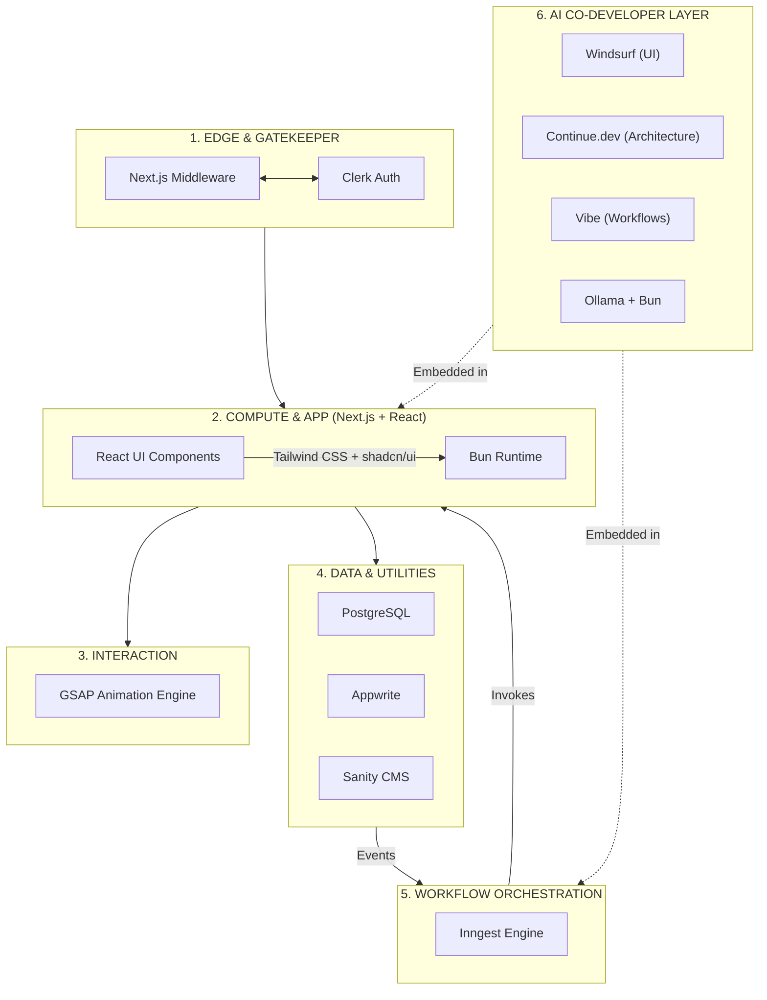

# Building My Ideal Web Stack: Next.js, React, Tailwind, Bun, PostgreSQL, Appwrite, Clerk, Sanity, Inngest, GSAP + AI Co-Developer Layer

Choosing a tech stack in today’s ecosystem can feel like trying to hit a moving target. The hype cycle moves fast, but my engineering objective has always remained sharp and consistent: **achieve rapid product delivery without sacrificing type safety, deep architectural control, or raw performance.**

Over years of building, I’ve moved away from bloated, fragmented setups. Instead, I’ve converged on a highly cohesive architecture that balances engineering velocity with structural rigidity, anchored by the reliability of **React**, the styling precision of **Tailwind CSS**, and the full-stack orchestration of **Next.js**.

Modern applications don't just need storage and rendering; they require reliable orchestration, polished interaction, **and structured collaboration with AI**. This stack transforms a collection of isolated tools into a unified, distributed application platform—with AI embedded as a true co-developer.

---

## My Architectural Topology

When designing systems, I rely on a strict mental model of where compute happens, where state lives, and how data flows. I segment this stack into seven distinct layers:

1. **Edge & Gatekeeper:** Intercepting requests and validating tokens at the network edge.
2. **Compute & Application:** Managing UI composition (React) and styling (Tailwind) via Next.js.
3. **Interaction Layer:** Orchestrating fluid, high-performance UI motion (GSAP).
4. **Core Data Engines:** Hosting transactional truth (PostgreSQL).
5. **Managed Utility Services:** Offloading identity (Clerk), content (Sanity), and storage (Appwrite).
6. **Event & Workflow Orchestration:** Executing durable background pipelines (Inngest).
7. **AI Co-Developer Layer:** Embedded intelligence across all layers (Windsurf, Continue.dev, Vibe + Local Ollama).

---

## 🧱 Integrated Architecture Model



---

## 🚀 The Foundation: Performance & Orchestration

* **Next.js:** The hub of the architecture. It bridges the gap between your frontend and backend. By utilizing **Server Actions**, we eliminate the need for traditional REST/GraphQL API boilerplates.
* **React Server Components (RSC):** Heavy data-fetching logic remains on the server.
* **Tailwind CSS + shadcn/ui:** Utility-first styling with production-grade, accessible components.
* **Bun:** Unifies the development environment—package manager, bundler, test runner, and runtime—into a single high-speed binary.

### The Multi-Surface Strategy

Bun allows you to compile your application into a standalone native binary that boots a local HTTP server and drives a platform-native WebView.

| Target Surface | Execution Environment | Styling/UI |
| --- | --- | --- |
| **Web & Edge** | Vercel / Edge Network | Tailwind + shadcn/ui |
| **Local/Desktop** | Bun Native Runtime | Tailwind + Native WebView |
| **Hybrid** | Offline-First | React-based Local State |

---

## 🛠️ The Strategic Tool Breakdown

### 1. Interaction & Styling
* **GSAP:** Animations decoupled from React's reconciliation cycle for frame-accurate performance.
* **Tailwind CSS + shadcn/ui:** Co-located styles and composable components.

### 2. Orchestration & Resilience
* **Inngest:** Durable step functions with intelligent retries for async workflows.

### 3. Data & Utilities
* **PostgreSQL:** ACID-compliant relational core.
* **Appwrite:** Object storage and real-time.
* **Clerk:** Edge-side auth.
* **Sanity:** Decoupled content management.

---

## 🤖 Beyond Vibecoding: The AI Co-Developer Layer

In 2026, AI is no longer experimental—it is operational. The difference between prototypes and production systems is how well you **structure collaboration with AI inside a real-world stack**.

Your stack (TypeScript, React, Next.js App Router, Tailwind + shadcn/ui, Clerk, Inngest, PostgreSQL, Sanity, GSAP, Bun) is component-driven, event-oriented, and API-light. AI must respect these conventions.

### Mapping AI Roles to Your Stack

#### 1. Windsurf → Frontend Velocity Layer
- Excels at React components, Tailwind, shadcn/ui, and GSAP.
- Ideal for generating dashboard cards, refactoring JSX, and iterating animations.
- Prompt example: *"Create a dashboard card component using shadcn with loading skeleton and Clerk user data."*

#### 2. Continue.dev → Architecture and Standards Layer
- Enforces rules across server actions, Inngest events, Clerk boundaries, and PostgreSQL patterns.
- Define checks in `.continue/checks/` for consistent, reviewable output.
- Perfect for maintaining architectural guardrails.

#### 3. Vibe → Event and Workflow Automation Layer
- Handles multi-step flows with Inngest, Clerk webhooks, PostgreSQL updates, and Sanity syncs.
- Turns feature specs into complete, working workflows.

### Local AI + Bun + Ollama: Efficiency Multiplier

Run Ollama alongside Bun for fast, private, zero-cost iteration.

**Recommended Models:**

| Purpose | Model | Why |
|---------|-------|-----|
| **Autocomplete** | `qwen2.5-coder:3b` | Ultra-fast, low RAM |
| **Chat/Refactor** | `qwen2.5-coder:7b` | Complex logic + multi-file |
| **High-End Reasoning** | `deepseek-r1:14b` | Agentic tasks |

**Continue.dev config example** (`~/.continue/config.json`):
```json
{
  "models": [
    {
      "title": "Fast Autocomplete",
      "provider": "ollama",
      "model": "qwen2.5-coder:3b",
      "roles": ["autocomplete"]
    },
    {
      "title": "Smart Chat/Refactor",
      "provider": "ollama",
      "model": "qwen2.5-coder:7b",
      "roles": ["chat", "edit", "apply"]
    }
  ]
}
```

### Structuring Your AI Onboarding

Create a `PROMPTS.md` with your stack rules:
- Use App Router + Server Actions only.
- Clerk for all auth.
- Inngest for async.
- shadcn/ui + Tailwind utility-first.
- Strict TypeScript.

Add custom commands in Continue for senior-level behavior, planning, and testing.

---

## A Realistic Hybrid Workflow

| Layer | Tool | Purpose |
|-------|------|---------|
| **Daily Work** | Windsurf | UI velocity & iteration |
| **Control** | Continue.dev | Architecture & consistency |
| **Execution** | Vibe | Complex workflows & Inngest |
| **Local Backbone** | Ollama + Bun | Fast, private feedback loops |

---

## Final Thoughts

Modern software architecture is about **designing portability, resilience, and intelligence into the runtime.** By combining Next.js, React, Tailwind/shadcn, Bun, PostgreSQL, Appwrite, Clerk, Sanity, Inngest, GSAP, **and a well-orchestrated AI layer**, I build a self-healing, self-improving system that scales from browser to desktop with professional-grade motion and developer velocity.

> By decoupling your motion design from component state and embedding AI as a governed co-developer, you allow your UI (and your team) to breathe—delivering the feedback and structure needed for complex asynchronous systems.

This is the stack I ship with in 2026.
