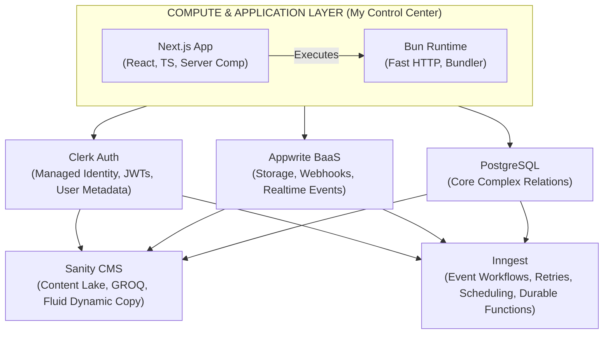
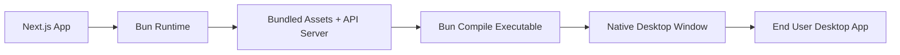

# Building My Ideal Web Stack: Next.js, Bun, PostgreSQL, Appwrite, Clerk, Sanity, and Inngest

Choosing a tech stack in today’s ecosystem can feel like trying to hit a moving target. The hype cycle moves fast, but my engineering objective has always remained sharp and consistent: **achieve rapid product delivery without sacrificing type safety, deep architectural control, or raw performance.**

Over years of building, refactoring, and maintaining production systems, I’ve moved away from bloated, fragmented setups and overly complex microservices. Instead, I’ve converged on a highly cohesive architecture that balances engineering velocity with structural rigidity: **Next.js**, **Bun**, **PostgreSQL**, **Appwrite**, **Clerk**, **Sanity**, and **Inngest**.

Modern applications don't just need storage and rendering anymore; they require reliable orchestration. They need event-driven workflows, bulletproof retries, durable background execution, and clean asynchronous boundaries between services. That’s exactly where Inngest enters the picture, acting as the connective tissue that transforms a collection of isolated tools into a unified distributed application platform.

---

## My Architectural Topology

When designing systems, I rely on a strict mental model of where compute happens, where state lives, and how data flows across operational boundaries. I segment this stack into four distinct layers:

1. **Compute & Application Layer:** Managing UI composition and runtime execution.
2. **Core Data Engines:** Hosting transactional truth and relational structure.
3. **Managed Utility Services:** Offloading identity, content pools, and object storage.
4. **Event & Workflow Orchestration:** Executing durable background pipelines.
5. **Distribution Layer (Web + Desktop):** Packaging and shipping the same system across platforms.

---

## 🧱 Architecture



---

## 🧠 Architecture: Another Representation

*(unchanged core model preserved)*

---

## 2. The Engine: Bun Runtime (Now Including Desktop Distribution Capability)

I swapped out Node.js for Bun in my development environments and the impact on developer velocity has been staggering.

Beyond being a runtime, Bun now also acts as a **distribution toolchain**, which fundamentally expands what “shipping a web app” means.

### Core Runtime Benefits

* **Zero-config TypeScript execution**: `.ts` and `.tsx` run natively.
* **Unified tooling**: package manager, bundler, and test runner in one.
* **High-performance HTTP layer** via `Bun.serve()`.

---

### 🚀 New Capability: Bun as a Desktop App Compiler

One of the most powerful extensions of this stack is using Bun to **package a web application into a distributable desktop binary**.

Instead of introducing a heavy Electron-only workflow or a Rust-first Tauri pipeline, Bun can act as the **build-and-bootstrap layer** that ships everything:

#### 1. Compile the full web runtime into a binary

Bun supports compiling TypeScript/JavaScript applications into a **single executable**:

```bash
bun build ./server.ts --compile --outfile my-app
```

This produces a self-contained binary that can:

* Start a local Next.js/Bun server
* Serve the compiled frontend assets
* Handle backend API routes locally
* Run offline-first or hybrid modes

---

#### 2. Wrap the app in a native WebView window

The compiled Bun binary can then launch a native browser shell:

* Windows: Edge WebView2
* macOS: WKWebView
* Linux: WebKitGTK

Example flow:

```
Bun Binary (compiled app)
        ↓
Starts local HTTP server
        ↓
Opens native WebView window → loads localhost UI
```

This effectively turns your **Next.js app into a desktop application without rewriting the frontend**.

---

#### 3. Why this approach matters

This model creates a powerful continuum:

| Mode        | Deployment                    |
| ----------- | ----------------------------- |
| Web         | Deployed via Vercel/Edge      |
| Local Dev   | Bun runtime                   |
| Desktop App | Bun-compiled binary + WebView |
| Hybrid      | Local-first + cloud sync      |

You are no longer “porting” applications—you are **reusing the same runtime across distribution targets**.

---

### Why this fits the architecture

* No forked frontend codebases
* No Electron-level memory overhead
* No Rust build pipeline requirement
* Same Next.js app runs everywhere
* Bun becomes both runtime *and* packaging tool

> The same system that runs in production can now be shipped as a local executable without architectural divergence.

---

## 8. Desktop Distribution Layer: Bun as a Packaging Bridge

This layer sits alongside your existing stack rather than replacing it.



### Responsibilities of this layer

* Compile server + frontend into a single artifact
* Bootstrap a local runtime environment
* Launch native window shell
* Optionally enable offline-first operation
* Sync with cloud (PostgreSQL, Appwrite, Sanity)

---

## Updated Mental Model

This changes the stack from:

> “Web application with backend services”

to:

> **“Portable distributed system with multiple execution surfaces.”**

* Browser = primary surface
* Desktop = local-first surface
* Server = scalable cloud surface
* Bun = unifying execution + packaging layer

---

## Final Thought (Enhanced)

Modern architecture is no longer just about choosing tools—it’s about **designing portability into the runtime itself**.

By combining:

* Next.js for UI composition
* Bun for execution + compilation
* PostgreSQL for truth
* Appwrite for infrastructure utilities
* Clerk for identity
* Sanity for content
* Inngest for orchestration

I get something more powerful than a web stack:

> A system that can be *run, scaled, and shipped across environments without rewriting its core.*
