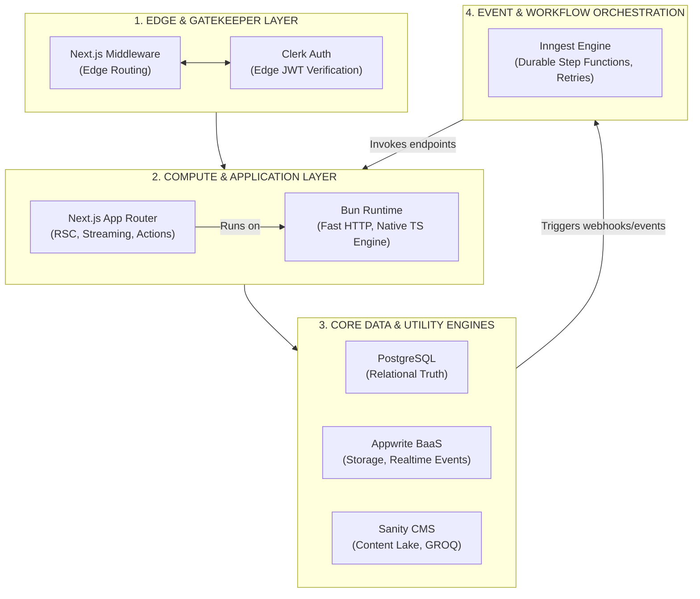

# Building My Ideal Web Stack: Next.js, Bun, PostgreSQL, Appwrite, Clerk, Sanity, and Inngest

Choosing a tech stack in today’s ecosystem can feel like trying to hit a moving target. The hype cycle moves fast, but my engineering objective has always remained sharp and consistent: **achieve rapid product delivery without sacrificing type safety, deep architectural control, or raw performance.**

Over years of building, refactoring, and maintaining production systems, I’ve moved away from bloated, fragmented setups and overly complex microservices. Instead, I’ve converged on a highly cohesive architecture that balances engineering velocity with structural rigidity: **Next.js**, **Bun**, **PostgreSQL**, **Appwrite**, **Clerk**, **Sanity**, and **Inngest**.

Modern applications don't just need storage and rendering anymore; they require reliable orchestration. They need event-driven workflows, step-by-step fault isolation, durable background execution, and clean asynchronous boundaries between services. That’s exactly where Inngest enters the picture, acting as the connective tissue that transforms a collection of isolated tools into a unified distributed application platform.

---

## My Architectural Topology

When designing systems, I rely on a strict mental model of where compute happens, where state lives, and how data flows across operational boundaries. I segment this stack into five distinct layers:

1. **Edge & Gatekeeper Layer:** Intercepting requests, validating incoming tokens, and optimizing assets close to the user.
2. **Compute & Application Layer:** Managing UI composition, React Server Components, and core runtime execution.
3. **Core Data Engines:** Hosting transactional truth, operational schemas, and relational structure.
4. **Managed Utility Services:** Offloading identity lifecycle, structured content pools, and object storage.
5. **Event & Workflow Orchestration:** Executing durable background pipelines with isolated step-level retries.

---

## 🧱 Architecture Model



---

## 🚀 The Core Engine: Bun Toolkit & Runtime

Swapping out Node.js for Bun in development and tooling workflows fundamentally shifts developer velocity. Instead of maintaining a fragile matrix of standalone compilers, linters, and test runners, Bun unifies the environment.

### Core Runtime Benefits

* **Native TypeScript Execution:** Run `.ts` and `.tsx` files directly with zero-config compilation transpilation step.
* **Unified Tooling Ecosystem:** A single high-speed binary acts as the package manager, bundler, and test runner.
* **High-Performance I/O:** Drastically reduced boot times and optimized I/O operations via `Bun.serve()`.

### The Distribution Surface: Packaging Web Layouts for Desktop

One of the most compelling aspects of using an all-in-one toolkit like Bun is its ability to act as a **packaging and compilation bridge** for alternative distribution surfaces. Rather than introducing a heavy Electron workflow or a complex Rust-first Tauri pipeline, Bun can be leveraged as the local bootstrap layer.

#### 1. Compiling the App Target

Bun supports compiling JavaScript and TypeScript codebases into a standalone, self-contained executable:

```bash
bun build ./server.ts --compile --outfile my-local-app

```

This produces a single native binary capable of booting a local HTTP instance, serving pre-bundled frontend assets, and driving backend APIs locally or in hybrid offline modes.

#### 2. Driving a Native WebView

The compiled binary boots up silently and bridges to a platform-native browser shell:

* **Windows:** Edge WebView2
* **macOS:** WKWebView
* **Linux:** WebKitGTK

```
┌──────────────────────────────────────┐
│       Bun Standalone Binary          │
│  (Local App Server + API Routes)     │
└──────────────────┬───────────────────┘
                   │ Boots local listener
                   ▼
┌──────────────────────────────────────┐
│        Native OS WebView             │
│  (Loads UI from local loopback)      │
└──────────────────────────────────────┘

```

#### 3. Why This Multi-Surface Strategy Works

This approach changes the stack from a standard web application into a **portable distributed system with multiple execution surfaces**:

| Target Surface | Execution Environment | Deployment / Packaging |
| --- | --- | --- |
| **Web & Edge** | Vercel / Edge Network | Continuous deployment via git hooks |
| **Local Dev** | Bun Native Runtime | Hot-reloading development server |
| **Desktop App** | Bun Binary + Native WebView | Packaged lightweight standalone executable |
| **Hybrid Mode** | Offline-First Architecture | Local database synchronization with cloud engines |

---

## 🛠️ The Strategic Tool Breakdown

Every service selected for this stack must justify its place by fulfilling exactly one operational domain with minimal configuration leak.

### 1. Next.js (The Composition Layer)

Next.js acts as the architecture's central station. It handles layout composition, server-side data fetching, and state hydration.

* **React Server Components (RSC):** Fetches data directly on the server, sending optimized payloads to the client without exposing heavy backend dependencies.
* **Server Actions:** Eradicates standard REST/GraphQL boilerplate for mutations, delivering end-to-end type safety directly from the UI to database layers.

### 2. PostgreSQL (The Relational Truth)

While document stores excel at un-structured utility data, transactional applications require strict invariants. PostgreSQL serves as the unshakeable foundation for complex data relationships.

* Run strict data schemas, relational foreign keys, and performant ACID-compliant transactions.
* Leverages advanced indexing strategies and JSONB support for hybrid document/relational structures.

### 3. Appwrite (The Infrastructure Utility Engine)

Instead of spending development cycles configuring raw S3 buckets or managing complex web sockets infrastructure, Appwrite offloads fundamental app utilities.

* **Object Storage:** Built-in management for media files, access control lists, and user avatars.
* **Realtime Events:** Instantly broadcasts data updates directly to connected clients without spinning up bespoke WebSocket infrastructure.

### 4. Clerk (The Perimeter Security & Identity Layer)

Authentication is a critical failure point. Clerk isolates identity handling completely, keeping user credentials away from internal servers.

* **Edge-Side Token Verification:** Cryptographically validates incoming user JWTs at the network edge via Next.js Middleware before compute resources are consumed.
* **Rich Session Metadata:** Implements seamless role-based access control (RBAC) across both web layouts and background tasks.

### 5. Sanity (The Content Lake)

Marketing collateral, transactional copy, and content layouts should never be hardcoded into an application code repository. Sanity isolates structured copy away from code deployment cycles.

* **GROQ Querying:** Offers deep structural querying power to slice and dice content pools exactly how the frontend requires them.
* **Fluid Copy Management:** Enables non-technical managers to ship dynamic layouts and localization variables in real-time without continuous code updates.

### 6. Inngest (The Background Orchestrator)

Inngest functions as the asynchronous nervous system of the architecture, coordinating the interaction between all these distinct services.

```
[ Incoming Application Event ]
              │
              ▼
    ┌──────────────────┐
    │  Inngest Server  │
    └─────────┬────────┘
              │ Coordinates step execution
              ▼
 ┌───────────────────────────┐
 │ Step 1: Query Sanity Content │ ──► Success
 └────────────┬──────────────┘
              │ Pass step data
              ▼
 ┌───────────────────────────┐
 │ Step 2: Write to Postgres │ ──► Error (Trigger backoff retry)
 └────────────┬──────────────┘
              │ Re-run isolated step
              ▼
 ┌───────────────────────────┐
 │ Step 3: Broadcast Appwrite│ ──► Complete
 └───────────────────────────┘

```

* **Durable Step Functions:** Write standard TypeScript functions that can pause execution, sleep for days, or await other explicit events.
* **Isolated Failure Domains:** If an external utility like Sanity or Appwrite goes down mid-workflow, Inngest retries **only the failed step** with exponential backoff. The surrounding application state remains completely unaffected.
* **Zero Infrastructure Overhead:** Avoids the necessity of spinning up complex, heavy state machines or managing Redis-backed queue pools manually.

---

## Final Thoughts

Modern software architecture is no longer about chaining together individual tools; it's about **designing portability and resilience directly into the runtime environment.**

By combining Next.js for interface composition, Bun for fast execution and lightweight packaging, PostgreSQL for structural data truth, Appwrite for utility management, Clerk for identity perimeter safety, Sanity for fluid content modeling, and Inngest for background durability, you create something far more powerful than a web stack.

> You build a portable, self-healing runtime architecture that scales cleanly across multiple distribution environments without rewriting its core codebase.
