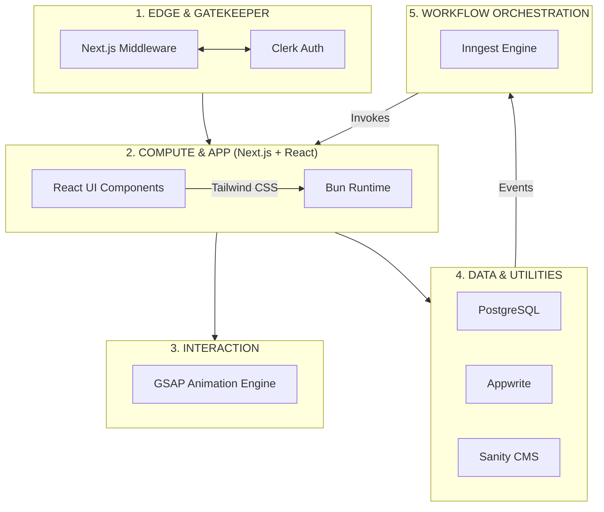

# Building My Ideal Web Stack: Next.js, React, Tailwind, Bun, PostgreSQL, Appwrite, Clerk, Sanity, Inngest, and GSAP

Choosing a tech stack in today’s ecosystem can feel like trying to hit a moving target. The hype cycle moves fast, but my engineering objective has always remained sharp and consistent: **achieve rapid product delivery without sacrificing type safety, deep architectural control, or raw performance.**

Over years of building, I’ve moved away from bloated, fragmented setups. Instead, I’ve converged on a highly cohesive architecture that balances engineering velocity with structural rigidity, anchored by the reliability of **React**, the styling precision of **Tailwind CSS**, and the full-stack orchestration of **Next.js**.

Modern applications don't just need storage and rendering; they require reliable orchestration and polished interaction. This stack transforms a collection of isolated tools into a unified, distributed application platform.

---

## My Architectural Topology

When designing systems, I rely on a strict mental model of where compute happens, where state lives, and how data flows. I segment this stack into six distinct layers:

1. **Edge & Gatekeeper:** Intercepting requests and validating tokens at the network edge.
2. **Compute & Application:** Managing UI composition (React) and styling (Tailwind) via Next.js.
3. **Interaction Layer:** Orchestrating fluid, high-performance UI motion (GSAP).
4. **Core Data Engines:** Hosting transactional truth (PostgreSQL).
5. **Managed Utility Services:** Offloading identity (Clerk), content (Sanity), and storage (Appwrite).
6. **Event & Workflow Orchestration:** Executing durable background pipelines (Inngest).

---

## 🧱 Integrated Architecture Model

---

## 🚀 The Foundation: Performance & Orchestration

* **Next.js:** The hub of the architecture. It bridges the gap between your frontend and backend. By utilizing **Server Actions**, we eliminate the need for traditional REST/GraphQL API boilerplates, allowing direct interaction between the UI and the database.
* **React Server Components (RSC):** Heavy data-fetching logic remains on the server. Only the final, lightweight UI is sent to the client, ensuring zero bundle size impact from backend SDKs.
* **Tailwind CSS:** Provides the utility-first styling engine, allowing for rapid interface iteration while maintaining design system consistency.
* **Bun:** Unifies the development environment—package manager, bundler, test runner, and runtime—into a single high-speed binary.

### The Multi-Surface Strategy

Bun allows you to compile your application into a standalone native binary that boots a local HTTP server and drives a platform-native WebView.

| Target Surface | Execution Environment | Styling/UI |
| --- | --- | --- |
| **Web & Edge** | Vercel / Edge Network | Tailwind Utility Classes |
| **Local/Desktop** | Bun Native Runtime | Tailwind + Native WebView |
| **Hybrid** | Offline-First | React-based Local State |

---

## 🛠️ The Strategic Tool Breakdown

### 1. Interaction & Styling

* **GSAP:** Animations shouldn't be coupled to React's reconciliation cycle. By using GSAP, you ensure animations remain frame-accurate and performant, allowing the UI to "breathe" while background processes finish.
* **Tailwind CSS:** Keeps styles co-located with components, reducing mental overhead and preventing "CSS file bloat."

### 2. Orchestration & Resilience

* **Inngest:** Acts as the asynchronous nervous system. It enables durable step functions. If a step (like a Sanity query or a Postgres write) fails, Inngest retries **only that step** with exponential backoff, leaving the surrounding application state intact.

### 3. Data & Utilities

* **PostgreSQL:** The bedrock for relational truth and ACID compliance.
* **Appwrite:** Handles object storage and real-time broadcasting without maintaining bespoke WebSocket servers.
* **Clerk:** Secures the perimeter. Edge-side token verification ensures no unauthorized request hits your compute layer.
* **Sanity:** The "Content Lake," isolating copy and layout updates from code deployment cycles.

---

## Final Thoughts

Modern software architecture is about **designing portability and resilience into the runtime.** By combining these tools, you build a self-healing system that scales from the browser to the desktop, with professional-grade motion, robust background logic, and a developer experience defined by the speed of Bun and the flexibility of the Next.js/React/Tailwind ecosystem.

> By decoupling your motion design from your component state, you allow your UI to breathe, providing the visual feedback necessary for users to understand the complex asynchronous workflows happening under the hood.
