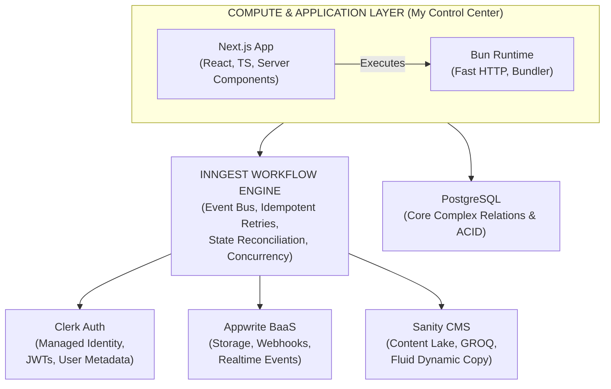

# Building My Ideal Web Stack: Next.js, Bun, PostgreSQL, Inngest, Appwrite, Clerk, and Sanity

Choosing a tech stack in today’s ecosystem can feel like trying to hit a moving target. The trend cycle moves fast, but my goal has always been sharp and consistent: **achieve rapid product delivery without sacrificing type safety, deep architectural control, or performance.**

Over years of building and refactoring, I’ve moved away from bloated setups and overly complex microservices. Instead, I’ve converged on a highly cohesive architecture that balances engineering velocity with structural rigidity: **Next.js and TypeScript** on the front, **Bun** running the engine underneath, **PostgreSQL** holding down the relational business data, and **Inngest** acting as the resilient, event-driven neural network orchestrating my workflows.

To bridge the gap between highly structured relational data (like transactions and user permissions), fluid collaborative content, and ambient system failures, I round out this architecture with **Clerk** for identity management, **Sanity** as my structured Content Lake, and **Appwrite** for object utility.

---

## My Architectural Topology

When designing applications, I prefer to keep a clear mental model of where compute happens, where state lives, and how data flows. I segment this stack across three distinct layers: the **Compute Layer**, the **Event & Asynchronous Orchestration Layer**, and **Managed Utility Services**.

```

```

---

## Component-by-Component Blueprint

### 1. Frontend & Compute: Next.js, React, & TypeScript

For the user-facing side of my applications, Next.js acts as the unified application layer. Moving to the **App Router** fundamentally changed how I structure code, primarily because it embraces **Locality of Behavior (LoB)**.

* **Locality of Behavior:** I strongly believe that code is easier to reason about when its behavior is visible right where it’s defined. With React Server Components (RSC), I can colocate my data fetching queries right inside the UI layout components that consume them.
* **End-to-End Type Safety:** By writing everything in TypeScript, I create an unbroken chain of type safety. I use modern ORMs like Drizzle or Prisma to map my database schemas into application types. If I alter a column in PostgreSQL, the compiler immediately flags exactly which React components will break.

### 2. The Engine: Bun Runtime

I swapped out Node.js for Bun in my development environments and server runtimes, and the difference in developer velocity is staggering.

* **Zero-Config TypeScript:** Bun natively executes `.ts` and `.tsx` files without requiring a messy compilation layer like `tsc` or `ts-node`. Things just run.
* **Unified Tooling:** Bun replaces my package manager, bundler, and test runner. Package installations take fractions of a second instead of minutes, which keeps me in a flow state. On top of that, its native HTTP server layer (`Bun.serve()`) delivers massive throughput, making it an incredible companion for running Next.js self-hosted or in containerized Docker environments.

### 3. Core Data: PostgreSQL

While Backend-as-a-Service (BaaS) platforms offer excellent out-of-the-box storage, I’ve learned that complex applications eventually require a mature relational database engine. I rely on PostgreSQL to handle my mission-critical structural data.

* **Relational Integrity:** Complex business logic, entity relationship mapping, and strict database constraints belong in Postgres. I lean heavily on its ACID transactional guarantees to ensure that multi-step operations—like processing an order or updating permission structures—either succeed completely or fail gracefully.
* **Architectural Extensibility:** Whether I need to optimize deep `JOIN` operations, query complex hierarchical structures using Common Table Expressions (CTEs), or store unstructured payloads in a `JSONB` column, Postgres scales with me without requiring a separate infrastructure migration.

### 4. Asynchronous Coordination & Reliability: Inngest

In a distributed environment, failures are ambient. Network requests drop, APIs timeout, and state temporarily diverges. I plug **Inngest** into the core of my stack to transition from fragile, linear step-execution to a resilient, event-driven ecosystem.

* **Zero-Infrastructure Queueing:** Instead of configuring, hosting, and maintaining heavy Redis queues or RabbitMQ instances, Inngest turns standard Next.js API routes into step-by-step stateful workflows. I write pure TypeScript code, and Inngest handles the scheduling, state persistence, and execution state transitions over HTTP.
* **State Convergence & Resilience:** When an asynchronous workflow fires—such as an order fulfillment path or an multi-stage AI orchestration loop—Inngest ensures that each step is **idempotent**. If step 3 fails, it retries precisely at step 3 without executing step 1 and 2 again. It natively provides out-of-the-box support for:
* Concurrency limits (throttling heavy traffic)
* Debouncing and batching incoming events
* Multi-day delays and human-in-the-loop coordination
* Distributed error-handling and failure fallback routines


### 5. Content & Presentation State: Sanity

Hardcoding UI text is a maintenance trap, but jamming marketing copy, blog posts, or landing page structures into a rigid SQL database ruins developer velocity. I use **Sanity** to decouple content from code.

* **The Content Lake:** Instead of a traditional CMS that spits out rigid HTML, Sanity treats content as a queryable Content Lake of structured JSON. Using **GROQ** (Graph Relational Object Queries), I can fetch exactly the content layout my Next.js Server Components need, shaping the JSON on the fly to match my frontend props perfectly.
* **Realtime Visual Editing & TypeGen:** Sanity’s native TypeScript generation matches my stack's core philosophy. I get compile-time type safety for my content schemas. When combined with Next.js App Router, Sanity allows non-technical team members to edit copy in a live-preview studio, which automatically revalidates my Next.js page caches via webhooks.

### 6. Identity & Security: Clerk

Authentication is a classic trap: it looks deceptively simple to build manually, but it quickly becomes an engineering money pit. I offload this entirely to Clerk.

* **Edge-Ready Verification:** Short-lived JWTs issued by Clerk can be intercepted and verified instantly at my Next.js Middleware layer. This allows me to block or permit requests at the edge before my server compute layer or backend services expend a single cycle.
* **Event-Driven Synchronization via Inngest:** To keep my systems loosely coupled, I route Clerk's webhooks straight into an **Inngest** event-driven function. When a user signs up or modifies their profile, an asynchronous event fires into my Inngest bus. Inngest catches it, handles potential high-concurrency spikes, and ensures that user metadata updates sync into my PostgreSQL database with absolute reliability.

### 7. Backend Utility & Storage: Appwrite

If PostgreSQL handles structural data, Sanity handles marketing data, and Clerk handles identity, Appwrite acts as my enterprise-grade utility knife. It seamlessly plugs the gaps that would otherwise require me to deploy and manage half a dozen standalone tools.

* **Object Storage & File Manipulation:** Managing user-generated file uploads safely is a headache. Appwrite’s Storage service handles bucket management, access control lists (ACLs), secure file previews, and on-the-fly image optimization.
* **Instant Realtime Features:** I hate writing and maintaining raw WebSocket servers. Appwrite’s native Realtime service allows my frontend to subscribe to file or data mutation events instantly using their clean client SDK.

---

## The Lifecycle of a Request: Data Flow in Action

To demonstrate how beautifully these components pull together, let's look at a concrete workflow: **A user updates their account tier (Clerk), which triggers an automated asynchronous billing and resource provision pipeline, updates local user states (PostgreSQL), updates telemetry logs (Appwrite), and presents a dynamic custom portal (Sanity).**

```
[ Clerk Webhook ] ──( Event )──> [  Inngest Bus  ] ───( Step 1 )───> [ Postgres Data Sync ]
                                         │
                                         ├───( Step 2: Retry Safe )─> [ Appwrite Bucket Provision ]
                                         │
                                         └───( Step 3 )───> [ Revalidate Next.js Server Cache ]

```

1. **Edge Identity Event:**
A user completes an upgrade layout. Clerk captures the profile modification and emits a webhook. Next.js Middleware intercepts the request, verifies the signature, and routes the payload to the Inngest event processor.
2. **Idempotent Workflow Execution:**
Inngest catches the `user.updated` event and triggers a structured multi-step background workflow.
* **Step 1:** It opens a localized transaction in **PostgreSQL** updating the relational security permission matrix.
* **Step 2:** It communicates with **Appwrite Storage** to securely provision an isolated asset folder for the user's elevated tier. If Appwrite is experiencing high latency, Inngest pauses, backs off, and retries just this single step without double-updating Postgres.


3. **Dynamic Presentation Convergence:**
Upon workflow completion, Inngest triggers an automated internal cache revalidation payload. **Next.js Server Components** running in the **Bun runtime** query the structured **Sanity Content Lake** and updated data from **Postgres** simultaneously, outputting a completely personalized, type-safe operational layout back to the browser.

---

## Final Thoughts: The Engineering Payoff

Every choice in this stack serves a singular architectural philosophy: **minimize boilerplate, eliminate configuration overhead, and maximize type safety and resilience.**

| Component | Why it earns its place in my stack |
| --- | --- |
| **Next.js / React** | Gives me clean UI component nesting, lightning-fast rendering strategies, and lets me practice Locality of Behavior. |
| **Bun** | Speeds up my local loops, strips away complex TypeScript transpilation steps, and handles heavy HTTP request volumes easily. |
| **PostgreSQL** | Provides rock-solid, transactional data consistency and structural integrity that I can rely on as my app grows. |
| **Inngest** | Acts as the resilient state-governor of the stack, turning risky asynchronous processes into predictable, replay-safe, step-by-step workflows. |
| **Sanity** | Decouples fluid copy and page layout architecture from my code, treating content as clean, type-safe queryable data. |
| **Clerk** | Secures my perimeter with enterprise-grade identity features, freeing me up to focus on business logic. |
| **Appwrite** | Acts as a scalable, worry-free backend utility that effortlessly manages my object storage, webhooks, and realtime needs. |

By offloading commoditized features like identity, content systems, file hosting, and distributed queue mechanics to specialized engines like Clerk, Sanity, Appwrite, and Inngest, while keeping absolute architectural control over my application server (Next.js/Bun) and relational engine (Postgres), I get the best of both worlds. I can build lean, move incredibly fast, and still know that my system is architected to remain stable when reality becomes adversarial.
