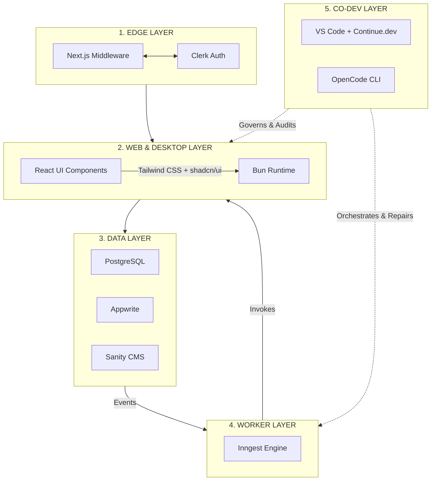

# From Web Stack to Living System: Engineering a Multi-Surface Architecture

When I left the corporate world to pivot into full-time freelancing, I realized that my previous methods of "building for scale" were actually recipes for "building for maintenance hell." In the enterprise, you have teams dedicated to DevOps, SRE, and architecture. As a solopreneur focusing on web development, enterprise architecture, consultation, and training, **I don't have that luxury.**

I needed a system that wasn't just a collection of tools, but a force multiplier. I moved away from "vibecoding"—relying on black-box AI to generate code I don't understand—and embraced **Co-Development**. I use AI to act as a governed, agentic extension of my own expertise within **Continue.dev** and the **OpenCode CLI**.

My goal is clear: **Achieve enterprise-grade product delivery while operating with the agility and low overhead of a single developer.**

---

## 🧭 The Shape of the System: My "Solopreneur Engine"

I’ve converged on a **multi-surface execution system**. As a consultant, my clients need code that is robust, type-safe, and self-documenting. As a trainer, I need code that follows clear, teachable patterns.

| Layer | Purpose | Key Tools |
| --- | --- | --- |
| **1. Edge Layer** | Auth, routing, request interception | Next.js Middleware, Clerk |
| **2. Web Layer** | Primary runtime (Web/Desktop) | Next.js, React 19, Bun, GSAP |
| **3. Data Layer** | Transactional truth + storage | PostgreSQL, Appwrite, Sanity |
| **4. Worker Layer** | Background execution + events | Inngest + Bun/Serverless |
| **5. Co-Dev Layer** | Intelligent orchestration | VS Code, Continue.dev, OpenCode CLI |



---

## 🚀 Empowering the Solopreneur: Why This Stack Wins

Pivoting to a freelancer focusing on architecture and training requires a specific kind of "leverage." Here is how this stack empowers my new career:

### 1. Velocity Without the "Junior" Trap

When I consult for enterprise clients, they demand maintainability. My **Contract-First** approach using **Zod** acts as a technical specification that clients can actually understand. When I teach, I don't teach "hacks"; I teach the **Zod-schema-as-contract** pattern. It turns my code into a living, validated document that junior developers find easy to follow and senior architects find impossible to ignore.

### 2. High-Margin Consultations (The "Productized Architecture")

Because I anchor my stack on **Next.js + Zod + Inngest**, I can spin up a fully compliant, production-ready environment for a client in hours, not weeks. This is "Productized Architecture." I am not just selling hours; I am selling a **proven, self-healing system**.

### 3. The Solopreneur’s Force Multiplier: Co-Development

As a freelancer, I am my own DevOps team. I cannot afford to spend days debugging environment drift. By using **Continue.dev** to enforce architecture and **OpenCode CLI** to handle terminal orchestration, I’ve effectively hired a "virtual staff" that never makes typos.

* **The Benefit:** I can take on more complex architecture projects because I am not bogged down by boilerplate or manual testing. The AI handles the "how," while I focus on the "why."

---

## 🛡️ The "Contract-First" Lifecycle: Why Zod is My Best Friend

In a distributed ecosystem, **data drift** is the primary risk. I treat **Zod** as my Interface Definition Language (IDL). Before I write a UI component, I define a schema. This ensures the entire system speaks the same language.

### Example: Defining the Source of Truth

```ts
// src/lib/contracts/post.schema.ts
import { z } from 'zod';

export const PostSchema = z.object({
  id: z.string().uuid(),
  title: z.string().min(5),
  content: z.string(),
  createdAt: z.date(),
});

```

* **Why this is key for training:** When I train teams, I start here. It teaches them that **data is the foundation of architecture**.

---

## 🤖 The Co-Development Workflow: VS Code as an Engine

My IDE is a governed, agentic environment where I am always in the loop.

* **Continue.dev (The Architect):** I index my `lib/contracts` and `docs/` folders. When I am consulting for a client, Continue helps me ensure that every new feature I build matches the *existing* project conventions. It’s perfect for maintaining the "look and feel" of a client's legacy codebase.
* **OpenCode CLI (The Orchestrator):** It parses terminal errors—like failed Zod validations—and suggests specific fixes. For a freelancer juggling multiple client projects, this is a lifesaver. I don't have to re-learn every client's build pipeline; the OpenCode CLI keeps the "Source of Truth" accessible.

---

## 🔄 The Feedback Loop: Terminal-to-Inngest

To automate the "last mile," I’ve engineered a feedback loop that validates my event contracts directly from my terminal:

```bash
# Example: Validating a client's Inngest event
bun run scripts/validate-payload.ts --file ./events/test-post-created.json
if [ $? -eq 0 ]; then
  opencode run "inngest send -e post.created -d ./events/test-post-created.json"
fi

```

**This is "Production-Grade" Freelancing:** I never deploy code that hasn't been validated locally against the contract. My clients get bug-free releases, and I keep my reputation for high-quality architectural delivery.

---

## 🏁 Final Engineering Principle: "Complexity Budgeting"

Leaving the corporate world to focus on freelancing and training has taught me one hard lesson: **Maintenance energy is your most expensive resource.** By anchoring my stack on **Next.js + Zod + Inngest**, and by practicing **Co-Development**, I’ve created a system that is self-validating and self-improving. I am not chasing the newest framework; I am refining this graph until it is unbreakable.

**Whether I’m training a team or building an enterprise-grade platform for a client, this stack is the engine that makes it all possible.**
