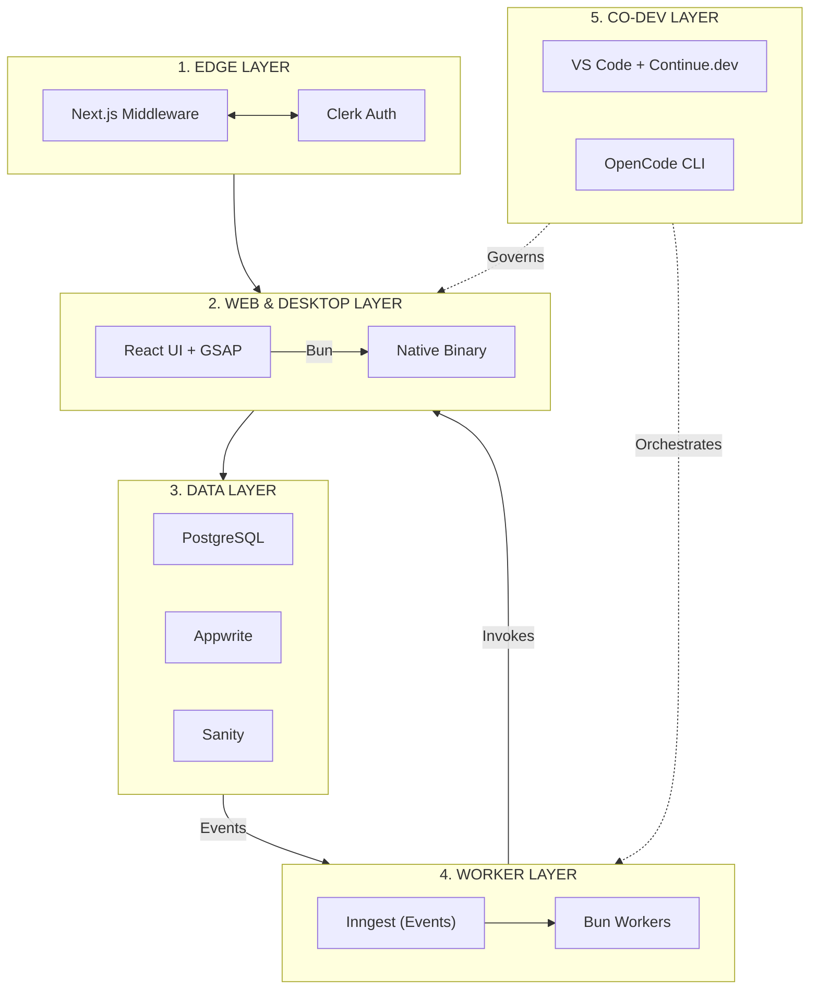

# From Web Stack to Living System: Engineering a Multi-Surface Architecture

When I left the corporate world to pivot into full-time freelancing, I realized that my previous methods of "building for scale" were recipes for maintenance hell. In the enterprise, you have teams for DevOps and SRE. As a solopreneur focusing on web development, enterprise architecture, and training, **I don’t have that luxury.**

I needed a system that wasn't just a collection of tools, but a force multiplier. I moved away from "vibecoding"—relying on black-box AI to generate code I don't understand—and embraced **Co-Development**. I use AI not to replace my engineering judgment, but to act as a force multiplier within a governed, agentic environment using **Continue.dev** and the **OpenCode CLI**.

---

## 🧭 The Shape of the System: My "Solopreneur Engine"

I’ve converged on a **multi-surface execution system**—one that spans web, edge, desktop, and background workers, all coordinated through a single event-driven backbone.

### The Architectural Topology

I segment my stack into five distinct layers. To understand this, think of **Layering** as the practice of separating *concern* (what the app does) from *infrastructure* (where the app lives).

| Layer | Purpose | Key Tools |
| --- | --- | --- |
| **1. Edge Layer** | Auth, routing, request interception | Next.js Middleware, Clerk |
| **2. Web Layer** | Primary runtime (Web/Desktop) | Next.js, React 19, Bun, GSAP |
| **3. Data Layer** | Transactional truth + storage | PostgreSQL, Appwrite, Sanity |
| **4. Worker Layer** | Background execution + events | Inngest + Bun/Serverless |
| **5. Co-Dev Layer** | Intelligent orchestration | VS Code, Continue.dev, OpenCode CLI |



---

## 🛡️ The "Contract-First" Lifecycle: Why Zod is Your Best Friend

In a distributed ecosystem, **data drift** is the primary risk. **Definition:** *Data drift* occurs when the shape of data in your database doesn't match what your code expects, leading to silent, catastrophic runtime failures.

I treat **Zod** as my Interface Definition Language (IDL). Before I write a UI component, I define a schema. This ensures the entire system speaks the same language.

### Example: Defining the Source of Truth

```ts
// src/lib/contracts/post.schema.ts
import { z } from 'zod';

// Zod schema acts as both the validation logic and the TypeScript type
export const PostSchema = z.object({
  id: z.string().uuid(),
  title: z.string().min(5),
  content: z.string(),
  createdAt: z.date(),
});

// Automatically infer type from schema - no double maintenance
export type Post = z.infer<typeof PostSchema>;

```

**My Opinion:** If you are not using a schema validator like Zod in 2026, you are essentially gambling with your production data. Stop writing interfaces manually; let your validation logic *be* your interface.

---

## 🚀 Orchestration & The "Brain" Strategy

I no longer treat background tasks as "fire and forget." My **Inngest** implementation is the durable state-engine of my application. **Definition:** *Durable Execution* allows a background function to pause, wait, or retry without losing its place in the logic, even if the server restarts.

```ts
// Example: Inngest Event Handler
export const createPostHandler = inngest.createFunction(
  { id: 'create-post' },
  { event: 'post.created' },
  async ({ event }) => {
    // This is "durable"—it survives process crashes
    const { title, content } = event.data;
    await db.insert(posts).values({ title, content });
  }
);

```

---

## 🤖 The Co-Development Workflow: VS Code as an Engine

My IDE is a governed, agentic environment. I don't "vibecode"; I **Co-Develop**.

* **Continue.dev (The Architect):** By indexing my `lib/contracts` and `docs/` folders, Continue understands my "Source of Truth." It knows exactly how to draft a new endpoint or hook that matches my project's existing "vocabulary."
* **OpenCode CLI (The Orchestrator):** It parses terminal errors and suggests fixes. For a freelancer juggling multiple client projects, this is my safety net.

### The Feedback Loop: Terminal-to-Inngest

```bash
# Validating a client's event contract locally
bun run scripts/validate-payload.ts --file ./events/test-post-created.json
if [ $? -eq 0 ]; then
  opencode run "inngest send -e post.created -d ./events/test-post-created.json"
fi

```

---

## 📅 The Daily Habit Strategy: Productivity vs. Vitality

Pivoting to freelance enterprise architecture requires "leverage." You have to optimize for output without burning out.

### 1. The "Deep Work" Morning (07:00–11:00)

* **AI-Orchestrated Coding:** Tackle the hardest architectural problems first using **Continue.dev**.
* **Zero Distractions:** No meetings, no email. Just shipping.

### 2. The "Vitality Routine"

* **Non-Negotiable Exercise:** I treat my exercise routine like a "production server"—it never goes down. 45 minutes of resistance training or intense cardio is my non-negotiable midday "system reset." It clears the mental fog and ensures I'm performing at peak level.
* **Context Switching:** I stop at a fixed time (18:00). I close VS Code and shut down the terminal. My brain needs time to offload from the "living system" I've been building.

---

## 🏁 Final Engineering Principle: "Complexity Budgeting"

My biggest lesson is that every tool costs "maintenance energy." By anchoring my stack on **Next.js + Zod + Inngest**, and by practicing **Co-Development**, I’ve created a system that is self-validating and self-improving. I am not chasing the newest framework; I am refining this graph until it is unbreakable.

**This is the stack I ship with—and the routine that keeps me shipping for years to come.**
