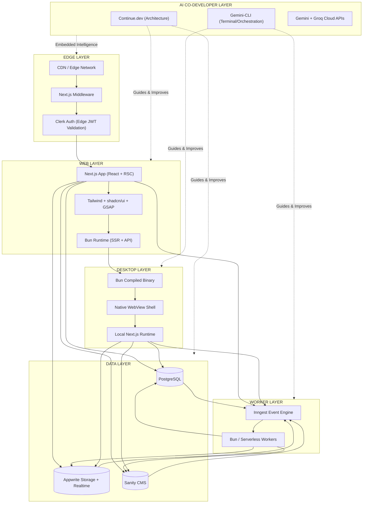
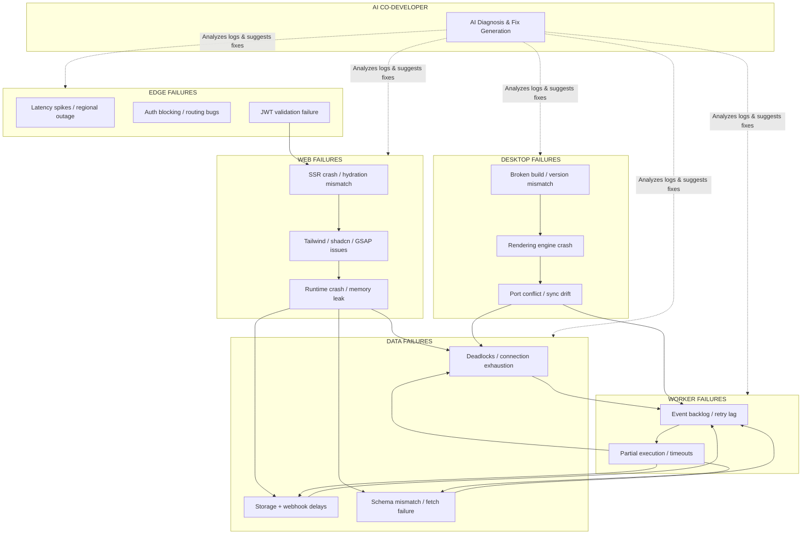
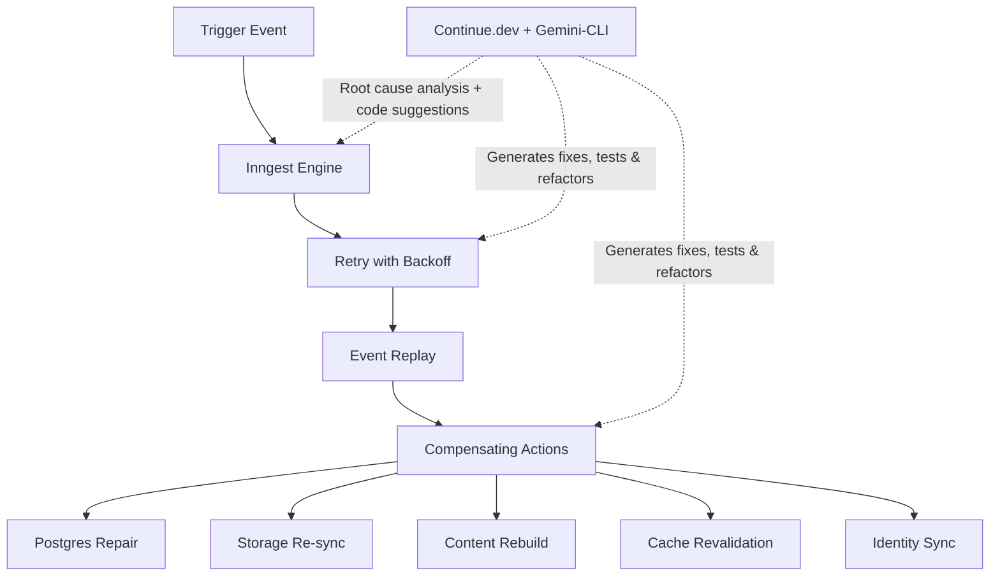

# From Web Stack to Living System:  
**My Multi-Surface Architecture with Next.js, Bun, Inngest + AI Co-Developer Layer (Gemini-CLI + Continue.dev Only)**

Choosing a tech stack today often feels like assembling a temporary compromise rather than designing a system. The tools change faster than the problems they solve, and most architectures end up as loosely connected services held together by convention and hope.

Over time, I've moved away from that mindset entirely.

What I've converged on is not just a "web stack," but a **multi-surface execution system**—one that spans web, edge, desktop, and background workers, all coordinated through a single event-driven backbone.

My core stack centers around **Next.js, Bun, PostgreSQL, Appwrite, Clerk, Sanity, Inngest, Tailwind + shadcn/ui, and GSAP**. But the more interesting part isn't the tools—it's how they **fail, recover, adapt, and continuously improve** across environments, now supercharged by my structured AI co-developer layer: **Gemini-CLI + Continue.dev only**.

This is the system as I actually think about it.

***

## 🧭 The Shape of the System

I mentally divide the architecture into **six** layers:

| Layer | Purpose | Key Tools |
|-------|---------|-----------|
| **1. Edge Layer** | Authentication, routing, request interception | Next.js Middleware, Clerk Auth (Edge JWT) |
| **2. Web Layer** | Primary application runtime | Next.js + React + RSC + Tailwind + shadcn/ui + GSAP |
| **3. Data Layer** | Transactional truth + storage | PostgreSQL, Appwrite, Sanity CMS |
| **4. Worker Layer** | Background execution + event processing | Inngest + Bun/Serverless Workers |
| **5. Distribution Layer** | Web + desktop (via Bun compilation) | Bun Compiled Binary + Native WebView |
| **6. AI Co-Developer Layer** | Embedded intelligence | **Continue.dev (Architecture)** + **Gemini-CLI (Orchestration)** + Cloud APIs (Gemini, Groq) |

These layers are not just "stacked." They are **interconnected through failure, recovery, event flow, and continuous intelligent improvement**.

***

## 🌐 The Full Topology (Web, Edge, Workers, Desktop + AI)

At the center of my system is a simple idea:

> **The same application should run everywhere—but behave differently depending on where it executes. And it should improve itself over time through structured collaboration with AI.**



***

## ⚙️ The Key Shift: Execution Is No Longer Single-Surface

A modern application is not deployed once—it is executed in multiple contexts:

- **Browser (web)**
- **Edge (middleware + auth)**
- **Worker runtime (background logic)**
- **Desktop (local-first binary via Bun)**

And now, **intelligently guided and evolved** across all surfaces by my AI co-developer layer: **Continue.dev + Gemini-CLI only**.

***

## ⚠️ Thinking in Failures, Not Features

Most architecture diagrams stop at "happy path flows." I found that misleading.

Instead, I design around a more honest question:

> **What breaks, where does it break, how does the system recover, and how does my AI co-developer layer (Continue.dev + Gemini-CLI) help diagnose, fix, and prevent recurrence?**

***

## 💥 Failure Model: Where Things Actually Break



***

## 🧠 The Real Insight: Failure Is Not an Exception, It's a Path

Once I started modeling failure explicitly **and embedding Continue.dev + Gemini-CLI**, the system changed in four important ways:

| Change | What It Means |
|--------|---------------|
| **1. Failures became local** | A broken service doesn't collapse the system—it isolates impact |
| **2. Everything became replayable** | Inngest makes workflows durable. Continue.dev + Gemini-CLI help design better events, recovery paths, and compensating transactions |
| **3. Recovery became automatic and intelligent** | Retries, backoff, event replay, and compensating actions—now accelerated by AI-assisted root cause analysis, code fixes, and test generation via Continue.dev + Gemini-CLI |
| **4. Evolution became continuous** | The AI layer turns every failure, feature request, or architectural drift into a rapid, governed improvement cycle |

***

## 🔁 Recovery Model: How the System Heals Itself



***

## 🤖 The AI Co-Developer Layer: Continue.dev + Gemini-CLI Only

This is the newest and most transformative addition to the architecture. Instead of treating AI as an occasional helper, I've embedded **Continue.dev + Gemini-CLI** as a **persistent intelligence layer** that works across all surfaces.

### Core AI Responsibilities

| Tool | Role | What It Does |
|------|------|--------------|
| **Continue.dev** | Architecture and standards layer | Enforces rules, performs audits, maintains consistency across server actions, Inngest patterns, Clerk boundaries, PostgreSQL queries, and shadcn/ui + GSAP conventions. Uses codebase embeddings to match my established patterns. |
| **Gemini-CLI** | Terminal orchestration & command | Instant reasoning without leaving terminal context. Perfect for script generation, CI/CD setup, querying Inngest event definitions, piping terminal errors into reasoning loops for fixes before staging. |
| **Cloud Free Models** (Gemini 1.5 Flash/Pro, Groq Llama 3.3 70B) | Powerful reasoning without local hardware tax | High-velocity logic, code generation, test creation, architectural suggestions—configured in Continue.dev's `config.yaml` |

### How AI Integrates Daily

- **During failures**: Gemini-CLI analyzes logs, Continue.dev proposes diffs, generates tests, suggests architectural improvements
- **During development**: Continue.dev helps scaffold new features while respecting all existing conventions; Gemini-CLI handles CLI orchestration
- **During maintenance**: Continue.dev performs codebase audits and refactors; Gemini-CLI keeps web/desktop surfaces in sync via terminal commands
- **During evolution**: Both tools turn vague requirements into well-structured implementations with proper error handling and observability

This layer transforms the entire system from merely resilient to **self-improving**.

### My `~/.continue/config.yaml` (Gemini + Groq Only)

```yaml
models:
  - name: Gemini 1.5 Flash (Context)
    provider: gemini
    model: gemini-1.5-flash
    apiKey: ${GEMINI_API_KEY}
    roles: [autocomplete, chat, edit]

  - name: Llama 3.3 (Reasoning)
    provider: groq
    model: llama-3.3-70b-versatile
    apiKey: ${GROQ_API_KEY}
    roles: [chat]

rules:
  - "Use App Router patterns"
  - "Use Server Actions for data mutations"
  - "Enforce strict TypeScript"
  - "Match shadcn/ui conventions"
  - "Decouple animations with GSAP"
```

***

## 🖥️ The Desktop Layer: Bun as a Distribution Engine

One of the most interesting extensions of this system is using **Bun as a compiler for desktop applications**. Continue.dev maintains consistency between web and desktop surfaces (shared components, logic, and styling), while Gemini-CLI handles the build orchestration via terminal.

Bun compiles your app into a **standalone native binary** that boots a local HTTP server and drives a **platform-native WebView**. This gives you:

- **Offline-first capability**
- **Local state + GSAP animations**
- **Shared React components** between web and desktop
- **Single codebase** with surface-specific behavior

***

## 🧩 What This Architecture Actually Becomes

Once everything is connected, the system stops feeling like a "stack."  
It starts behaves like a **distributed runtime organism**:

| Component | Role in the Organism |
|-----------|----------------------|
| **Next.js + React** | Perception layer (UI + rendering) |
| **Tailwind + shadcn/ui + GSAP** | Interaction & motion layer |
| **Bun** | Execution + packaging layer (metabolism) |
| **PostgreSQL** | Memory (truth) |
| **Inngest** | Nervous system (time + coordination) |
| **Appwrite / Clerk / Sanity** | Utility & identity organs |
| **Continue.dev + Gemini-CLI** | Intelligence, adaptation & evolution layer |

And across all of it:

> **Events are the bloodstream. Continue.dev + Gemini-CLI are the mind guiding continuous evolution.**

***

## 🧭 Final Thought

Most architectures try to minimize failure.  
I've started designing systems that **expect failure, model it explicitly, route around it automatically, and continuously improve with Continue.dev + Gemini-CLI**.

The result is not just a stack that is fast to build with.  
It's a stack that behaves more like a **living system**—one that can run across environments, recover from partial collapse, adapt to new requirements, and evolve with minimal friction.

That shift—from **tools to systems**, from **services to execution surfaces**, and from **coder to orchestrator of intelligence** (via Continue.dev + Gemini-CLI only)—is the real architecture.

Everything else is just implementation detail.
