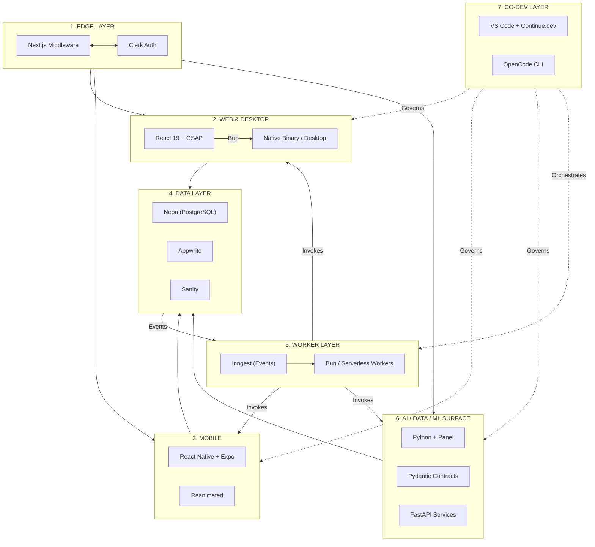

# From Web Stack to Living System: Engineering a Multi-Surface Architecture

When I left the corporate world to pivot into full-time freelancing, I realized that my previous methods of “building for scale” were recipes for maintenance hell. In the enterprise you have teams for DevOps and SRE. As a solopreneur focusing on web development, enterprise architecture, and training, **I don’t have that luxury.**

I needed a system that wasn’t just a collection of tools, but a force multiplier. I moved away from “vibecoding”—relying on black-box AI to generate code I don’t understand—and embraced **Co-Development**. I use AI not to replace my engineering judgment, but to act as a force multiplier within a governed, agentic environment using **Continue.dev** and the **OpenCode CLI**.

The result is a living system: one architecture that spans web, mobile, desktop, edge, background workers, and AI-enabled data/ML surfaces—all coordinated through contracts, events, and a single source of truth.

---

## 🧭 The Shape of the System: My “Solopreneur Engine”

I’ve converged on a **multi-surface execution system**. Every surface—browser, native mobile, desktop binary, interactive dashboard, or long-running pipeline—shares the same contracts, the same identity layer, and the same event backbone. This is what turns a stack into a living system.

### The Architectural Topology

I segment the system into seven distinct layers. Layering here is the practice of separating *concern* (what the system does) from *infrastructure* (where it lives) while keeping every surface interoperable.

| Layer | Purpose | Key Tools |
| --- | --- | --- |
| **1. Edge Layer** | Auth, routing, request interception | Next.js Middleware, **Clerk** |
| **2. Web & Desktop Layer** | Primary product runtime | **Next.js 16**, **React 19**, Bun, GSAP |
| **3. Mobile Layer** | Native mobile experience | **React Native (latest)**, Expo, Reanimated |
| **4. Data Layer** | Transactional truth + content + storage | **Neon (PostgreSQL)**, Appwrite, **Sanity** |
| **5. Worker Layer** | Background execution + durable events | **Inngest** + Bun / serverless |
| **6. AI / Data / ML Surface** | Interactive analytics, pipelines, models | **Python**, **Panel**, Pydantic, FastAPI |
| **7. Co-Dev Layer** | Intelligent orchestration & governance | VS Code, Continue.dev, OpenCode CLI |


```mermaid
flowchart TB
    subgraph EDGE["1. EDGE LAYER"]
        M["Next.js Middleware"] <--> C["Clerk Auth"]
    end

    subgraph WEB["2. WEB & DESKTOP"]
        A["React 19 + GSAP"] -->|Bun| B["Native Binary / Desktop"]
    end

    subgraph MOBILE["3. MOBILE"]
        RN["React Native + Expo"]
        RA["Reanimated"]
    end

    subgraph DATA["4. DATA LAYER"]
        E["Neon (PostgreSQL)"] & D["Appwrite"] & F["Sanity"]
    end

    subgraph ORCH["5. WORKER LAYER"]
        G["Inngest (Events)"] --> H["Bun / Serverless Workers"]
    end

    subgraph ML["6. AI / DATA / ML SURFACE"]
        PY["Python + Panel"]
        PD["Pydantic Contracts"]
        FA["FastAPI Services"]
    end

    subgraph AI["7. CO-DEV LAYER"]
        VS["VS Code + Continue.dev"]
        Open["OpenCode CLI"]
    end

    EDGE --> WEB
    EDGE --> MOBILE
    EDGE --> ML
    WEB --> DATA
    MOBILE --> DATA
    ML --> DATA
    DATA -->|"Events"| ORCH
    ORCH -->|"Invokes"| WEB
    ORCH -->|"Invokes"| MOBILE
    ORCH -->|"Invokes"| ML
    AI -.->|"Governs"| WEB
    AI -.->|"Governs"| MOBILE
    AI -.->|"Governs"| ML
    AI -.->|"Orchestrates"| ORCH
```

This topology keeps every surface honest. A change to a schema, an event, or an identity rule propagates through the whole system instead of living in isolated silos.

---

## 🛡️ The “Contract-First” Lifecycle: Why Schemas Are Non-Negotiable

In a distributed, multi-surface ecosystem, **data drift** is the primary risk. Data drift occurs when the shape of data in your database (or CMS, or event payload) no longer matches what your code expects—leading to silent, catastrophic runtime failures.

I treat schemas as my Interface Definition Language. On the TypeScript side that means **Zod**. On the Python side that means **Pydantic**. Before I write a UI component, a mobile screen, a Panel dashboard, or a pipeline stage, I define the contract. The entire system then speaks the same language.

### Example: Defining the Source of Truth (TypeScript)

```ts
// src/lib/contracts/post.schema.ts
import { z } from 'zod';

export const PostSchema = z.object({
  id: z.string().uuid(),
  title: z.string().min(5),
  content: z.string(),
  createdAt: z.date(),
});

export type Post = z.infer<typeof PostSchema>;
```

### Equivalent Contract on the Python Side

```python
# shared/contracts/post.py
from pydantic import BaseModel, Field
from datetime import datetime
from uuid import UUID

class Post(BaseModel):
    id: UUID
    title: str = Field(min_length=5)
    content: str
    created_at: datetime
```

**My Opinion:** If you are not using schema validators like Zod (and Pydantic where Python lives) in 2026, you are gambling with production data. Stop writing interfaces manually. Let your validation logic *be* your interface. Shared contracts are what make a multi-surface system coherent instead of fragile.

I also apply the same discipline to client state with **Zustand** (web + mobile) and to content models in Sanity. Every write path—Server Action, FastAPI endpoint, Inngest function, or Panel callback—validates before it mutates.

---

## 🗄️ Data Layer Reality: Neon + Sanity + Appwrite

Transactional truth lives in **Neon** (serverless PostgreSQL with branching). Content and configuration live in **Sanity**. File and auxiliary storage can sit in Appwrite when needed. 

Neon’s branching is especially valuable for a solopreneur: I can spin up an identical database for a feature, run migrations, validate against the contracts, and only then merge. Both the TypeScript (Drizzle) and Python sides talk to the same source of truth under the same schema discipline.

Sanity acts as the global configuration and content brain. Feature flags, marketing copy, and structured content are edited there and consumed by Next.js, React Native, and Panel apps through the same validated contracts—no rebuild required for many changes.

---

## 🚀 Orchestration & The “Brain” Strategy

I no longer treat background tasks as fire-and-forget. **Inngest** is the durable state-engine of the living system. Durable execution lets a function pause, wait, or retry without losing its place—even across process restarts or surface boundaries.

Events can originate from the web app, a mobile client, a Python pipeline, or a Panel interaction. Inngest processes them uniformly and can invoke any surface.

```ts
// Example: Inngest handler that can also trigger Python / Panel work
export const createPostHandler = inngest.createFunction(
  { id: 'create-post' },
  { event: 'post.created' },
  async ({ event }) => {
    const { title, content } = event.data;
    // validated upstream against the shared contract
    await db.insert(posts).values({ title, content });
    // optionally emit a follow-up event consumed by a Python worker or Panel pipeline
  }
);
```

This is how a product feature, a data pipeline, and an ML exploration surface stay coordinated without custom glue for every combination.

---

## 🐍 Python + Panel: The Analytical & AI Surface

Not every surface is a polished product UI. For AI-enabled applications, data pipelines, interactive analytics, model exploration, and internal tooling I deliberately use **Python + Panel**.

Panel lets me build reactive, production-grade dashboards and data apps while staying inside the Python data/ML ecosystem (Polars, scikit-learn, modern LLM tooling, etc.). FastAPI (or equivalent) exposes clean service boundaries that the rest of the system can call. Clerk JWTs are validated at that boundary so identity remains consistent.

The critical discipline is the same: Pydantic models mirror the Zod contracts. Schema drift is treated as a failure. Long-running or multi-step jobs are handed to Inngest so they inherit durable execution.

This surface is not a side project—it is a first-class citizen of the living system.

---

## 🤖 The Co-Development Workflow: VS Code as an Engine

My IDE is a governed, agentic environment. I don’t vibecode; I **Co-Develop**.

- **Continue.dev (The Architect):** By indexing `lib/contracts`, the Python package that holds Pydantic models, and the `docs/` folder, Continue understands the source of truth. Rules enforce contract-first changes, shared schemas across surfaces, and consistent patterns for Server Actions, FastAPI endpoints, Zustand stores, and Panel components.
- **OpenCode CLI (The Orchestrator):** It parses terminal errors, validation failures, and migration mismatches, then suggests precise fixes. For a freelancer juggling multiple client projects, this is the safety net that prevents drift from becoming debt.

### The Feedback Loop: Terminal → Validation → Inngest

```bash
# Validate a payload against both TypeScript and Python contracts
bun run scripts/validate-payload.ts --file ./events/test-post-created.json
python -m scripts.validate_payload --file ./events/test-post-created.json

if [ $? -eq 0 ]; then
  echo "✅ Schema validation passed. Invoking Inngest..."
  opencode run "inngest send -e post.created -d ./events/test-post-created.json"
else
  echo "❌ Schema drift detected. Stopping."
  exit 1
fi
```

When a property is added to a shared schema, I ask Continue.dev to update the Zod definition, the Pydantic model, the Neon migration, the Sanity schema, the Zustand slice, any React Native screens, the relevant Panel components, and the orchestration scripts. The living system stays in sync.

---

## 📅 The Daily Habit Strategy: Productivity vs. Vitality

Pivoting to freelance enterprise architecture requires leverage. You have to optimize for output without burning out. The living system only stays alive if the person operating it does too.

### 1. The “Deep Work” Morning (07:00–11:00)
- AI-orchestrated coding: tackle the hardest architectural problems first with Continue.dev.
- Zero distraction: no meetings, no email. Just shipping the next coherent piece of the system.

### 2. The “Vitality Routine”
- Non-negotiable exercise: I treat my physical routine like a production server—it never goes down. 45 minutes of resistance training or intense cardio is the midday system reset. It clears mental fog and keeps decision quality high.
- Hard stop: I close VS Code and shut down the terminal at a fixed time (18:00). The brain needs time to offload from the living system it has been building.

This rhythm is not optional. It is what makes multi-year refinement of the architecture sustainable.

---

## 🏁 Final Engineering Principle: “Complexity Budgeting”

My biggest lesson is that every tool costs maintenance energy. By anchoring the system on **Clerk** for identity, **Neon + Sanity** for truth and content, **Zod + Pydantic** for contracts, **Zustand** for shared client state, **Inngest** for durable orchestration, **React 19 / Next.js 16 / React Native** for product surfaces, and **Python + Panel** for AI-enabled data and ML work—all inside a deliberate Co-Development workflow—I have created a system that is self-validating and self-improving.

I am not chasing the newest framework. I am refining this graph until it is unbreakable across every surface I ship on.

**This is the living system I ship with—and the routine that keeps me shipping for years to come.**
