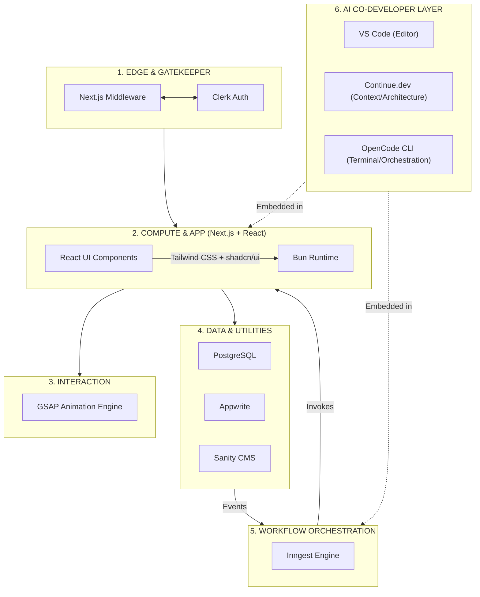

# Engineering a Self-Validating, Co-Development Stack

When I first started building for the web, I often felt like I was chasing a moving target. The hype cycle moves at breakneck speed, and it’s remarkably easy to end up with a project that is bloated, fragmented, and—most importantly—difficult to maintain.

There is a popular trend today toward "vibecoding"—relying on black-box AI to generate massive chunks of code without oversight. **I don’t believe in that.** I believe in **Co-Development.** My goal is to maintain absolute structural integrity and architectural control. I use AI not to replace my engineering judgment, but to act as a force multiplier within a governed, agentic environment using **Continue.dev** and the **OpenCode CLI**.

My objective is consistent: **Achieve rapid product delivery without sacrificing type safety, architectural control, or performance.**

---

## 🧠 The Architectural Topology: A Seven-Layer Model

To keep my mental model clear, I segment my stack into seven distinct layers. This prevents the "spaghetti code" trap by ensuring every service has a single, well-defined responsibility.

| Layer | Function | Key Tools |
| --- | --- | --- |
| **1. Edge & Gatekeeper** | Request validation & auth | Next.js Middleware, Clerk |
| **2. Compute & Application** | UI composition & runtime | React 19, Tailwind, Bun |
| **3. Interaction** | High-performance motion | GSAP |
| **4. Core Data Engines** | Transactional truth | PostgreSQL (Neon) |
| **5. Managed Services** | Content & storage | Sanity CMS, Appwrite |
| **6. Orchestration** | Event-driven pipelines | Inngest |
| **7. AI Co-Development** | Intelligence layer | VS Code, Continue.dev, OpenCode CLI |

### The Blueprint



---

## 🛡️ The "Contract-First" Lifecycle: Why Zod is Your Best Friend

In a distributed ecosystem, **data drift** is the primary risk. I treat **Zod** as my Interface Definition Language (IDL). Before I write a UI component, I define a schema. This ensures the entire system speaks the same language.

### Example: Defining the Source of Truth

```ts
// src/lib/contracts/post.schema.ts
import { z } from 'zod';

export const PostSchema = z.object({
  id: z.string().uuid(),
  title: z.string().min(5),
  content: z.string(),
  createdAt: z.date(),
});

export type Post = z.infer<typeof PostSchema>;

```

**Why this is maintainable:**

1. **Mock Generation:** Using `zod-mock`, I generate dummy data, allowing me to build the frontend in total isolation from the backend.
2. **Validation Boundaries:** I implement server actions wrapped in Zod-validated handlers.
3. **Runtime Safety:** If Sanity or Appwrite returns an unexpected field, the app doesn't crash silently. It throws an explicit error logged to **Sentry**, allowing me to fix the "drift" before users see it.

---

## 🚀 Orchestration & The "Brain" Strategy

I no longer treat background tasks as "fire and forget." My **Inngest** implementation is the durable state-engine of my application.

* **Durable Recovery:** I wrap multi-service operations (e.g., *Upload file → Update DB → Notify CMS*) in single functions. If the database update fails, Inngest handles the retry logic automatically.
* **Sanity as Config:** I treat Sanity as my Global Configuration Layer. Feature flags and dynamic UI layouts are managed there, allowing "deployment-less" updates.

```ts
// Example: Inngest Event Handler
export const createPostHandler = inngest.createFunction(
  { id: 'create-post' },
  { event: 'post.created' },
  async ({ event }) => {
    const { title, content } = event.data;
    await db.insert(posts).values({ title, content });
  }
);

```

---

## 🤖 The Co-Development Workflow: VS Code as an Engine

I don’t believe in "vibecoding." I practice **Co-Development**. My IDE is a governed, agentic environment where I am always in the loop, ensuring that the code produced is robust, maintainable, and predictable.

### 1. Continue.dev: Architectural Enforcement

Continue acts as a **Context-Aware Policy Engine**. By indexing my `lib/contracts` and `docs/` folders, it understands my "Source of Truth."

* **Rules Guardrail:** I force rules like *"Always use Server Actions for mutations."* * **Knowledge Graph:** If I ask it to "Add a new endpoint for orders," it automatically drafts the Zod schema, the database action, and the React hook using my established project conventions.

### 2. OpenCode CLI: Terminal Orchestration

I use the **OpenCode CLI** to bridge the gap between my terminal and my cloud infrastructure.

* **Self-Healing Scripts:** It parses terminal errors—like failed Zod validations—and suggests specific fixes.
* **Deployment Gatekeeping:** My CI/CD pipeline includes "pre-flight" checks. If a local change violates the global contract, the terminal blocks the `git push`.

---

## 🔄 The Feedback Loop: Terminal-to-Inngest

To automate the "last mile," I’ve engineered a feedback loop that validates my Inngest event contracts directly from my terminal:

```bash
#!/bin/bash
# scripts/test-event.sh

# 1. Validate payload against Zod contract
bun run scripts/validate-payload.ts --file ./events/test-post-created.json

if [ $? -eq 0 ]; then
  echo "✅ Schema validation passed. Invoking Inngest..."
  # 2. Use OpenCode CLI to trigger the local Inngest dev server
  opencode run "inngest send -e post.created -d ./events/test-post-created.json"
else
  echo "❌ Schema drift detected. Stopping deployment."
  exit 1
fi

```

**Why this is "Production-Grade":**

* **Architectural Symmetry:** This local test is identical to my production CI/CD pipeline.
* **The Self-Healing Loop:** If I add a property to my `PostSchema`, I ask Continue.dev: *"Update my orchestration scripts to match the new schema."* It then refactors the validation and the trigger script automatically.

---

## 🏁 Final Engineering Principle: "Complexity Budgeting"

My biggest lesson in 2026 is that every tool you add costs "maintenance energy." By anchoring my stack on **Next.js + Zod + Inngest**, and by practicing **Co-Development** rather than "vibecoding," I’ve created a system that is self-validating and self-improving.

I am not chasing the newest framework; I am refining this graph until it is unbreakable. **This is the stack I ship with.**
