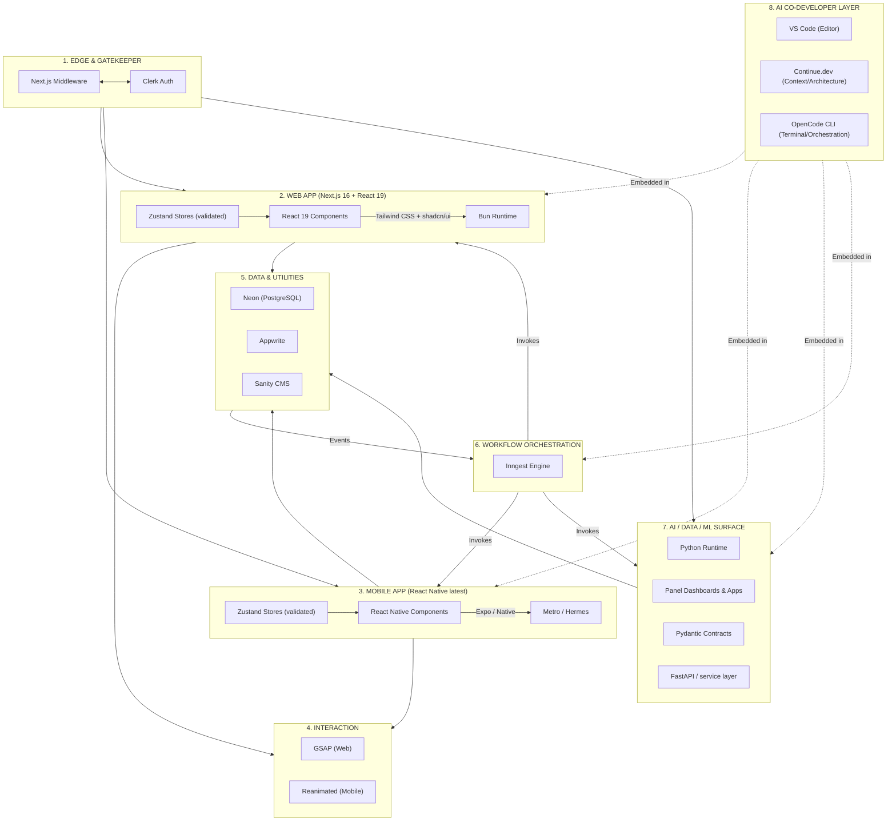

# Engineering a Self-Validating Stack with React 19, Next.js 16, React Native, Python & Panel

When I first started building for the web, I often felt like I was chasing a moving target. The hype cycle moves at breakneck speed, and it’s remarkably easy to end up with a project that is bloated, fragmented, and—most importantly—difficult to maintain.

There is a popular trend today toward “vibecoding”—relying on black-box AI to generate massive chunks of code without oversight. **I don’t believe in that.** I believe in **Co-Development.** My goal is to maintain absolute structural integrity and architectural control. I use AI not to replace my engineering judgment, but to act as a force multiplier within a governed, agentic environment using **Continue.dev** and the **OpenCode CLI**.

My objective is consistent: **Achieve rapid product delivery without sacrificing type safety, architectural control, or performance—across web, mobile, and AI-enabled data/ML surfaces.**

---

## 🧠 The Architectural Topology: A Nine-Layer Model

To keep my mental model clear, I segment the stack into nine distinct layers. This prevents the “spaghetti code” trap by ensuring every service has a single, well-defined responsibility. With **React 19**, **Next.js 16**, **React Native (latest)**, and a first-class **Python + Panel** surface for data pipelines and ML apps, I now have a unified foundation for interactive product experiences *and* serious analytical/AI workloads.

| Layer | Function | Key Tools |
| --- | --- | --- |
| **1. Edge & Gatekeeper** | Request validation & auth | Next.js Middleware, **Clerk** |
| **2. Web Compute & UI** | Web application | **React 19**, **Next.js 16**, Tailwind, Bun |
| **3. Mobile Compute & UI** | Mobile application | **React Native (latest)**, Expo |
| **4. Interaction** | High-performance motion | GSAP (web), Reanimated (mobile) |
| **5. Core Data Engines** | Transactional truth | **PostgreSQL (Neon)** |
| **6. Managed Services** | Content & storage | **Sanity CMS**, Appwrite |
| **7. Orchestration** | Event-driven pipelines | Inngest |
| **8. AI / Data / ML Surface** | Interactive analytics, pipelines & models | **Python**, **Panel**, Pydantic, FastAPI (or similar) |
| **9. AI Co-Development** | Intelligence layer | VS Code, Continue.dev, OpenCode CLI |

### The Blueprint


```mermaid
flowchart TB
    subgraph EDGE["1. EDGE & GATEKEEPER"]
        M["Next.js Middleware"] <--> C["Clerk Auth"]
    end

    subgraph WEB["2. WEB APP (Next.js 16 + React 19)"]
        WA["React 19 Components"] -->|Tailwind CSS + shadcn/ui| WB["Bun Runtime"]
        WZ["Zustand Stores (validated)"] --> WA
    end

    subgraph MOBILE["3. MOBILE APP (React Native latest)"]
        MA["React Native Components"] -->|Expo / Native| MB["Metro / Hermes"]
        MZ["Zustand Stores (validated)"] --> MA
    end

    subgraph MOTION["4. INTERACTION"]
        GS["GSAP (Web)"]
        RN["Reanimated (Mobile)"]
    end

    subgraph DATA["5. DATA & UTILITIES"]
        E["Neon (PostgreSQL)"]
        D["Appwrite"]
        F["Sanity CMS"]
    end

    subgraph ORCH["6. WORKFLOW ORCHESTRATION"]
        G["Inngest Engine"]
    end

    subgraph ML["7. AI / DATA / ML SURFACE"]
        PY["Python Runtime"]
        PN["Panel Dashboards & Apps"]
        PD["Pydantic Contracts"]
        FA["FastAPI / service layer"]
    end

    subgraph AI["8. AI CO-DEVELOPER LAYER"]
        VS["VS Code (Editor)"]
        Cont["Continue.dev (Context/Architecture)"]
        Open["OpenCode CLI (Terminal/Orchestration)"]
    end

    EDGE --> WEB
    EDGE --> MOBILE
    EDGE --> ML
    WEB --> MOTION
    MOBILE --> MOTION
    WEB --> DATA
    MOBILE --> DATA
    ML --> DATA
    DATA -->|"Events"| ORCH
    ORCH -->|"Invokes"| WEB
    ORCH -->|"Invokes"| MOBILE
    ORCH -->|"Invokes"| ML
    AI -.->|"Embedded in"| WEB
    AI -.->|"Embedded in"| MOBILE
    AI -.->|"Embedded in"| ML
    AI -.->|"Embedded in"| ORCH
```

---

## 🔐 Clerk: The Gatekeeper That Never Sleeps

Authentication is the first line of defense, and **Clerk** gives me a fully managed, enterprise-grade identity layer without the usual headaches. I integrate Clerk at the edge via Next.js Middleware for web, via Clerk’s React Native SDK for mobile, and via JWT validation (or Clerk’s backend SDKs) for the Python services that power Panel apps and data pipelines—ensuring every request, whether from a browser, device, or analytical surface, is authenticated before it touches application logic.

**Why Clerk wins:**
- **User-friendly flows:** Pre-built components for sign-in, sign-up, and profile management that are fully customisable across platforms.
- **Multi-tenant ready:** Organizations and roles are built-in, making it trivial to support B2B scenarios.
- **Webhooks + Server Actions / service sync:** I consume Clerk webhooks to synchronise user profiles directly into my Neon database, keeping the user table consistent for web, mobile, and Python services.

```ts
// Example: Next.js Middleware that protects routes
import { clerkMiddleware } from '@clerk/nextjs/server';

export default clerkMiddleware();

export const config = {
  matcher: ['/((?!.*\\..*|_next).*)', '/', '/(api|trpc)(.*)'],
};
```

On React Native the same user session is managed via `@clerk/clerk-expo`. Python services validate the same JWTs (or call Clerk’s backend APIs) so identity remains the single source of truth.

---

## 🗄️ Neon: Serverless PostgreSQL with Branching Superpowers

For transactional data, I rely on **Neon**—a serverless Postgres that scales instantly and offers database branching. This is a game-changer for development, testing, and also for the analytical workloads that feed Panel dashboards and ML pipelines.

**Why Neon is my primary data engine:**
- **Branching:** I spin up a production-identical branch for every feature, run migrations against it, and validate schema changes before merging.
- **Automatic scaling:** No more provisioning; Neon handles concurrency spikes effortlessly.
- **Point-in-time recovery:** I sleep better knowing I can restore to any second.

My data model is defined using **Drizzle ORM** on the TypeScript side and mirrored (or queried) from Python with SQLAlchemy / async drivers. Every table is validated against a **Zod** contract (TypeScript) and an equivalent **Pydantic** model (Python) so the application layer never writes malformed data—whether the request comes from a web client, mobile client, or a Panel-driven pipeline.

---

## 📝 Sanity: The Content Brain

I treat **Sanity** as more than a CMS—it’s the global configuration and content orchestration layer. All dynamic content—blog posts, product catalogs, landing page copy, even feature flags—lives in Sanity.

**Why Sanity fits my stack:**
- **Real-time collaboration:** Content teams edit in the studio while apps instantly reflect changes via GROQ queries.
- **Structured content:** Schemas mirror my Zod / Pydantic contracts, eliminating content-model drift.
- **Deployment-less updates:** Changing a promotional banner or a feature flag doesn’t require a rebuild; Sanity’s CDN serves fresh data on every request.

Both Next.js / React Native and the Python services fetch content using the same conceptual contracts (Zod on the JS side, Pydantic on the Python side).

```ts
// Example: Fetching content from Sanity with Zod validation (shared JS code)
import { createClient } from '@sanity/client';
import { PostSchema } from '@/lib/contracts/post.schema';

const client = createClient({ /* ... */ });

export async function getPosts() {
  const data = await client.fetch(`*[_type == "post"]`);
  return data.map((p) => PostSchema.parse(p));
}
```

---

## 🧘 State Management with Zustand + Zod (Shared Across Platforms)

Global client state is no exception to the contract-first rule. I use **Zustand** for its minimal boilerplate and excellent TypeScript support; it works seamlessly in both React and React Native. I enforce the same discipline I apply to backend data.

```ts
// src/lib/stores/postStore.ts (shared between web and mobile)
import { create } from 'zustand';
import { PostSchema, type Post } from '@/lib/contracts/post.schema';

interface PostStore {
  posts: Post[];
  addPost: (post: Post) => void;
}

export const usePostStore = create<PostStore>((set) => ({
  posts: [],
  addPost: (post) => set((state) => {
    const validated = PostSchema.parse(post);
    return { posts: [...state.posts, validated] };
  }),
}));
```

Every piece of data entering the store must pass the Zod gauntlet. On the Python side the equivalent is Pydantic models that feed Panel apps and pipeline stages, keeping the same invariants.

---

## 🌐 React 19 & Next.js 16: The Web Foundation

**Next.js 16** brings the latest React 19 features, including the new compiler, improved server components, and enhanced caching. I use it as the primary web application framework:

- **Server Components** for data-heavy pages, reducing client-side JavaScript.
- **Server Actions** for mutations, tightly integrated with Zod validation.
- **App Router** for file-based routing with built-in layout and error boundaries.
- **Turbopack** (via Bun) for lightning-fast development.

React 19’s concurrent features further streamline UI responsiveness, especially when combined with GSAP for high-performance animations.

---

## 📱 React Native (Latest): The Mobile Experience

For the mobile app I use the **latest React Native** (with Expo). The same Zod contracts, Zustand stores, and Sanity / Neon data layers are shared via a monorepo (pnpm workspaces or Turborepo). This enables true code reuse:

- **UI Components:** React Native for Web where it makes sense, with platform-specific implementations when needed.
- **Animations:** GSAP on web, **React Native Reanimated** on mobile, both driven by the same state.
- **Navigation:** Expo Router keeps the mental model consistent with Next.js.

Clerk’s Expo SDK and the shared stores keep the mobile experience in lock-step with the rest of the system.

---

## 🐍 Python + Panel: The AI-Enabled Data & ML Surface

Not every surface is a product UI. For AI-enabled applications, data pipelines, interactive analytics, model exploration, and internal tooling I deliberately step into **Python**. The core of this layer is **Panel**—a high-level, reactive framework for building data apps, dashboards, and exploratory interfaces that can be served as standalone apps or embedded where appropriate.

**Why Python + Panel belongs in the stack:**
- **Data & ML native:** Pandas, Polars, scikit-learn, PyTorch / JAX, LangChain-style agents, and modern LLM tooling all live naturally here.
- **Reactive dashboards & apps:** Panel (with HoloViews, Bokeh, Plotly, etc.) lets me build production-grade interactive surfaces without abandoning the Python data science ecosystem.
- **Contract parity:** Every payload that crosses the boundary is validated with **Pydantic** models that mirror the Zod schemas used on the TypeScript side. Schema drift is treated as a first-class failure.
- **Service boundary:** FastAPI (or equivalent) exposes clean HTTP / WebSocket endpoints that the web and mobile apps (or Inngest jobs) can call. Clerk JWTs are validated at this boundary.
- **Pipeline & orchestration friendly:** Long-running or multi-step data / ML jobs are triggered and observed via Inngest; Panel apps can both emit and consume those events.

```python
# Example: Pydantic contract + simple Panel app entry point
from pydantic import BaseModel, Field
from panel import serve
import panel as pn

class Post(BaseModel):
    title: str
    content: str
    # mirrors the Zod PostSchema

# ... load data from Neon / Sanity with the same contracts ...

def create_dashboard():
    # reactive widgets, plots, model controls, etc.
    return pn.Column(
        pn.pane.Markdown("## AI-Enabled Post Analytics"),
        # ... Panel components bound to validated data ...
    )

if __name__ == "__main__":
    serve(create_dashboard, port=5006)
```

Both product UIs and these analytical surfaces share the same underlying truth (Neon + Sanity) and the same validation discipline. The result is that an ML feature or data pipeline can be prototyped and iterated in Panel, then promoted into production product surfaces without rewriting the contracts.

---

## 🚀 Orchestration & The “Brain” Strategy

I no longer treat background tasks as “fire and forget.” My **Inngest** implementation is the durable state-engine of the entire system.

- **Durable Recovery:** Multi-service operations (upload → update DB → notify CMS → trigger ML job) are wrapped in single functions. Failures are retried automatically.
- **Sanity as Config:** Feature flags and dynamic layouts live in Sanity, enabling deployment-less updates.
- **Cross-surface triggers:** Events can be emitted from web, mobile, or Python services; Inngest processes them uniformly and can invoke Panel-backed pipelines or model jobs.

```ts
// Example: Inngest handler that can also kick off Python / Panel work
export const createPostHandler = inngest.createFunction(
  { id: 'create-post' },
  { event: 'post.created' },
  async ({ event }) => {
    const { title, content } = event.data;
    await db.insert(posts).values({ title, content });
    await sanityClient.create({ _type: 'post', title, content });
    // optionally emit a follow-up event that a Python worker / Panel pipeline consumes
  }
);
```

---

## 🤖 The Co-Development Workflow: VS Code as an Engine

I don’t believe in “vibecoding.” I practice **Co-Development.** My IDE is a governed, agentic environment where I remain in the loop.

### 1. Continue.dev: Architectural Enforcement
Continue indexes `lib/contracts`, `docs/`, and the Python package that holds Pydantic models. Rules enforce:
- “Always validate with Zod (or Pydantic) before writing to stores / databases.”
- “Share contracts between web, mobile, and Python via the shared package / schema definitions.”
- “Prefer Server Actions / FastAPI endpoints over ad-hoc fetches.”

When I ask it to “Add a new orders feature,” it drafts the Zod + Pydantic schemas, Drizzle migration, Sanity update, Clerk role check, Zustand slice, React Native screen, and the corresponding Panel dashboard / pipeline stub—using the established conventions.

### 2. OpenCode CLI: Terminal Orchestration
OpenCode bridges the terminal and infrastructure. It parses validation failures, migration mismatches, and pipeline errors, then suggests precise fixes. Pre-flight checks in CI block pushes that violate the global contract, whether the change originated in TypeScript or Python.

---

## 🔄 The Feedback Loop: Terminal-to-Inngest (and Python)

A typical local validation script now covers both the TypeScript and Python sides of a contract:

```bash
#!/bin/bash
# scripts/test-event.sh

# 1. Validate payload against Zod (and, where relevant, Pydantic)
bun run scripts/validate-payload.ts --file ./events/test-post-created.json
python -m scripts.validate_payload --file ./events/test-post-created.json

if [ $? -eq 0 ]; then
  echo "✅ Schema validation passed. Invoking Inngest..."
  opencode run "inngest send -e post.created -d ./events/test-post-created.json"
else
  echo "❌ Schema drift detected. Stopping."
  exit 1
fi
```

If a property is added to a shared schema, I ask Continue.dev to update the orchestration scripts, Sanity schema, Neon migration, Zustand stores, Pydantic models, and any Panel apps that consume the data. The refactor stays consistent across every surface.

---

## 🏁 Final Engineering Principle: “Complexity Budgeting”

My biggest lesson is that every tool you add costs maintenance energy. By anchoring the stack on **Clerk** for auth, **Neon** for data, **Sanity** for content, **Zod + Pydantic** for contracts, **Zustand** for shared client state, **Inngest** for orchestration, **React 19 / Next.js 16 / React Native** for product UIs, and **Python + Panel** for AI-enabled data pipelines and ML applications—all inside a deliberate Co-Development workflow—I have a system that is self-validating and self-improving.

I am not chasing the newest framework. I am refining this graph until it is unbreakable—across web, mobile, data, and ML. **This is the stack I ship with.**
