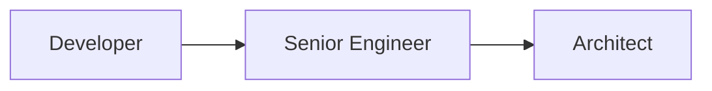
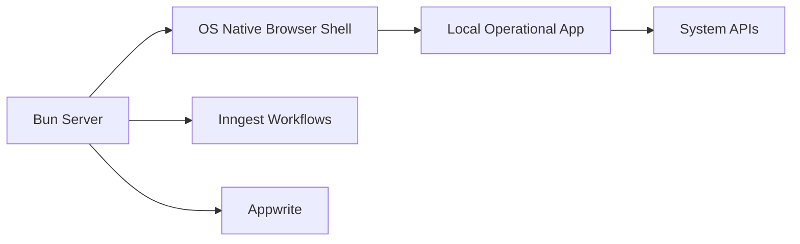
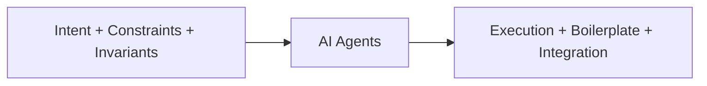
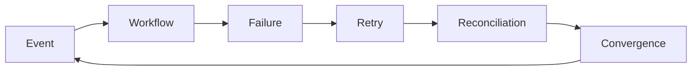
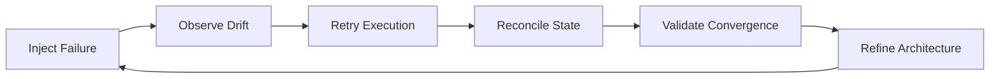
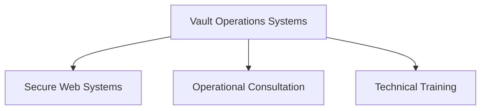
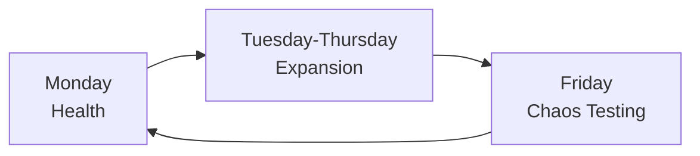

# 🌌 My 2026 Solopreneur Blueprint


## *From Enterprise Architect to System Governor*

I no longer see myself as “just a developer.”

That label increasingly feels like a leftover abstraction from an earlier phase of the software industry — a time when implementation itself was the scarce skill.

By 2026, implementation is rapidly becoming commoditized.

AI agents generate scaffolding in seconds. Infrastructure platforms collapse months of backend work into managed primitives. Boilerplate is automated. Integration glue is synthesized on demand.

The bottleneck has moved.

The real leverage is no longer in typing syntax faster than someone else.

It is in **designing systems that remain stable, governable, and correct under uncertainty.**

That realization became the foundation of my transition from enterprise architecture into solopreneurship.

I am not trying to become a freelancer competing on hourly execution.

I am building toward something far more durable:

> Becoming a **System Governor**.

A System Governor designs, assembles, hardens, and continuously governs resilient production systems capable of recovering, adapting, and evolving with minimal human intervention.

This is no longer conventional software engineering.

It is the convergence of:

* Distributed systems orchestration
* Operational resilience engineering
* AI-assisted execution pipelines
* Secure workflow architecture
* Cybernetic feedback systems
* Event-driven operational governance
* Failure-aware systems thinking

My career path is no longer linear:



It has evolved into an operational governance loop:


---

# 🧭 Why I Am Making This Transition

After years working across infrastructure support, cybersecurity, enterprise integration, cloud systems, hardware operations, and CTO-level strategic planning, I realized something fundamental:

> The bottleneck is no longer implementation.
> The bottleneck is architectural clarity under uncertainty.

Corporate environments often optimize for:

* Process layers
* Sprint metrics
* Hierarchy
* Coordination overhead
* Stakeholder alignment
* Organizational velocity

Meanwhile, modern tooling is collapsing the cost of software creation.

A single focused operator can now assemble systems that previously required:

* Backend teams
* DevOps specialists
* Platform engineers
* Operations departments
* Integration teams

That changes the economics of software entirely.

For the first time, a solo operator can combine:

* Enterprise architecture discipline
* Cybersecurity rigor
* Cloud-native infrastructure
* Workflow orchestration
* AI-assisted execution
* Operational governance

…into an extremely high-leverage independent operating model.

---

# 🧠 The Great Shift: From Execution to Intent

For decades, software engineering rewarded implementation throughput.

More features.

More tickets.

More commits.

More sprint velocity.

AI-native tooling has inverted that equation.

Execution is compressing.

Which means the premium shifts toward:

* Intent precision
* Architectural governance
* Structural correctness
* Operational resilience
* State convergence

## The Old Model vs The New Model

| Corporate Engineer              | System Governor                     |
| ------------------------------- | ----------------------------------- |
| Measured by output volume       | Measured by operational reliability |
| Writes implementation syntax    | Governs architectural boundaries    |
| Focuses on feature delivery     | Focuses on state convergence        |
| Builds isolated applications    | Builds operational ecosystems       |
| Reacts to incidents             | Designs for automatic recovery      |
| Optimizes shipping velocity     | Optimizes structural correctness    |
| Depends on organizational scale | Leverages AI and composable systems |

This is the defining inversion of the next decade:

> **AI compresses execution. Governance becomes the leverage.**

---

# ☁️ The Infrastructure Revolution

I no longer need to build foundational infrastructure from scratch.

Modern infrastructure has collapsed into composable primitives that allow a solo operator to assemble production-grade operational systems with extraordinary leverage.

My stack is intentionally lean:

* **Next.js** → application platform and frontend delivery
* **Bun** → high-performance JavaScript runtime
* **Appwrite** → authentication, persistence, storage, identity
* **Inngest** → durable workflows and event orchestration
* **Stripe** → transactional authority and financial truth
* **Cloudflare / Vercel** → edge infrastructure, deployment, observability

The important shift is not merely the tooling.

It is the collapse of operational overhead.

What once required entire departments can now be orchestrated through deterministic APIs, workflow engines, and AI-assisted execution systems.

But composability introduces a dangerous tradeoff:

> Without governance, composability becomes high-speed entropy.

My value is no longer in merely connecting APIs together.

My value lies in ensuring that the resulting system:

* Converges correctly
* Recovers automatically
* Preserves operational truth
* Survives partial failure
* Remains observable under stress

---

# 🖥️ Rethinking Desktop Infrastructure

One of the biggest shifts in my thinking has been around desktop operational systems.

Initially, I explored heavier desktop abstraction layers like Electron wrappers and ElectroBun-style architectures.

But increasingly, I am becoming interested in something much leaner:

> Using the operating system’s native browser shell itself as the desktop runtime.

Instead of embedding an entire Chromium stack into the application, I can simply launch the OS-native browser directly into app mode and point it at a local Bun server.

The result is surprisingly elegant.

## The Native API Route



On Windows:

```ts
if (process.platform === "win32") {
  Bun.spawn([
    "cmd",
    "/c",
    "start",
    "msedge",
    "--app=http://localhost:4321"
  ]);
}
```

On macOS:

```ts
if (process.platform === "darwin") {
  Bun.spawn([
    "open",
    "-a",
    "Safari",
    "http://localhost:4321"
  ]);
}
```

This approach dramatically changes the equation.

Instead of shipping an entire desktop framework runtime, I can leverage:

* The OS-native browser engine
* Bun as the local execution layer
* Local-first operational interfaces
* Lightweight deployment models
* Shared TypeScript contracts
* Minimal framework overhead

The application instantly feels native while remaining fundamentally web-native underneath.

No massive Electron bundle.

No duplicated browser runtime.

No unnecessary abstraction layers.

Just:

```text id="native-stack"
Bun Runtime → Native Browser Shell → Operational Interface
```

For internal operational systems, this is incredibly compelling.

Especially when the real value is not flashy desktop chrome — but governed workflows, resilience, auditability, and convergence.

---

# 🤖 AI as a Compilation Layer

AI has not merely accelerated coding.

It has fundamentally redefined the engineering discipline itself.

Using Cursor, agentic reasoning systems, and multi-file AI workflows means implementation increasingly behaves like a compilation layer.



The division of labor is becoming increasingly clear.

## I Provide

* Intent
* Constraints
* Security boundaries
* Operational invariants
* Governance models
* Failure assumptions

## AI Provides

* Boilerplate
* Refactoring
* Scaffolding
* Syntax generation
* Integration glue
* Rapid iteration

The scarce skill is no longer typing code.

The scarce skill is knowing:

> What system should exist — and how to preserve its integrity over time.

---

# 🔁 Thinking in Systems, Not Pages

The old web model was linear:

```text id="linear-web"
request → response → done
```

Modern systems are cyclical:

```text id="modern-web"
event → workflow → retry → reconciliation → convergence
```

Applications increasingly behave less like static websites and more like distributed organisms.

Failures are no longer exceptional.

They are ambient.

I now design systems assuming:

* APIs will timeout
* Workers will crash
* Webhooks will duplicate
* Queues will backlog
* State will temporarily diverge
* Retries will occur unpredictably

My role is no longer eliminating all failure.

My role is ensuring the system inevitably converges back toward correctness despite it.

## The Resilience Loop



---

# 🧠 The Disciplines Influencing My Thinking

To build at this level, I increasingly draw from systems science rather than traditional CRUD-centric development.

### Information Theory

Understanding how truth propagates through asynchronous distributed systems.

### Control Theory

Designing feedback loops capable of stabilizing operational environments.

### Cybernetics

Modeling governance, adaptation, communication, and automated correction.

### Category Theory

Creating safe abstractions and composable transformation systems.

---

# 🛠️ The 30-Day Hardening Sprint

I am no longer in a tutorial phase.

I am in a production hardening phase.

My objective is to construct a **Production Spine** capable of surviving real-world operational brutality.

---

## 1. Idempotency as a Core Law

Every meaningful transaction must be replay-safe.

Not “probably safe.”

Mathematically safe.

f(x)=f(f(x))

Whether workflows encounter retries, duplicate events, or partial failures, the resulting state must remain correct.

That prevents:

* Double billing
* Corrupted workflows
* State divergence
* Orphaned entitlements
* Financial inconsistency

In solo operations, idempotency is survival.

---

## 2. Chaos-First Validation

I refuse to wait for production to expose weaknesses.

I intentionally manufacture failure during development:

* Killing workers mid-execution
* Duplicating webhook payloads
* Triggering retry storms
* Injecting corrupted states
* Simulating queue backpressure
* Delaying reconciliation events

If the architecture cannot autonomously recover, the design is incomplete.

## The Hardening Loop



---

# 💼 The Solopreneur Operating Model

I do not want to compete as a generic freelancer.

I position myself as a:

> **Secure Systems Architect and Operational Governance Specialist**

focused on SMEs operating on fragile infrastructure.

Many businesses still rely on:

* Excel spreadsheets
* Open browser tabs
* WhatsApp coordination
* Tribal operational knowledge
* Manual reconciliation

That creates enormous operational fragility.

My core offering — **Vault Operations Systems** — replaces that fragility with governed computational infrastructure.

Using Bun, Appwrite, Inngest, and local operational runtimes, I build systems emphasizing:

* Auditability
* Workflow durability
* Security
* Resilience
* Local operational control
* State observability

The product is not merely software.

> The product is operational risk compression.

## Service Architecture



---

# 💰 Revenue Architecture

My revenue model operates across two layers.

## Phase 1 — Build

### What

* Secure operational systems
* Workflow automation
* Governance dashboards
* Internal tooling

### Economics

AI-assisted high-leverage implementation.

### Target

**$10K–$25K per project**

---

## Phase 2 — Governance

### What

* Drift monitoring
* Operational oversight
* Resilience refinement
* Convergence auditing
* Security governance

### Economics

High-margin retainers with low linear-hour dependency.

### Target

**$1K–$2K/month per client**

The governance layer is where long-term enterprise value compounds.

Businesses will always pay for systems that continue behaving correctly under stress.

---

# ⚡ The Weekly Governance Loop

To maintain focus without burnout, I operate using a structured governance rhythm.

| Day              | Layer     | Objective                                          |
| ---------------- | --------- | -------------------------------------------------- |
| Monday           | Health    | Audit retries, drift, and reconciliation gaps      |
| Tuesday–Thursday | Expansion | Strengthen architecture and operational invariants |
| Friday           | Chaos     | Stress-test convergence and resilience             |

## Operational Rhythm



### Monday — Health

I audit retry graphs, execution anomalies, reconciliation gaps, and operational logs.

Not reactive debugging.

Systemic drift detection.

### Tuesday–Thursday — Expansion

Deep architecture mode.

I strengthen invariants, refine boundaries, and extend capabilities.

The AI executes.

I govern.

### Friday — Chaos

I deliberately break systems:

* Queue failures
* Delayed webhooks
* Retry storms
* Race conditions
* Partial outages

If the system fails to reconcile safely, the architecture gets redesigned.

---

# 🏁 Final Statement

We have crossed a major technical threshold.

Implementation is becoming abundant.

Correctness remains scarce.

As AI-assisted execution, composable infrastructure, and distributed operational complexity continue accelerating, the future belongs to those who can:

* Govern uncertainty
* Preserve operational truth
* Design resilient systems
* Maintain convergence under failure
* Architect stability in adversarial environments

I am not scaling human labor.

I am scaling the governance of distributed intelligence.

I am no longer just a developer.

I am a **System Governor**.
